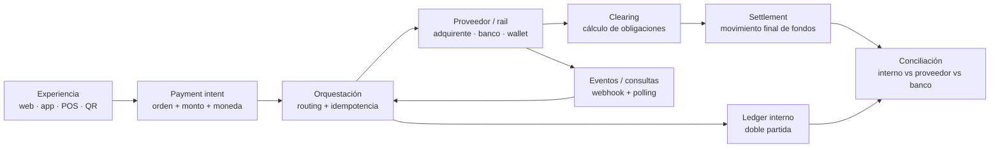

# 💳 Universal Payments Engineering Lab

## Ingeniería de pagos de extremo a extremo · del intento al settlement

Laboratorio profesional en español para diseñar, integrar, operar, probar y auditar sistemas de pago con la disciplina que exige dinero real: idempotencia, estados inciertos, ledger, conciliación, seguridad, cumplimiento y evidencia.

[](https://github.com/vladimiracunadev-create/universal-payments-engineering-lab/actions/workflows/ci.yml)
[](pyproject.toml)
[](LICENSE)
[](docs/operations/COVERAGE.md)

🚀 [Inicio rápido](#-inicio-rápido) · 🗺️ [Arquitectura](docs/architecture/ARCHITECTURE.md) · 💳 [Medios de pago](docs/payment-methods/CATALOG.md) · ⚙️ [Tecnologías](docs/technology/STACK.md) · 🧪 [Laboratorios](labs/README.md) · 🛡️ [Seguridad](SECURITY.md) · 📊 [Cobertura](docs/operations/COVERAGE.md) · 🎓 [Currículo](curriculum/README.md)

---

> [!IMPORTANT]
> Este repositorio enseña cómo se opera un sistema de pagos, pero no es por sí solo un PSP, adquirente, switch, banco ni procesador certificado. Una integración solo se marca como operativa cuando existe una ruta de código hacia infraestructura oficial; aun así, ejecutarla requiere credenciales, contrato y permisos propios. Nunca se simula una certificación o una liquidación real.

## 🎯 Qué resuelve

Una pantalla de checkout no es un sistema de pagos. El problema real empieza cuando una respuesta se pierde, un webhook llega dos veces, el proveedor autoriza después de un timeout, el dinero se liquida por un monto distinto o una devolución queda sin cuadrar.



La regla de oro: **un error de transporte no demuestra un error financiero**. Ante un timeout, el resultado puede ser desconocido; reintentar sin idempotencia ni consulta de estado puede convertir una falla técnica en un doble cargo.

## ✅ Estado verificable

| Superficie | Estado actual | Evidencia |
|---|---|---|
| Núcleo transaccional | `OPERATIVE_LOCAL` | estados, idempotencia, ledger balanceado y conciliación en `src/` |
| Khipu API v3 | `REQUIRES_CREDENTIALS` | crear, consultar, eliminar, anular y reembolsar mediante API configurable |
| Mercado Pago Payments API | `REQUIRES_CREDENTIALS` | crear, consultar y reembolsar; payload explícito e idempotencia obligatoria |
| Transbank Webpay Plus REST | `REQUIRES_CREDENTIALS` | crear, confirmar, consultar y reembolsar contra el ambiente autorizado |
| Resto de medios y rails | `DOCUMENTED` / acceso externo | taxonomía, riesgos y ruta de laboratorio; sin falsa promesa productiva |
| Pruebas | verificable en local y CI | `python -m unittest discover -s tests -v` |

La matriz completa está en [Cobertura operativa](docs/operations/COVERAGE.md); su catálogo canónico legible por máquina vive en [`config/payment_rails.yaml`](config/payment_rails.yaml). El alcance preciso de cada integración está en [Adaptadores incluidos](docs/integrations/ADAPTERS.md).

## 💳 Cobertura del ecosistema

La documentación recorre las familias relevantes sin confundir instrumento, canal y rail:

- efectivo, cheque, vale vista, contra entrega y cash-in/cash-out;
- tarjetas de crédito, débito y prepago; presencial, CNP, recurrente, cuotas y credenciales almacenadas;
- EMV chip/contactless, NFC, QR MPM/CPM, POS, mPOS, SoftPOS y Tap to Pay;
- wallets, dinero electrónico, stored value, gift cards, loyalty y mobile money;
- transferencias A2A, ACH, débito directo, mandatos, request-to-pay e instant payments;
- Pix, UPI, SPEI, FedNow, RTP, Faster Payments y SEPA Instant como estudios de rail;
- pagos internacionales, corresponsalía, SWIFT, FX, remesas y liquidación RTGS;
- links de pago, vouchers, BNPL, carrier billing, marketplaces y split payments;
- Bitcoin, Lightning, stablecoins y CBDC, condicionados a jurisdicción y custodia;
- Open Banking/Open Finance, M2M/IoT y pagos agentic con autoridad delegada.

Consulta el [catálogo de medios](docs/payment-methods/CATALOG.md) para entender actores, ciclo, riesgos y condición de integración de cada familia.

## 🚀 Inicio rápido

Requiere Python 3.11 o superior. El núcleo no tiene dependencias de runtime externas.

```bash
git clone https://github.com/vladimiracunadev-create/universal-payments-engineering-lab.git
cd universal-payments-engineering-lab
python -m unittest discover -s tests -v
python scripts/paylab.py states
python scripts/paylab.py catalog
python scripts/verify_repository.py
```

Para instalar el CLI en un entorno virtual:

```bash
python -m venv .venv
# Linux/macOS: source .venv/bin/activate
# PowerShell:   .venv\Scripts\Activate.ps1
python -m pip install -e .
paylab states
```

### Ejecución real controlada

1. Lee el [runbook](docs/operations/RUNBOOK.md) y la [política de seguridad](SECURITY.md).
2. Carga secretos desde tu shell o secret manager; `.env` no se versiona.
3. Usa exclusivamente credenciales y ambientes oficiales autorizados.
4. Define monto máximo, destinatario, evidencia y reversa antes de enviar.
5. Consulta estado y concilia; el retorno del navegador nunca es la fuente final.

Ejemplos de CLI y contratos: [laboratorio de certificación](labs/certification/README.md).

## 🧠 Autorizar no es liquidar

| Etapa | Pregunta que responde | Evidencia esperada |
|---|---|---|
| Intent | ¿Qué se pretende cobrar? | `payment_id`, orden, monto, moneda |
| Autenticación | ¿La persona controla el instrumento? | resultado 3DS/PIN/biometría/redirect |
| Autorización | ¿El emisor acepta reservar o mover valor? | código y referencia del proveedor |
| Captura | ¿El comercio confirma el cobro? | identificador y monto capturado |
| Clearing | ¿Cuánto debe cada participante? | archivo/mensaje, fees y netos |
| Settlement | ¿Los fondos quedaron abonados? | lote, abono, fecha valor, moneda |
| Conciliación | ¿Coinciden negocio, proveedor, ledger y banco? | diferencias explicadas |

Profundización: [ciclo de vida](docs/fundamentals/PAYMENT_LIFECYCLE.md) y [conciliación](docs/operations/RECONCILIATION_SETTLEMENT.md).

## 🗺️ Rutas por audiencia

| Si eres… | Empieza por | Resultado |
|---|---|---|
| desarrollador/a | [Arquitectura](docs/architecture/ARCHITECTURE.md) → [stack](docs/technology/STACK.md) | integrar sin esconder semántica financiera |
| SRE / plataforma | [Runbook](docs/operations/RUNBOOK.md) → [fault lab](fault-lab/README.md) | operar timeouts, duplicados y recuperación |
| seguridad / compliance | [Threat model](docs/security/THREAT_MODEL.md) → [regulación](docs/regulations/README.md) | delimitar datos, controles y evidencia |
| producto / negocio | [Medios](docs/payment-methods/CATALOG.md) → [glosario](docs/GLOSSARY.md) | elegir por necesidad, no por marca |
| estudiante | [Currículo](curriculum/README.md) → [laboratorios](labs/README.md) | avanzar de conceptos a evidencia |

## 🗂️ Estructura

```text
src/payments_lab/core/        invariantes transaccionales
src/payments_lab/adapters/    transportes hacia proveedores reales
config/payment_rails.yaml     catálogo canónico y madurez
docs/                         conocimiento por dominio y audiencia
labs/                         contratos y guías de ejecución
fault-lab/                    fallos controlados del software propio
curriculum/                   recorrido pedagógico
scripts/                      CLI y verificadores
tests/                        evidencia automatizada
```

## 🎯 Qué es y qué no es

### Sí es

- un laboratorio orientado a invariantes, fallos y operación;
- una taxonomía transversal de instrumentos, canales, rails y tecnologías;
- código ejecutable para demostrar estados, idempotencia, ledger y conciliación;
- una base extensible para adaptadores que respeten contratos oficiales;
- material honesto: cada superficie declara evidencia, dependencias y límites.

### No es

- un procesador listo para custodiar o mover fondos de terceros;
- una certificación PCI, EMV, de red, bancaria o regulatoria;
- un sustituto de HSM, POS, switch, cámara o core bancario;
- asesoría legal, contable, tributaria, de fraude o cumplimiento;
- autorización para probar credenciales, tarjetas o cuentas ajenas.

## 🛡️ Seguridad y uso responsable

Nunca confirmes por el `return_url`. Verifica servidor-a-servidor o mediante webhook autenticado, procesa eventos de forma idempotente y concilia contra el abono. No registres PAN completo, CVV/CVC/CID, PIN, track data, secretos, tokens de sesión ni payloads sin sanitizar.

Para vulnerabilidades, consulta [SECURITY.md](SECURITY.md). Para cambios, [CONTRIBUTING.md](CONTRIBUTING.md). Licencia: [MIT](LICENSE).

---

Hecho para quien quiere entender qué ocurre **después de pulsar Pagar**.

⬆️ [Comenzar por el ciclo de vida](docs/fundamentals/PAYMENT_LIFECYCLE.md) · 💳 [Explorar los medios](docs/payment-methods/CATALOG.md) · 🧪 [Ejecutar un laboratorio](labs/README.md)

Hecho con 🧠 y ☕ por Vladimir Acuña
