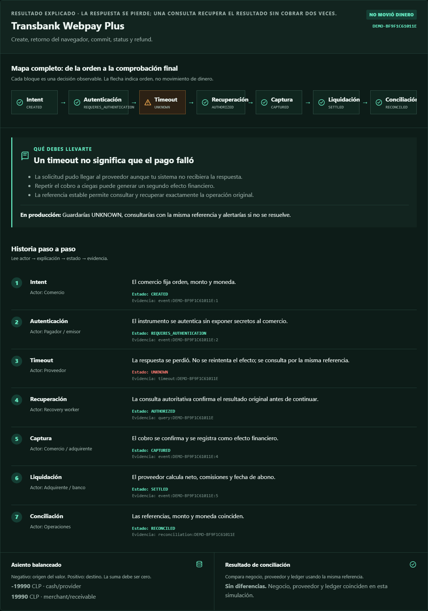
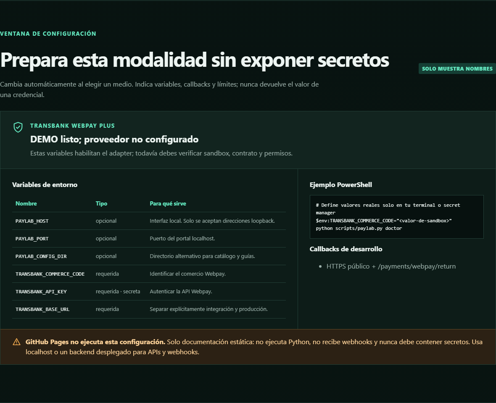

# 💳 Universal Payments Engineering Lab

Laboratorio autoexplicativo en español para **aprender qué ocurre realmente cuando alguien paga**: desde la orden hasta el ledger, la liquidación, los fallos y la conciliación.

[](https://github.com/vladimiracunadev-create/universal-payments-engineering-lab/actions/workflows/ci.yml)
[](https://github.com/vladimiracunadev-create/universal-payments-engineering-lab/actions/workflows/pages.yml)
[](pyproject.toml)
[](LICENSE)
[](docs/PRODUCT_GUIDE.md)

## 🎯 Objetivo del repositorio

Una API de proveedor enseña a “crear un pago”, pero no siempre explica cómo evitar duplicados, recuperar un resultado desconocido, contabilizar el efecto o comprobar el abono. PayLab hace visibles esas decisiones mediante recorridos que se pueden ejecutar sin credenciales ni dinero.

No es una pasarela ni afirma que 28 proveedores estén conectados. Es:

- un **laboratorio DEMO** para observar estados, actores, evidencia y fallos;
- un **modelo común** para comparar 28 familias de pago;
- código real para idempotencia, ledger, conciliación y cuatro adapters;
- una guía para llevar el aprendizaje a SANDBOX y, con controles externos, a LIVE.

Si llegas por primera vez, abre [🧭 Empieza aquí](docs/START_HERE.md). Después sigue la [🎓 ruta de aprendizaje](docs/LEARNING_PATH.md) y consulta los [📊 diagramas explicativos](docs/diagrams/PAYMENT_JOURNEY.md).

## 🧪 La primera práctica

1. Ejecuta `python scripts/paylab.py serve`.
2. Abre `http://127.0.0.1:8080`.
3. Pulsa **Ejemplo guiado: Webpay + timeout**.
4. Comprueba que el estado pasa por `UNKNOWN` y se recupera mediante consulta.
5. Explica por qué un segundo cobro habría sido inseguro.

Para comparar todo sin perderte, empieza por la [📋 tabla de los 28 recorridos, de comienzo a fin](docs/payment-methods/END_TO_END_MATRIX.md). Luego usa el [🧩 casebook pedagógico](docs/payment-methods/CASEBOOK.md). La [⚙️ guía de configuración](docs/LOCALHOST_AND_CONFIGURATION.md) separa variables globales, secretos por proveedor y callbacks; [🌐 GitHub Pages](docs/GITHUB_PAGES.md) explica por qué la web pública documenta pero no ejecuta el backend.

## Qué puedes hacer hoy

Sin instalar servicios externos ni configurar credenciales puedes:

- abrir un portal local y explorar **28 familias de pago**;
- ejecutar cada familia en cuatro situaciones: éxito, timeout recuperado, evento duplicado y diferencia de conciliación;
- observar actores, estados, tecnologías, evidencia, asiento balanceado y resultado de conciliación;
- comprobar qué integraciones externas están configuradas con el comando `doctor`;
- usar clientes HTTP para Khipu, Mercado Pago, Webpay Plus y Oneclick cuando dispongas de acceso autorizado.

El modo DEMO es una simulación determinista. **No contacta proveedores y no mueve dinero.**

## Levántalo en dos minutos

Requiere Python 3.11 o superior. El producto no tiene dependencias de runtime externas.

```bash
git clone https://github.com/vladimiracunadev-create/universal-payments-engineering-lab.git
cd universal-payments-engineering-lab
python scripts/paylab.py doctor
python scripts/paylab.py serve
```

Abre [http://127.0.0.1:8080](http://127.0.0.1:8080), elige un medio de pago y ejecuta el recorrido.

En Windows PowerShell se usan exactamente los mismos comandos. Para instalar la CLI:

```powershell
python -m venv .venv
.venv\Scripts\Activate.ps1
python -m pip install -e .
paylab doctor
paylab serve
```

## Qué verás

### 1. Primero entiendes el propósito

La portada define qué enseña el laboratorio, qué no demuestra y cómo completar la primera práctica.


### 2. Después cada ejecución se explica

El resultado contiene un mapa de decisiones, una conclusión pedagógica, la historia actor por actor, el asiento y la conciliación.



### 3. La configuración cambia con el medio

La ventana enumera variables y callbacks sin mostrar valores de secretos.



Cada fila de la matriz abre una guía publicada generada desde **un único archivo Markdown**. No hay copias HTML dentro de `docs/`: MkDocs las crea sólo en el artefacto de GitHub Pages. Por ejemplo: [Webpay Plus](docs/payment-methods/cases/chile-webpay.md), [transferencia bancaria](docs/payment-methods/cases/bank-transfer.md) y [pagos realizados por agentes](docs/payment-methods/cases/agentic-payments.md).

Para comprobar la documentación exactamente como se publicará:

```bash
python -m pip install -r requirements-docs.txt
python scripts/generate_documentation_pdf.py
python scripts/verify_documentation_pdf.py
python -m mkdocs build --strict
mkdir -p site/downloads
cp output/pdf/universal-payments-engineering-lab.pdf site/downloads/
python scripts/verify_documentation_site.py --site-dir site
python -m mkdocs serve
```

Abre `http://127.0.0.1:8000/universal-payments-engineering-lab/`. La guía [GitHub Pages](docs/GITHUB_PAGES.md) y el [mapa de formatos](docs/FORMATS_AND_TRACEABILITY.md) explican de principio a fin la separación y correspondencia entre Markdown fuente, HTML generado, PDF navegable y laboratorio ejecutable.

## Los tres modos no significan lo mismo

| Modo | Qué hace | Qué demuestra |
|---|---|---|
| `DEMO` | ejecuta datos y eventos deterministas dentro del proceso local | lógica, estados, fallos, ledger y conciliación |
| `SANDBOX` | llama al ambiente de prueba oficial cuando existe y hay credenciales | contrato técnico del proveedor en una cuenta autorizada |
| `LIVE` | opera contra infraestructura real bajo habilitación explícita | comportamiento real de esa cuenta; no implica certificación general |

El modo se elige **antes** de crear un intento. Si una operación SANDBOX o LIVE vence por timeout, queda `UNKNOWN` y debe consultarse; nunca se sustituye silenciosamente por un resultado DEMO.

## Qué problema resuelve cada grupo

| Grupo | Casos disponibles | Pregunta principal |
|---|---|---|
| aceptación física | efectivo, cheque, POS, mPOS, SoftPOS y vouchers | ¿cómo se recibe, custodia y concilia valor físico? |
| tarjetas y wallets | tarjetas, Webpay Plus, Oneclick, Mercado Pago y wallets tokenizadas | ¿cómo se autentica, autoriza, captura y devuelve un cargo? |
| cuenta a cuenta | Khipu, transferencias, ACH, débito directo y pagos instantáneos | ¿cómo se confirma un movimiento cuando la respuesta puede ser diferida? |
| experiencias de inicio | QR, links, facturas y request-to-pay | ¿cómo se conecta la orden comercial con el rail que mueve el dinero? |
| saldos y crédito | stored value, gift cards, mobile money, BNPL y carrier billing | ¿quién mantiene el saldo o financia al pagador? |
| plataformas y empresas | marketplace, splits, payouts, B2B y tesorería | ¿cómo se distribuyen fondos entre varias partes con control y auditoría? |
| infraestructura global | SWIFT, FX, corresponsalía, RTGS y Open Finance | ¿qué contratos, mensajes y reglas determinan finalidad y settlement? |
| nuevas formas | Bitcoin, Lightning, stablecoins, IoT y pagos agentic | ¿cómo se limita autoridad, custodia, firma y riesgo operacional? |

La explicación individual de las 28 familias está en el [mapa de producto](docs/PRODUCT_GUIDE.md). El catálogo canónico legible por máquina vive en [`config/payment_rails.yaml`](config/payment_rails.yaml), y las descripciones simples en [`config/case_guides.json`](config/case_guides.json).

## Qué está implementado y qué sigue siendo arquitectura

### Ejecutable ahora

- máquina de estados de pagos;
- idempotencia por clave y fingerprint en memoria;
- ledger balanceado en memoria;
- conciliación por referencia, monto y moneda;
- cliente HTTP JSON sin retries monetarios automáticos;
- firma HMAC y ventana de frescura para webhooks Khipu y Mercado Pago;
- adaptadores HTTP para Khipu, Mercado Pago, Webpay Plus y Oneclick;
- motor DEMO para las 28 familias;
- API y portal localhost;
- diagnóstico de credenciales y límites de modo.

### Todavía no implementado

- base de datos y transacciones;
- idempotencia distribuida con respuesta y TTL;
- inbox/outbox y colas;
- deduplicación persistente de webhooks;
- recovery scheduler;
- routing multi-proveedor y risk engine;
- settlement bancario real, payouts y tesorería;
- observabilidad, dashboards y SLO;
- ejecución SANDBOX automatizada de punta a punta para todos los proveedores;
- certificaciones, hardware y permisos externos.

La secuencia completa y el estado de cada tecnología están en el [roadmap](ROADMAP.md) y la [matriz de cobertura](docs/operations/COVERAGE.md).

## Integraciones externas existentes

| Integración | Código disponible | Estado actual |
|---|---|---|
| Khipu v3 | crear, consultar, eliminar, listar bancos y verificar firma | requiere credenciales; no existe evidencia live en este checkout |
| Mercado Pago Payments | crear, consultar, reembolsar y verificar firma | requiere credenciales; las pruebas usan transporte falso |
| Webpay Plus REST | crear, commit, consultar y reembolsar | requiere comercio, ambiente y puesta en producción propios |
| Oneclick Mall | inscripción, cobro, status, devolución y baja | requiere producto contratado y certificación |

`REQUIRES_CREDENTIALS` significa que existe transporte configurable; no significa que se haya efectuado un pago.

## Comandos principales

```bash
python scripts/paylab.py doctor
python scripts/paylab.py catalog
python scripts/paylab.py states
python scripts/paylab.py demo chile-webpay --scenario timeout-recovered
python scripts/paylab.py serve --port 8080
python -m unittest discover -s tests -v
python scripts/verify_repository.py
```

## Ruta de lectura recomendada

1. [Guía del producto](docs/PRODUCT_GUIDE.md): qué resuelve cada caso y cómo usar el portal.
2. [Empieza aquí](docs/START_HERE.md): objetivo, primer recorrido y relación pantalla-código.
3. [Ruta de aprendizaje](docs/LEARNING_PATH.md): prácticas con preguntas y criterios verificables.
4. [Diagramas](docs/diagrams/PAYMENT_JOURNEY.md): actores, estados, timeout, webhook y conciliación.
5. [Implementación web](docs/IMPLEMENTATION_GUIDE.md): lenguaje, API, alta, costos, pruebas, seguridad y fallos.
6. [Arquitectura](docs/architecture/ARCHITECTURE.md): componentes actuales y arquitectura objetivo.
7. [Integraciones](docs/integrations/ADAPTERS.md): contrato seguro de los proveedores.
8. [Runbook](docs/operations/RUNBOOK.md): qué hacer ante timeouts, duplicados y diferencias.
9. [Roadmap](ROADMAP.md): orden de construcción de DEMO, SANDBOX y capacidades productivas.
10. [Windows](docs/WINDOWS.md): arranque, aislamiento y límites de exposición local.

## Seguridad

Este repositorio no es un PSP, adquirente, switch, banco ni procesador certificado. Nunca uses instrumentos, cuentas o credenciales ajenas. No almacenes PAN completo, CVV, PIN, track data, secretos ni payloads sin sanitizar.

Consulta [SECURITY.md](SECURITY.md) antes de conectar un proveedor. Licencia: [MIT](LICENSE).
