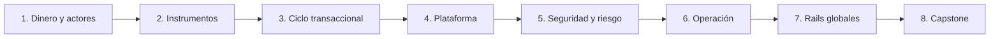

# 🎓 Programa de Ingeniería de Pagos

## 8 partes · 32 módulos · de fundamentos a operación multi-rail

El recorrido forma criterio para construir y operar, no para memorizar marcas. Cada módulo debe cerrar con una evidencia: modelo, diagrama, prueba, journal, reporte o decisión defendible.

## Parte 1 — Fundamentos y contabilidad

| # | Módulo | Resultado verificable |
|---:|---|---|
| 01 | dinero, deuda, orden, instrumento y rail | clasifica diez experiencias sin confundir canal con rail |
| 02 | actores: pagador, comercio, PSP, adquirente, red, emisor, banco | diagrama de responsabilidad y contratos |
| 03 | autorización, clearing, settlement y finalidad | timeline con fuente de verdad por etapa |
| 04 | doble partida, receivables, fees, reservas y payouts | journals balanceados de venta/refund/chargeback |

## Parte 2 — Instrumentos y aceptación

| # | Módulo | Resultado verificable |
|---:|---|---|
| 05 | efectivo, cheque, voucher y contra entrega | procedimiento de caja y conciliación |
| 06 | tarjetas crédito/débito/prepago y CNP | flujo emisor-red-adquirente con excepciones |
| 07 | EMV, POS/mPOS/SoftPOS, NFC y CVM | mapa L1/L2/L3 y requisitos externos |
| 08 | wallets, tokens, QR MPM/CPM y stored value | clasificación por fuente de fondos |

## Parte 3 — Transferencias y crédito alternativo

| # | Módulo | Resultado verificable |
|---:|---|---|
| 09 | A2A, wire, ACH y archivos batch | contrato push/pull con returns |
| 10 | mandatos, direct debit, PAC y recurrencia | lifecycle de mandato y cobro |
| 11 | instant payments y request-to-pay | comparativa Pix/UPI/SPEI/FedNow/RTP/FPS/SCT Inst |
| 12 | BNPL, gift, loyalty, mobile money y carrier billing | riesgos, ledger y regulación por familia |

## Parte 4 — Core de plataforma

| # | Módulo | Resultado verificable |
|---:|---|---|
| 13 | order, intent, attempt y estado | modelo de dominio con invariantes |
| 14 | API, idempotencia y concurrencia | prueba duplicate/conflicting payload |
| 15 | webhooks, polling, queues y outbox/inbox | consumidor idempotente y re-drive |
| 16 | adaptadores, capability model y routing | contrato que preserve semántica del rail |

## Parte 5 — Seguridad, identidad y fraude

| # | Módulo | Resultado verificable |
|---:|---|---|
| 17 | PCI DSS, tokenización y minimización | diagrama de datos y alcance |
| 18 | HSM/KMS, PKI, secretos, TLS/mTLS | inventario y lifecycle de claves |
| 19 | OAuth/OIDC/FAPI/Open Finance | flujo authorization code + PKCE/PAR y tokens ligados |
| 20 | fraude, AML/CFT, sanciones, disputas y APP fraud | controles preventivos/detectivos y case workflow |

## Parte 6 — Operación financiera

| # | Módulo | Resultado verificable |
|---:|---|---|
| 21 | timeout, retry, circuit breaker y `UNKNOWN` | fault-lab sin doble cargo |
| 22 | observabilidad, SLO y respuesta a incidentes | dashboard/runbook sin datos sensibles |
| 23 | clearing, settlement y conciliación | match de cinco fuentes y aging de excepciones |
| 24 | refunds, reversals, returns, disputes y chargebacks | journals compensatorios y timeline |

## Parte 7 — Infraestructura global y emergente

| # | Módulo | Resultado verificable |
|---:|---|---|
| 25 | ISO 8583 | mensaje conceptual, reversa y campos de correlación |
| 26 | ISO 20022 | mapa pain/pacs/camt/remt y community profile |
| 27 | SWIFT, corresponsalía, FX, remesas y RTGS | cadena de fees, fecha valor, liquidez y finalidad |
| 28 | Bitcoin, Lightning, stablecoin, CBDC y tokenized deposits | modelo custodia/finalidad/reconciliación |

## Parte 8 — Plataforma avanzada y capstone

| # | Módulo | Resultado verificable |
|---:|---|---|
| 29 | marketplace, split, reserves y payouts | ledger multi-parte y límites regulatorios |
| 30 | multi-provider, smart routing y tesorería | política de failover sin duplicación |
| 31 | pagos IoT y agentic | mandato acotado, policy engine y human approval |
| 32 | capstone | plataforma multi-rail con evidencia y conciliación |

## Contrato pedagógico

Cada módulo se trabaja con: propósito, vocabulario, actores, diagrama, happy path, estados, fallos, controles, laboratorio, evidencia, criterio de aceptación y fuentes primarias. La teoría no eleva el estado de cobertura: solo una integración autorizada y verificable puede hacerlo.

## Evaluación del capstone

- 20% dominio e invariantes;
- 15% contrato de adapters;
- 15% seguridad y privacidad;
- 15% resiliencia/fault injection;
- 15% ledger y conciliación;
- 10% operación/SLO/runbook;
- 10% claridad, evidencia y honestidad de cobertura.

Se reprueba automáticamente por exponer secretos/datos reales, simular certificación, confirmar pagos por callback, reintentar ciegamente o alterar un ledger para ocultar diferencias.
