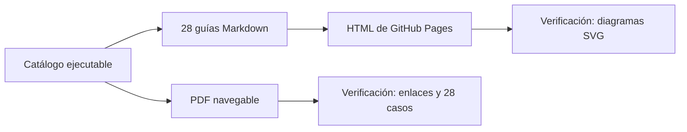

# Markdown, GitHub Pages y PDF: qué es cada cosa

Este repositorio ofrece el mismo conocimiento en tres formatos. No son tres documentaciones mantenidas a mano:

| Formato | Dónde vive | Cómo se obtiene | Para qué se usa |
|---|---|---|---|
| Markdown | `docs/**/*.md` | Es la fuente escrita y versionada. | Leer y revisar cambios directamente en GitHub. |
| HTML | GitHub Pages | MkDocs convierte los Markdown durante el workflow. | Navegar, buscar, filtrar y ver Mermaid en el navegador. |
| PDF | `output/pdf/universal-payments-engineering-lab.pdf` | El generador lee el mismo catálogo ejecutable. | Descargar, imprimir y navegar sin conexión. |

## Cómo se correlacionan

La [tabla de los 28 casos](payment-methods/END_TO_END_MATRIX.md) presenta, en cada fila:

1. el nombre del caso enlazado a su HTML público;
2. el enlace **fuente MD** al archivo que se revisa en GitHub;
3. el enlace **PDF** al destino interno de ese mismo caso.

Cada guía individual repite esa relación al comienzo. Dentro del PDF, el índice es clicable, cada caso tiene un marcador propio y los enlaces **Volver al índice** no salen del documento.

## Qué se verifica automáticamente

- no existen archivos fuente `.html` dentro de `docs/`;
- existen exactamente 28 Markdown de casos;
- MkDocs construye todas las páginas sin advertencias;
- todos los enlaces internos del HTML generado resuelven;
- cada contenedor Mermaid termina en un SVG real y nunca en “Syntax error”;
- el PDF contiene los 28 casos, destinos internos, enlaces y diagramas vectoriales;
- GitHub Pages publica el artefacto HTML y una copia del PDF.

## Abrir cada salida

- [Fuente Markdown de Webpay](https://github.com/vladimiracunadev-create/universal-payments-engineering-lab/blob/main/docs/payment-methods/cases/chile-webpay.md)
- [HTML de Webpay](https://vladimiracunadev-create.github.io/universal-payments-engineering-lab/payment-methods/cases/chile-webpay.html)
- [PDF completo](https://vladimiracunadev-create.github.io/universal-payments-engineering-lab/downloads/universal-payments-engineering-lab.pdf)
