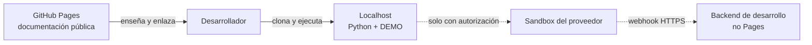

# 🌐 GitHub Pages

## Qué publica este repositorio

GitHub Pages presenta la documentación: objetivo, guías, diagramas, casos y roadmap. Es una referencia pública para leer antes o después de usar el laboratorio.

La dirección esperada es:

```text
https://vladimiracunadev-create.github.io/universal-payments-engineering-lab/
```

## Qué no puede hacer

Pages sirve archivos estáticos. Por eso:

- no ejecuta Python;
- no responde `POST /api/demo/{familia}`;
- no consulta bancos ni PSP;
- no recibe webhooks de forma segura;
- no guarda secretos ni variables de backend.

Para ejecutar el recorrido debes clonar el repositorio y usar localhost. Para SANDBOX necesitas además un backend autorizado y, si el proveedor envía webhooks, una URL HTTPS controlada.



## Fuente y despliegue

La fuente de Pages es la carpeta `docs/` de la rama `main`. `docs/index.md` funciona como portada y `docs/_config.yml` define título, descripción y tema.

Cada push a `main` vuelve a publicar la documentación mediante el mecanismo administrado de GitHub Pages. El estado de Pages es independiente de los workflows CI y Security: deben comprobarse ambos.

## Seguridad

Nunca incluyas en Markdown, JavaScript, configuración de Jekyll o capturas:

- access tokens;
- API keys;
- códigos privados de comercio;
- secretos de webhook;
- tarjetas, cuentas o datos personales reales.

Los ejemplos usan marcadores y nombres de variables. Los valores se inyectan únicamente en el proceso backend descrito en [configuración local](LOCALHOST_AND_CONFIGURATION.md).
