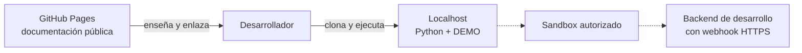
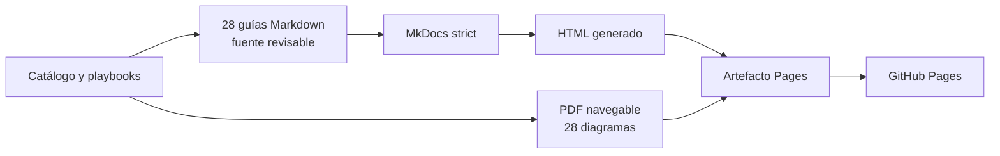

# 🌐 GitHub Pages

## Qué publica este repositorio

GitHub Pages presenta la documentación: objetivo, guías, diagramas, casos y roadmap. Es una referencia pública para leer antes o después de usar el laboratorio.

La dirección esperada es:

```text
https://vladimiracunadev-create.github.io/universal-payments-engineering-lab/
```

## Qué no puede hacer

Pages sirve archivos estáticos. Por eso:

- no ejecuta Python;
- no responde `POST /api/demo/{familia}`;
- no consulta bancos ni PSP;
- no recibe webhooks de forma segura;
- no guarda secretos ni variables de backend.

Para ejecutar el recorrido debes clonar el repositorio y usar localhost. Para SANDBOX necesitas además un backend autorizado y, si el proveedor envía webhooks, una URL HTTPS controlada.



## Fuente y despliegue: Markdown entra, HTML sale

La única fuente editorial es `docs/**/*.md`. No se mantienen copias `.html` junto a cada guía. `mkdocs.yml` define navegación y tema; el workflow `.github/workflows/pages.yml` ejecuta `mkdocs build --strict` y genera el HTML en un artefacto temporal llamado `site`.



Por eso la URL pública termina en `.html`, pero el árbol `docs/` del repositorio contiene Markdown. Cada push a `main` que toca documentación ejecuta **Documentation Pages**; la publicación sólo continúa si la construcción estricta y la comprobación de enlaces terminan correctamente.

El mismo workflow regenera [el PDF navegable](https://vladimiracunadev-create.github.io/universal-payments-engineering-lab/downloads/universal-payments-engineering-lab.pdf), comprueba sus 28 casos, 28 diagramas vectoriales y enlaces internos, y lo añade al artefacto sin convertirlo en otra fuente editorial. La [guía de formatos](FORMATS_AND_TRACEABILITY.md) muestra la correspondencia.

## Seguridad

Nunca incluyas en Markdown, JavaScript, configuración de MkDocs o capturas:

- access tokens;
- API keys;
- códigos privados de comercio;
- secretos de webhook;
- tarjetas, cuentas o datos personales reales.

Los ejemplos usan marcadores y nombres de variables. Los valores se inyectan únicamente en el proceso backend descrito en [configuración local](LOCALHOST_AND_CONFIGURATION.md).
