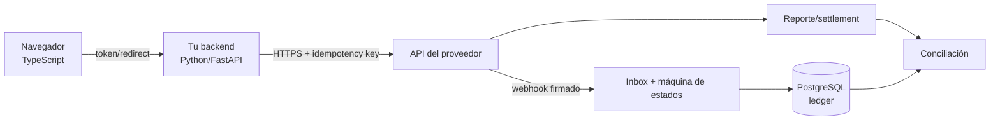
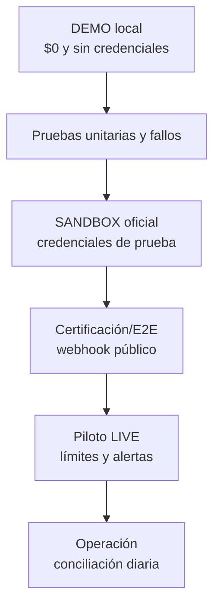

# Implementar un medio de pago en cualquier web

Esta guía responde la pregunta práctica: **qué lenguaje y API usar, dónde inscribirse, cuánto cuesta, cómo probar, cómo proteger datos y qué hacer cuando falla**. El portal en localhost muestra el playbook específico al elegir cualquiera de las 28 modalidades.

## Decisión corta de tecnología

No existe un “lenguaje de pagos” obligatorio. El proveedor fija el protocolo; tu equipo elige el lenguaje que pueda operar con seguridad.

| Capa | Elección recomendada para este producto | Responsabilidad |
|---|---|---|
| navegador | TypeScript + HTML/CSS | mostrar checkout, token o redirección; nunca secretos |
| backend | Python 3.11+ y FastAPI | crear orden, firmar/autenticar, idempotencia, consultar y contabilizar |
| proveedor | HTTPS REST/JSON; a veces ISO 8583/20022, archivo o SDK | autorizar, procesar y reportar estado |
| asincronía | webhook HTTPS + cola/outbox | recibir cambios repetidos o fuera de orden |
| datos | PostgreSQL + ledger de doble entrada | verdad de negocio, auditoría y conciliación |
| operación | Docker, secretos, métricas y alertas | despliegue repetible, diagnóstico y respuesta |

Java, .NET, Go o Node.js son opciones igualmente válidas para el backend. Se recomienda Python aquí porque el repositorio ya lo usa y permite enseñar el recorrido con pocas dependencias. Cambiar de lenguaje no cambia las invariantes.

## Regla de seguridad principal

El navegador no decide monto, moneda, beneficiario ni resultado. Tampoco recibe la llave secreta. Para tarjetas se prefiere checkout alojado o tokenización del proveedor para reducir el alcance PCI DSS. Para transferencias, la web nunca pide ni almacena la clave bancaria del cliente.

Un retorno visual como `/gracias` no confirma un pago. La confirmación llega mediante una consulta servidor a servidor o un webhook verificado. Si enviar una operación termina en timeout, queda `UNKNOWN` hasta consultar: no se repite a ciegas.

## Recorrido universal de implementación

1. Elegir proveedor por país, cobertura, experiencia, plazo de liquidación, reversibilidad, soporte y costo total.
2. Abrir una cuenta comercial, verificar empresa/beneficiarios y solicitar credenciales de sandbox.
3. Crear una orden propia en el backend con monto, moneda y expiración fijados por el servidor.
4. Llamar la API desde el backend con secreto e idempotency key; persistir referencia antes de continuar.
5. Dar al navegador únicamente el token, QR o URL alojada.
6. Recibir retorno y webhook; verificar autenticidad, persistir y deduplicar el evento.
7. Aplicar una máquina de estados monotónica y contabilizar una sola vez.
8. Consultar resultados desconocidos, procesar devoluciones y conciliar contra reporte/banco.
9. Pasar a LIVE solo con contrato, checklist de seguridad, observabilidad, runbook y piloto limitado.

## Proveedores implementados en el repositorio

### Transbank Webpay Plus

- **Alta:** comenzar en [Transbank Developers](https://www.transbankdevelopers.cl/documentacion/como_empezar), usar credenciales/tarjetas de integración y luego completar contratación y puesta en producción.
- **API:** create en backend, redirección alojada, commit en backend y status/refund. El retorno del navegador no reemplaza commit.
- **Costo:** el DEMO es $0; la tarifa real pertenece al contrato vigente del comercio y debe confirmarse con Transbank.
- **Ventaja:** el comercio no captura la tarjeta. **Costo técnico:** redirección y certificación/alta productiva.
- **Pruebas mínimas:** autorizada, rechazada, cancelada, timeout de commit, consulta posterior y refund.
- **Fuente:** [referencia REST de Webpay](https://www.transbankdevelopers.cl/referencia/webpay).

### Transbank Oneclick Mall

- **Alta:** contratar el producto y completar primero la inscripción alojada.
- **API:** start/finish de inscripción; guardar `tbk_user` cifrado como credencial tokenizada; authorize/status/refund y delete desde backend.
- **Riesgo especial:** un token permite cobros posteriores. Exige consentimiento demostrable, límites, detección de fraude, baja y auditoría.
- **Fuente:** [referencia REST de Oneclick](https://www.transbankdevelopers.cl/referencia/oneclick).

### Khipu

- **Alta:** registrarse como cobrador, crear credenciales y seguir la [guía oficial](https://www.khipu.com/en-us/page/guia-de-implementacion).
- **API:** autenticar, crear el pago, abrir/redirigir la experiencia, consultar y procesar webhook.
- **Datos:** la clave bancaria permanece en la experiencia bancaria/Khipu; el comercio conserva solo referencias y estados.
- **Costo:** comprobar comisión, cobertura y liquidación vigentes con Khipu.
- **Fuente:** [Payment API](https://docs.khipu.com/en/payment-solutions/instant-payments/payment-api).

### Mercado Pago

- **Alta:** crear cuenta de vendedor y aplicación; separar credenciales de prueba y producción.
- **API:** el adaptador actual enseña Payments API. Para una integración nueva se debe evaluar Orders API según la documentación vigente.
- **Frontend/backend:** tokenización o experiencia del proveedor en frontend; access token, idempotencia, consulta y refund exclusivamente en backend.
- **Costo:** cambia por país, producto y plazo de disponibilidad; usar el enlace de costos de la propia cuenta, no un número copiado al README.
- **Fuentes:** [primeros pasos](https://www.mercadopago.cl/developers/es/docs/getting-started) y [Payments API](https://www.mercadopago.cl/developers/es/docs/checkout-api-payments/overview).

## Cómo probar de DEMO a LIVE

En cada etapa se prueban éxito, rechazo, cancelación, expiración, timeout antes/después de enviar, webhook tardío/duplicado/fuera de orden, devolución y diferencia de conciliación. DEMO prueba comportamiento propio; SANDBOX prueba contrato técnico; solo LIVE demuestra autorización y liquidación reales.

## Fallos que el diseño debe resolver

| Fallo | Estado seguro | Acción |
|---|---|---|
| timeout antes de enviar | no iniciado | reintento con la misma intención |
| timeout después de enviar | `UNKNOWN` | consultar por referencia; no duplicar |
| webhook duplicado | sin cambio | registrar/deduplicar por event ID |
| webhook fuera de orden | estado monotónico | ignorar regresión y conservar evidencia |
| monto o moneda distintos | excepción | detener contabilización automática |
| proveedor caído | degradado | circuit breaker, cola y conciliación |
| secreto expuesto | incidente | revocar/rotar, auditar y notificar según obligación |
| disputa/chargeback | pasivo abierto | asociar evidencia y asiento compensatorio; no borrar historia |

## Las 28 modalidades

Las reglas anteriores se especializan en el portal para efectivo, papel, tarjetas, Webpay, Oneclick, Khipu, Mercado Pago, POS, wallets, stored value, mobile money, QR, transferencias, ACH, débito directo, instant payments, links, vouchers, BNPL, carrier billing, marketplaces, B2B, internacional, RTGS, Open Finance, activos digitales, pagos máquina a máquina y pagos agentic.

Para cada una, `/api/catalog` entrega `playbook` con stack, alta, costo, pasos, pruebas, pros/contras, seguridad, fallos, checklist LIVE y fuentes. Las modalidades genéricas requieren seleccionar un proveedor/regulación del país antes de poder fijar endpoints o precios reales.

## Fuentes transversales

- [PCI Security Standards Council · PCI DSS](https://www.pcisecuritystandards.org/standards/pci-dss/)
- [EMVCo · tecnologías EMV](https://www.emvco.com/emv-technologies/)
- [ISO 20022](https://www.iso20022.org/)
- [OpenID Foundation · FAPI](https://openid.net/wg/fapi/)
- [OAuth 2.0 Security Best Current Practice, RFC 9700](https://www.rfc-editor.org/rfc/rfc9700)
- [OWASP Application Security Verification Standard](https://owasp.org/www-project-application-security-verification-standard/)

Los precios, requisitos comerciales y capacidades son datos externos cambiantes. Se enlaza la fuente oficial y se exige confirmación antes de diseñar el caso económico o habilitar LIVE.
