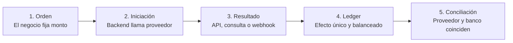
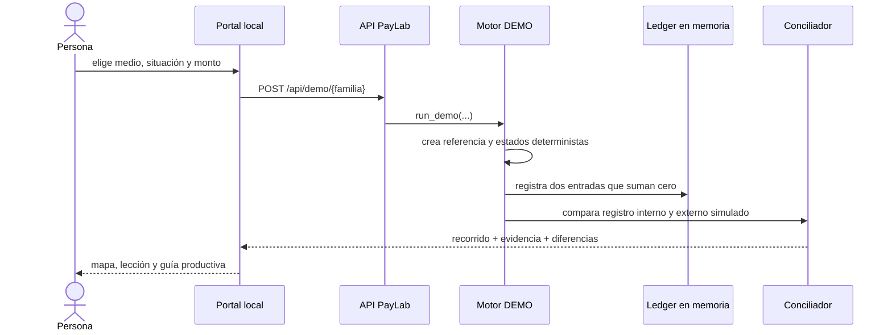

# 🧭 Empieza aquí

## El objetivo, sin jerga

Cuando una persona pulsa **Pagar**, la pantalla suele ocultar casi todo lo importante. Puede existir una autenticación, una autorización, un movimiento todavía pendiente, un evento repetido, un abono posterior y una conciliación al día siguiente.

**PayLab hace visibles esas decisiones.** Es un laboratorio local para aprender a diseñar y operar pagos sin usar credenciales ni dinero real.

Al terminar el primer recorrido deberías poder responder:

1. ¿Quién decide el monto y quién procesa el pago?
2. ¿Por qué “autorizado” no siempre significa “dinero recibido”?
3. ¿Qué hago si la API vence por timeout?
4. ¿Cómo evito aplicar dos veces el mismo webhook?
5. ¿Cómo demuestro que negocio, proveedor, ledger y banco coinciden?
6. ¿Qué cambia al pasar de DEMO a SANDBOX y a LIVE?

## Qué es y qué no es

| PayLab sí es | PayLab no es |
|---|---|
| una simulación determinista de 28 familias de pago | una pasarela que procese dinero |
| una implementación educativa de estados, idempotencia, ledger y conciliación | evidencia de que una cuenta está certificada |
| un catálogo de adapters para Khipu, Mercado Pago y Transbank | un reemplazo del contrato o documentación del proveedor |
| una guía para decidir lenguaje, API, pruebas y controles | software listo para producción sin persistencia ni operación |

## Tu primera práctica, en diez minutos

### 1. Comprueba el entorno

```powershell
python scripts/paylab.py doctor
```

Busca tres hechos en la salida:

- `demo.ready` debe ser `true`;
- `demo.moves_money` debe ser `false`;
- un proveedor sin credenciales debe decir “DEMO disponible”, no fingir SANDBOX.

### 2. Levanta el portal

```powershell
python scripts/paylab.py serve --port 8080
```

Abre `http://127.0.0.1:8080` y pulsa **Ejemplo guiado: Webpay + timeout**.

### 3. Formula una hipótesis

Antes de leer el resultado, responde: “si mi backend envió el cobro pero no recibió respuesta, ¿debo enviarlo otra vez?”.

La respuesta segura es **no**. El proveedor pudo procesarlo. PayLab deja la operación en `UNKNOWN`, conserva la misma referencia y consulta el resultado original.

### 4. Lee el resultado en este orden

1. **Mapa completo:** muestra la secuencia y dónde apareció el problema.
2. **Qué debes llevarte:** explica la idea técnica en lenguaje común.
3. **Historia paso a paso:** identifica actor, decisión, estado y evidencia.
4. **Asiento:** comprueba que origen + destino suman cero.
5. **Conciliación:** contrasta la verdad interna con la externa.
6. **Implementación:** explica qué harías en una web real.

## El modelo mental mínimo



Las flechas significan **orden de decisiones**, no que el dinero ya se movió. Un estado técnico y un movimiento bancario son hechos distintos.

## Qué ocurre al pulsar “Ejecutar y explicar”



No hay una llamada oculta al proveedor. Todo ocurre dentro del proceso Python y se pierde al detenerlo porque la persistencia productiva todavía es parte del roadmap.

## Cómo relacionar la pantalla con el código

| Lo que ves | Fuente de verdad | Qué enseña |
|---|---|---|
| selector de 28 modalidades | `config/payment_rails.yaml` | catálogo y estado real de cobertura |
| texto “qué resuelve” | `config/case_guides.json` | problema de negocio |
| recorrido y fallos | `src/payments_lab/demo.py` | estados, recuperación y evidencia |
| asiento | `src/payments_lab/core/ledger.py` | doble entrada |
| diferencias | `src/payments_lab/core/reconciliation.py` | conciliación |
| lenguaje, alta y seguridad | `src/payments_lab/playbooks.py` | paso de DEMO a integración |
| API localhost | `src/payments_lab/web.py` | contrato consumido por la pantalla |
| interfaz | `web/index.html`, `web/app.js` y `web/styles.css` | explicación interactiva |

## Qué escenario estudiar después

| Situación | Pregunta que responde |
|---|---|
| éxito | ¿cuándo una operación pasa de intención a conciliada? |
| timeout recuperado | ¿cómo evito cobrar otra vez cuando no conozco el resultado? |
| evento duplicado | ¿cómo recibo webhooks “al menos una vez” sin duplicar efectos? |
| diferencia de conciliación | ¿cómo conservo una discrepancia sin falsear el ledger? |

Continúa con la [ruta de aprendizaje](LEARNING_PATH.md) si quieres avanzar de principiante a diseño de una integración; usa la [guía de implementación](IMPLEMENTATION_GUIDE.md) si ya tienes una web concreta.
