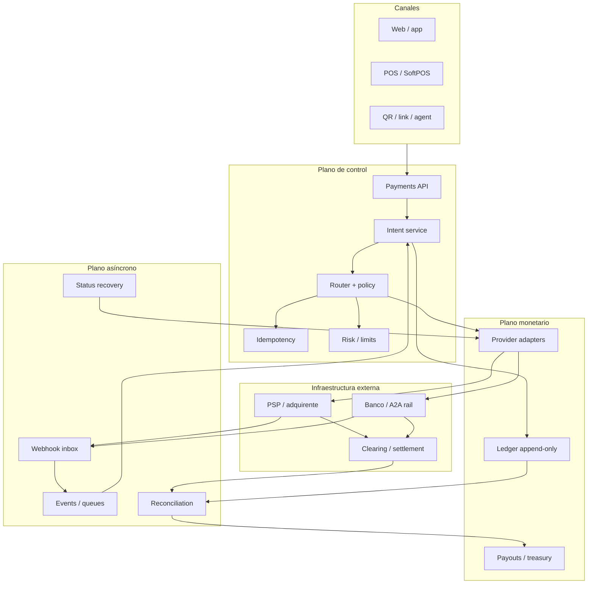
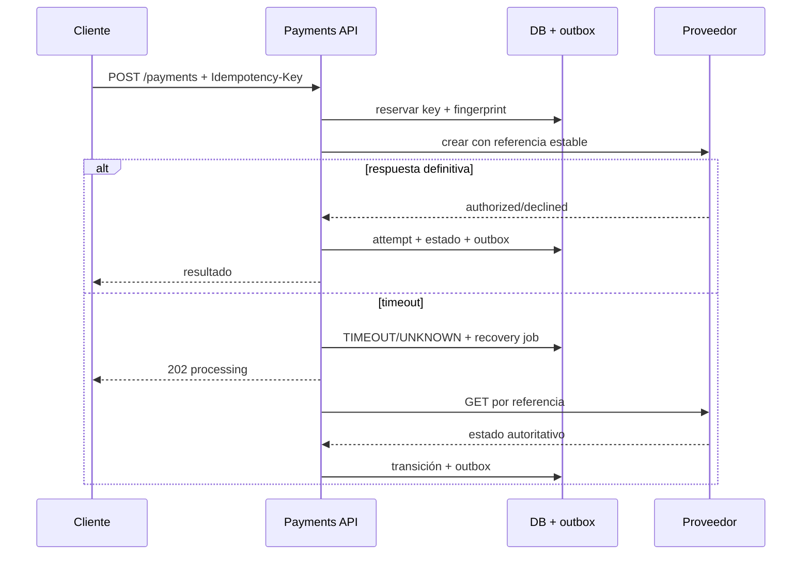

# 🏗️ Arquitectura de referencia

## Objetivo

La arquitectura preserva dos verdades simultáneas: la experiencia comercial (“esta orden debe pagarse”) y los hechos financieros externos (“el proveedor autorizó, la red liquidó, el banco abonó”). Ninguna API aislada domina todo el ciclo.

## Agregados de dominio

### Order

Contrato comercial: líneas, impuestos, descuentos, total, moneda y propietario. El servidor calcula el monto; nunca confía en el cliente.

### PaymentIntent

Deseo estable de obtener un resultado financiero. Contiene monto autorizado/capturado/devuelto, estado agregado y política. No se sobrescribe con el JSON de un proveedor.

### PaymentAttempt

Interacción concreta con proveedor/rail: idempotency key, request fingerprint, referencias, timestamps, resultado crudo sanitizado y estado normalizado.

### Ledger y Journal

Cada efecto se representa con asientos balanceados por moneda. El código actual demuestra la invariante en memoria; producción exige persistencia transaccional, constraints, cuentas, períodos y auditoría.

### SettlementBatch y ReconciliationCase

El lote representa lo que el proveedor declara liquidar. El caso conserva una diferencia, su owner, evidencia, antigüedad y resolución; nunca se “arregla” alterando silenciosamente el pago.

## Contrato de adaptador

Un adaptador traduce sin inventar. Debe exponer capacidades (`authorize`, `capture`, `status`, `reverse`, `refund`) solo si el proveedor las soporta y conservar códigos/referencias originales para auditoría. No debe:

- llamar `captured` a una autorización;
- transformar timeout en decline;
- reintentar `POST` monetario sin idempotencia/consulta;
- aceptar monto `float` desde el dominio;
- registrar secretos o payloads completos;
- ocultar que refund, void y reversal tienen semánticas distintas.

## Consistencia y concurrencia

El límite transaccional recomendado es `PaymentIntent + Attempt + Outbox`. Un worker adquiere lock optimista/pesimista, verifica la versión, reserva idempotencia y persiste antes de emitir. Webhooks entran por inbox con unique constraint. El ledger usa referencias únicas para evitar doble contabilización.

## Multi-provider routing

El routing usa moneda, país, medio, capacidad, costo, salud, riesgo y contrato. **Failover no es retry**: antes de cambiar de proveedor hay que probar que el anterior no produjo efecto o crear una nueva decisión explícita. Persistir la versión de la regla que tomó la decisión.

## Fronteras de seguridad

| Zona | Datos admitidos | Control |
|---|---|---|
| checkout | token/nonce del proveedor; no CVV persistido | CSP, anti-CSRF, integridad de scripts, TLS |
| API | IDs internos, monto, moneda, referencias tokenizadas | authN/Z, schema, idempotencia, rate limit |
| adapter | secreto solo en memoria y payload mínimo | secret manager, egress allowlist, mTLS/TLS |
| events | evento sanitizado | firma, replay defense, inbox |
| ledger | cuentas y valores, no credencial de pago | append-only, RBAC, dual control |
| analytics | datos minimizados/tokenizados | acceso por propósito, retención, auditoría |

## SLO y degradación

Definir SLO separados para crear pago, confirmar estado, procesar eventos y conciliar. Si un proveedor falla, puede deshabilitarse el método antes que arriesgar duplicados. La cola de recuperación y la antigüedad de estados `UNKNOWN` son señales financieras, no solo técnicas.

## Producción pendiente

El repositorio no implementa aún persistencia, API de servidor, outbox/inbox, verificador de webhooks, observabilidad ni despliegue. El diagrama es arquitectura objetivo y la [matriz de cobertura](../operations/COVERAGE.md) lo declara para impedir confundir documentación con producto terminado.
