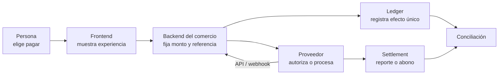
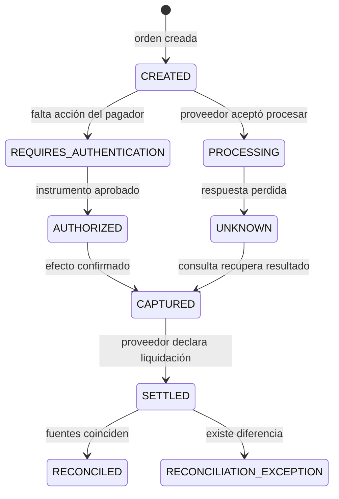
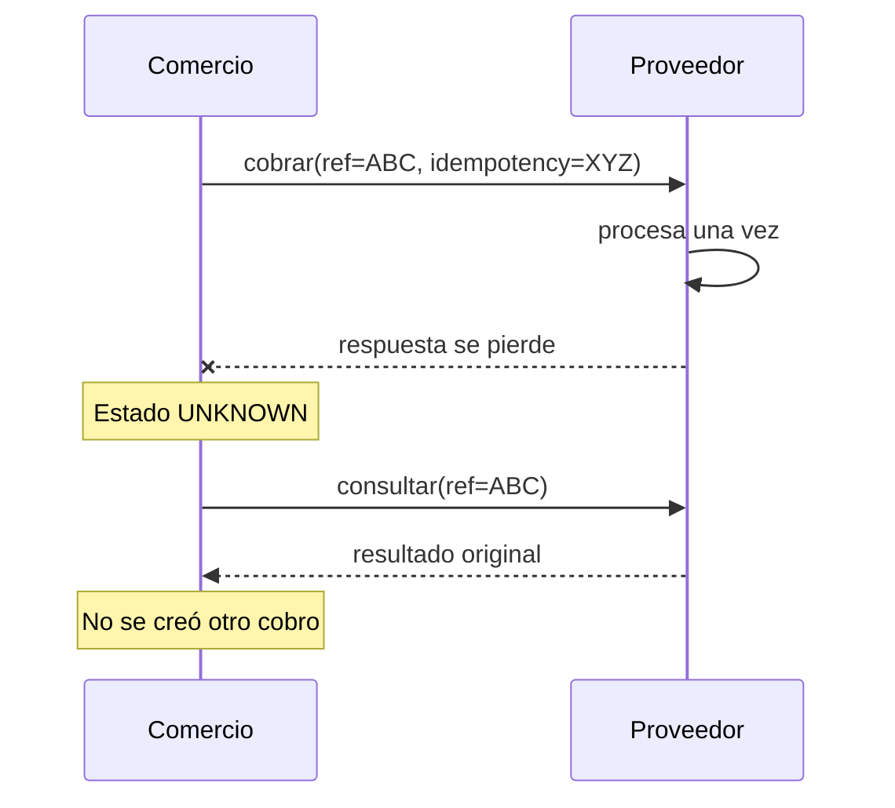
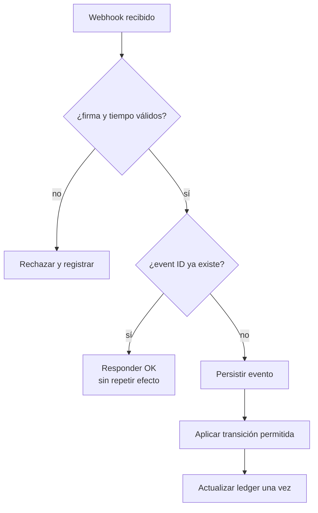
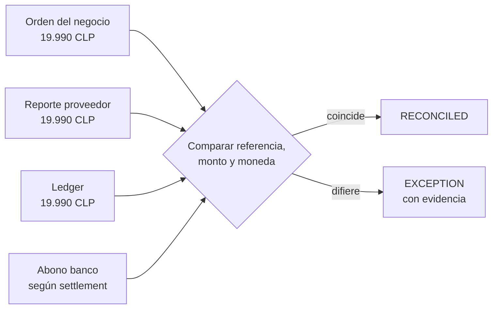
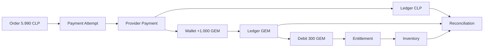
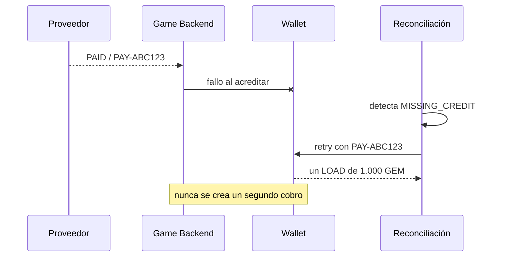

# 📊 Diagramas para comprender un pago

## 1. Quién hace qué

La frontera crítica está entre frontend y backend: el navegador puede iniciar la experiencia, pero no decide el monto final ni guarda la llave secreta.

## 2. Estado técnico frente a dinero

`AUTHORIZED` responde “¿el proveedor aprobó?”. `SETTLED` responde “¿el proveedor declaró el movimiento?”. `RECONCILED` responde “¿nuestras fuentes coinciden?”.

## 3. Timeout seguro

La consulta no es un segundo pago. Usa la referencia del primer intento para descubrir el hecho que ya pudo ocurrir.

## 4. Webhook repetido

Verificar la firma no deduplica. La deduplicación necesita memoria persistente del identificador del evento.

## 5. Conciliación

Conciliar no significa modificar datos hasta que cuadren; significa detectar, explicar y resolver diferencias sin borrar historia.

## Leyenda

## 6. Pago externo y entrega digital

El proveedor confirma dinero externo. El juego registra valor interno. Una compra posterior debita GEM y concede un derecho; ninguna flecha permite sumar CLP y GEM.

### Recuperación de fulfillment

## Leyenda

| Elemento | Significado |
|---|---|
| rectángulo | actor, dato o decisión observable |
| rombo | regla que puede producir resultados distintos |
| flecha | orden o mensaje; no prueba por sí sola movimiento de dinero |
| `UNKNOWN` | no existe evidencia suficiente para afirmar éxito o fallo |
| `EXCEPTION` | fuentes en conflicto; requiere resolución |
