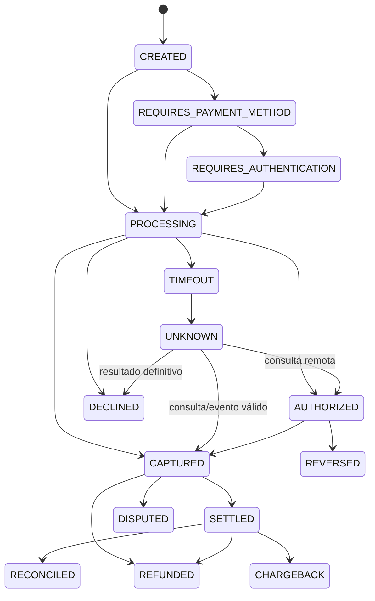
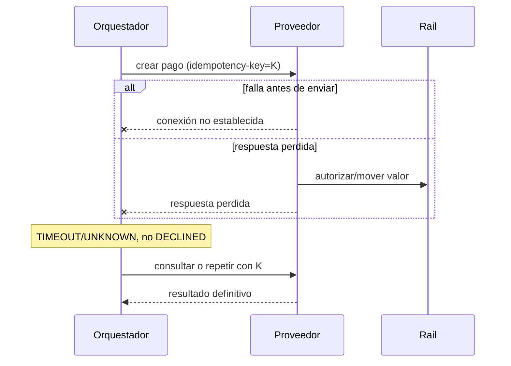

# 🔄 Ciclo de vida de un pago

## Tres objetos, no uno

Un diseño robusto separa la **orden comercial**, el **payment intent** (objetivo de cobrar o transferir) y cada **payment attempt** concreto contra un proveedor. Una orden puede tener varios intentos legítimos; lo peligroso es crear varios efectos por confundir retry técnico con una nueva decisión del usuario.

La máquina incluida es deliberadamente común, no universal. Cada adaptador debe traducir estados propios sin forzar equivalencias falsas.

## Fuentes de verdad

| Momento | Fuente autoritativa | Error habitual |
|---|---|---|
| orden creada | servicio de órdenes | usar el precio enviado por el navegador |
| operación aceptada | respuesta API autenticada | tratar `HTTP 200` como settlement |
| autenticación | resultado validado del mecanismo | confiar en parámetros del redirect |
| estado financiero | consulta servidor-a-servidor / evento autenticado | depender de una sola notificación |
| efecto contable | ledger | mutar el saldo sin asiento trazable |
| abono | reporte de settlement y cuenta bancaria | conciliar solo por checkout |

## Timeout y estado desconocido

Política segura: conservar la misma clave para la misma intención; consultar antes del retry si no hay garantía de idempotencia; usar backoff con jitter y presupuesto finito; impedir una nueva operación accidental; mantener `UNKNOWN` hasta evidencia definitiva.

## Webhooks

Los eventos pueden duplicarse, llegar tarde, fuera de orden o nunca. El consumidor debe verificar autenticidad sobre los bytes requeridos, validar timestamp/anti-replay si existe, deduplicar, persistir antes de reconocer, aplicar transiciones monotónicas, responder rápido y conservar polling/conciliación como red de seguridad.

## Autorización, captura y devolución

- `auth-only` reserva y permite capturar después.
- `sale/auth-capture` une los pasos.
- una captura parcial cobra parte; múltiples capturas dependen del esquema.
- una reversa intenta liberar/cancelar antes de settlement.
- un refund devuelve valor después y tiene estado e idempotencia propios.

Nunca modeles un refund poniendo el pago original en cero: destruye el historial.

## Invariantes mínimos

- monto decimal o unidades menores enteras; nunca `float` en el dominio financiero;
- moneda y redondeo explícitos;
- identificador interno separado del del proveedor;
- referencias únicas dentro de la ventana exigida;
- evidencia inmutable y auditable para cada efecto;
- ledger balanceado por moneda; FX mediante cuentas puente y tasa identificada;
- una transición terminal no retrocede sin operación compensatoria;
- `settled` y `reconciled` no se infieren de `captured`.

## Criterio de aceptación

Un flujo debe demostrar happy path, rechazo, timeout antes/después de enviar, retry idempotente, conflicto de payload, webhook duplicado/tardío, consulta, reversa o refund, trazabilidad sanitizada y cierre contra proveedor y abono.
