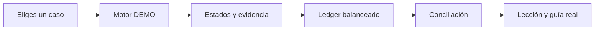

# 💳 Universal Payments Engineering Lab

Aprende qué ocurre realmente cuando alguien paga: orden, autenticación, autorización, resultado incierto, ledger, liquidación y conciliación.

> Esta página es documentación estática. Para ejecutar recorridos sin dinero debes usar el localhost.

## Empieza según tu objetivo

- [🧭 Primera vez: objetivo y recorrido de diez minutos](https://github.com/vladimiracunadev-create/universal-payments-engineering-lab/blob/main/docs/START_HERE.md)
- [🎓 Ruta de aprendizaje práctica](https://github.com/vladimiracunadev-create/universal-payments-engineering-lab/blob/main/docs/LEARNING_PATH.md)
- [📊 Diagramas explicativos](https://github.com/vladimiracunadev-create/universal-payments-engineering-lab/blob/main/docs/diagrams/PAYMENT_JOURNEY.md)
- [🧩 Los 28 casos, del concepto al desarrollo](https://github.com/vladimiracunadev-create/universal-payments-engineering-lab/blob/main/docs/payment-methods/CASEBOOK.md)
- [⚙️ Localhost y configuración por medio](https://github.com/vladimiracunadev-create/universal-payments-engineering-lab/blob/main/docs/LOCALHOST_AND_CONFIGURATION.md)
- [🌐 Qué hace y qué no hace GitHub Pages](https://github.com/vladimiracunadev-create/universal-payments-engineering-lab/blob/main/docs/GITHUB_PAGES.md)
- [🛠️ Implementar en una web](https://github.com/vladimiracunadev-create/universal-payments-engineering-lab/blob/main/docs/IMPLEMENTATION_GUIDE.md)
- [🗺️ Roadmap](https://github.com/vladimiracunadev-create/universal-payments-engineering-lab/blob/main/ROADMAP.md)

## La regla central

**DEMO enseña; SANDBOX prueba un contrato técnico; LIVE mueve valor bajo contrato y controles.** Una operación externa incierta nunca se reemplaza silenciosamente por una simulación.

## Qué ocurre en el laboratorio

La flecha muestra el orden de aprendizaje. No representa movimiento real de dinero.

## Localhost frente a esta página

| Localhost | GitHub Pages |
|---|---|
| ejecuta Python y `POST /api/demo/{familia}` | publica esta guía estática |
| crea recorridos deterministas | explica cómo instalar y aprender |
| puede leer variables del proceso | no tiene secretos ni backend |
| solo escucha en tu computador | es pública en internet |

