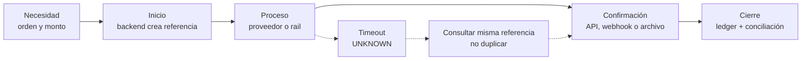
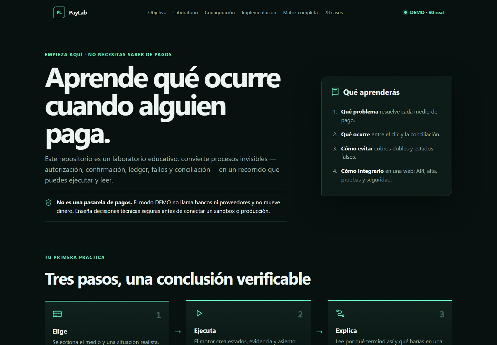

<section class="docs-hero">
  
Laboratorio ejecutable + manual de implementación

  <h1>Entiende un pago desde el primer clic hasta la conciliación.</h1>
  
PayLab convierte 28 modalidades de pago en recorridos legibles: quién inicia, quién procesa, qué prueba el resultado, qué ocurre si falla y qué debes construir antes de producción.

  

    <a class="primary-button" href="payment-methods/END_TO_END_MATRIX.html">Ver la tabla de los 28 casos</a>
    <a class="secondary-button" href="START_HERE.html">Hacer el recorrido de 10 minutos</a>
    <a class="secondary-button" href="https://vladimiracunadev-create.github.io/universal-payments-engineering-lab/downloads/universal-payments-engineering-lab.pdf">Descargar PDF navegable</a>
  

  
<strong>DEMO enseña</strong>SANDBOX conectaLIVE mueve valor

</section>

## Qué resuelve este repositorio

  <article>01<h3>Ver lo invisible</h3>
Estados, actores, evidencia, ledger y conciliación aparecen en pantalla.
</article>
  <article>02<h3>Practicar fallos</h3>
Timeout, webhook duplicado y diferencias se simulan sin dinero ni credenciales.
</article>
  <article>03<h3>Construirlo de verdad</h3>
Cada caso indica alta, API, variables, seguridad, pruebas y paso a producción.
</article>

## Un pago completo tiene cinco preguntas

  <b>1</b> ¿Qué necesita pagar?<i>→</i>
  <b>2</b> ¿Cómo se inicia?<i>→</i>
  <b>3</b> ¿Quién procesa?<i>→</i>
  <b>4</b> ¿Quién confirma?<i>→</i>
  <b>5</b> ¿Cómo se concilia?

> La pantalla de retorno no confirma un pago. La prueba llega desde una fuente autoritativa y el cierre exige explicar el dinero en ledger, proveedor y banco.

## Elige tu entrada

  <a href="payment-methods/END_TO_END_MATRIX.html"><small>Vista central + 28 guías individuales</small><strong>Tabla: 28 casos de comienzo a fin</strong>Cada fila abre un documento propio con ejemplo, actores, API, variables, pruebas, fallos, seguridad y LIVE.</a>
  <a href="START_HERE.html"><small>Primera vez</small><strong>Empieza aquí</strong>Objetivo, vocabulario y una práctica guiada de diez minutos.</a>
  <a href="LOCALHOST_AND_CONFIGURATION.html"><small>Ejecutar</small><strong>Localhost y variables</strong>Instalación, variables globales, credenciales por proveedor y callbacks.</a>
  <a href="IMPLEMENTATION_GUIDE.html"><small>Desarrollar</small><strong>Implementar en cualquier web</strong>Lenguaje, API, frontend, backend, datos, seguridad y operación.</a>
  <a href="payment-methods/CASEBOOK.html"><small>Profundizar</small><strong>Casebook pedagógico</strong>Modelo mental, primer incremento, evidencia y condiciones LIVE por caso.</a>
  <a href="diagrams/PAYMENT_JOURNEY.html"><small>Visualizar</small><strong>Diagramas explicados</strong>Estados, timeout, webhook duplicado, ledger y conciliación.</a>
  <a href="LEARNING_PATH.html"><small>Aprender</small><strong>Ruta por niveles</strong>De primer DEMO a un piloto productivo con criterios de salida.</a>
  <a href="GITHUB_PAGES.html"><small>Publicación</small><strong>GitHub Pages</strong>Qué publica, qué no ejecuta y por qué jamás contiene secretos.</a>
  <a href="FORMATS_AND_TRACEABILITY.html"><small>Correspondencia</small><strong>Markdown, HTML y PDF</strong>Qué genera cada formato y cómo abrir el mismo caso en los tres.</a>

## Localhost y GitHub Pages no son lo mismo

| | Localhost | GitHub Pages |
|---|---|---|
| Propósito | ejecutar y observar recorridos | leer, comparar y navegar la documentación |
| Runtime | Python + API + JavaScript | HTML/CSS/diagramas estáticos |
| Puede simular | sí, 28 casos × 4 escenarios | no |
| Variables | lee el proceso local | no usa credenciales |
| Webhooks | sólo con backend/túnel controlado | no puede recibirlos |
| Riesgo monetario | $0 en DEMO | $0; es documentación |

## Resultado esperado

Al terminar, debes poder señalar una fila de la [matriz completa](payment-methods/END_TO_END_MATRIX.md) y explicar: **qué inicia la operación, qué sistema tiene autoridad, cómo sobrevives a un estado incierto, qué asiento se genera y con qué reporte se concilia**. Si una de esas respuestas falta, la integración todavía no está lista.
