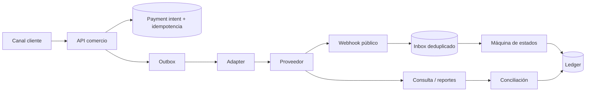

# Integraciones operables: contrato común

Este directorio contiene código de integración reutilizable, no simuladores. Cada adaptador construye solicitudes contra la API REST oficial, valida entradas, evita `float`, exige HTTPS, impide inyección en rutas y deja explícitas las operaciones monetarias. Los tests son locales y deterministas; una prueba local **no sustituye** las credenciales, habilitación comercial, certificación ni conciliación de una cuenta real.

## Casos implementados

| Caso | Código | Guía de punta a punta | Estado honesto |
|---|---|---|---|
| Khipu Instant Payments v3 | `adapters/khipu.py` | [Khipu](KHIPU.md) | requiere cuenta y credenciales |
| Mercado Pago Payments API | `adapters/mercadopago.py` | [Mercado Pago](MERCADO_PAGO.md) | requiere aplicación y credenciales |
| Transbank Webpay Plus | `adapters/transbank.py` | [Webpay Plus](TRANSBANK_WEBPAY_PLUS.md) | requiere comercio y puesta en producción |
| Transbank Oneclick Mall | `adapters/transbank_oneclick.py` | [Oneclick: inscripción y cobro](TRANSBANK_ONECLICK.md) | requiere producto contratado y certificación |

## Arquitectura que debe envolver al adaptador

El adapter no debe decidir el estado contable, persistir secretos ni responder al cliente antes de guardar el intento. La aplicación anfitriona aporta una transacción de base de datos, `inbox/outbox`, control de concurrencia, observabilidad, retención y un gestor de secretos.

## Contrato operativo obligatorio

1. Crear una referencia interna inmutable y una clave de idempotencia ligada al mismo payload.
2. Persistir intención, monto, moneda, provider y estado antes de tocar la red.
3. Invocar con timeout finito. No reintentar una mutación por timeout: marcar `UNKNOWN`.
4. Confirmar por API o webhook autenticado; el retorno del navegador es solo navegación.
5. Deduplicar eventos por identificador del proveedor y conservar su hash/auditoría sanitizada.
6. Aplicar transiciones con compare-and-swap; jamás permitir que un evento viejo degrade un estado final.
7. Registrar en ledger mediante doble partida con referencia única.
8. Conciliar negocio ↔ proveedor ↔ liquidación bancaria; abrir excepción si difieren.
9. Reembolso/anulación es una nueva operación idempotente, no una edición del pago original.
10. Secretos separados por ambiente, rotados y nunca expuestos al browser, logs o repositorio.

## Taxonomía de fallas

| Condición | Significado financiero | Respuesta segura |
|---|---|---|
| 4xx de validación | solicitud rechazada | corregir; no repetir igual |
| 401/403 | secreto, alcance o comercio inválido | detener integración y alertar |
| 409/422 | conflicto/regla de negocio | consultar operación y resolver por contrato |
| 429/5xx antes de certeza | puede ser transitorio | GET/backoff; mutaciones solo con idempotencia comprobada |
| timeout/DNS/TLS tras enviar | resultado desconocido | `UNKNOWN`, consultar; no cobrar de nuevo |
| webhook inválido/viejo | no confiable o replay | responder 4xx, no mutar estado, alertar por volumen |
| navegador no retorna | experiencia incompleta | recuperar por status/webhook, no declarar rechazo |
| proveedor dice pagado y ledger no | incidente interno | bloquear fulfillment automático hasta reparar asiento |
| ledger cuadra y banco no liquida | excepción settlement | caso operativo con adquirente/PSP |

## Límites de seguridad

- Los `BASE_URL` son configuración de despliegue inmutable; nunca llegan desde una petición del usuario.
- `JsonHTTPClient` exige HTTPS, limita el body a 1 MiB, exige objeto JSON y clasifica errores reintentables.
- No implementa reintentos automáticos: el dueño de la operación debe conocer idempotencia y estado.
- Khipu y Mercado Pago tienen verificación HMAC con ventana anti-replay; se firma el body/manifiesto exacto.
- El código no recibe PAN, CVV, PIN ni track data. Use páginas/tokenización alojadas por el proveedor para reducir alcance PCI DSS.
- Redacte `Authorization`, API keys, RUT/documento, email, cuenta bancaria, `tbk_user`, tokens y cuerpos completos.

## Adaptación a cualquier entorno

Los adaptadores solo dependen de Python estándar e inyección de `http`; funcionan en VM, contenedor, serverless o Kubernetes. En producción sustituya el transporte si necesita proxy corporativo, mTLS o tracing, conservando el mismo contrato. Docker no es requisito del código; será útil cuando se agreguen Postgres, colas y pruebas de concurrencia reales.

**Contratos revisados:** 7 de septiembre de 2026. Antes de desplegar, compare endpoints, campos y credenciales con el contrato vigente de su comercio.
