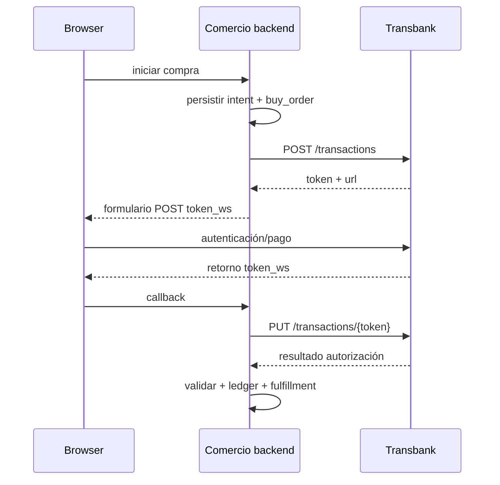

# Transbank Webpay Plus: integración de punta a punta

## Contratación y puesta en producción

El comercio debe contratar Webpay, obtener código de comercio y credencial REST, integrar en el ambiente oficial, completar pruebas exigidas y solicitar el paso a producción. Mantenga credenciales y URLs separadas; no copie credenciales públicas de integración a producción. Fuentes: [cómo empezar](https://www.transbankdevelopers.cl/documentacion/como_empezar), [ambientes y credenciales](https://www.transbankdevelopers.cl/documentacion/como_empezar#ambientes-y-credenciales) y [referencia Webpay Plus](https://www.transbankdevelopers.cl/referencia/webpay).

## Flujo real



```python
from payments_lab.adapters.transbank import WebpayPlusProvider

webpay = WebpayPlusProvider()
created = webpay.create({
    "buy_order": "ORD-20260907-001",
    "session_id": "session-4f5f",
    "amount": 19990,
    "return_url": "https://shop.example/pagos/webpay/retorno",
})
# POST browser a created['url'] con token_ws=created['token']
result = webpay.commit(created["token"])
status = webpay.get(created["token"])
```

Solo `response_code == 0` junto con status autorizado y coincidencia de `buy_order`, `amount` y contexto permite cumplir la orden. La URL de retorno y presencia de `token_ws` no prueban pago. Guarde el token en servidor, vinculado a la orden y de un solo uso lógico.

## Abandono, timeout y recuperación

- Sin retorno: consultar status por token; expirar la experiencia, no inventar rechazo.
- Timeout al crear: el `buy_order` queda `UNKNOWN`; investigar antes de crear otro intento.
- Timeout al commit: consultar status. Repetir commit sin contrato puede cambiar el resultado o producir error.
- Retorno abortado (`TBK_TOKEN`) o campos inesperados: registrar sanitizado, cerrar experiencia y consultar si existe token conocido.
- Evento fuera de orden: compare-and-swap y precedencia de estados; jamás bajar `AUTHORIZED` a `INITIALIZED`.
- Reembolso: nueva orden operativa y contable; validar monto disponible, segregación de funciones y respuesta (`REVERSED`/`NULLIFIED` según contrato).

## Seguridad y ciberseguridad

Use backend-to-backend, TLS moderno, HSTS y cookies `Secure`, `HttpOnly`, `SameSite`. Proteja inicio/callback con sesión propia y vinculación estricta a la orden; no use datos del browser para monto o comercio. Secretos en KMS, IAM mínimo y rotación. WAF/rate limit, CSP y anti-CSRF en endpoints del comercio. No haga certificate pinning rígido: gestione confianza TLS del sistema y renovaciones. Transbank recomienda cifrado, WAF/IPS, componentes actualizados, escaneo trimestral, monitoreo y auditoría externa.

## Operación y conciliación

Registre token hash/últimos caracteres, buy order, monto, estado, response code, authorization code sanitizado, tipo/últimos dígitos permitidos y timestamps. Concilie con reportes/abonos de Transbank incluyendo comisiones, IVA, anulaciones y fecha de abono. Alertas: UNKNOWN envejecido, caída de aprobación, latencia commit, 401/403, discrepancias y reembolsos manuales.

## Checklist de producción

Dominio activo y HTTPS; comercio/credencial de producción; prueba de todos los códigos; callback idempotente; consulta de rescate; controles de monto/referencia; política de expiración; reembolsos con doble control; conciliación diaria; respaldo y plan de incidente; aprobación de negocio, seguridad y cumplimiento.
