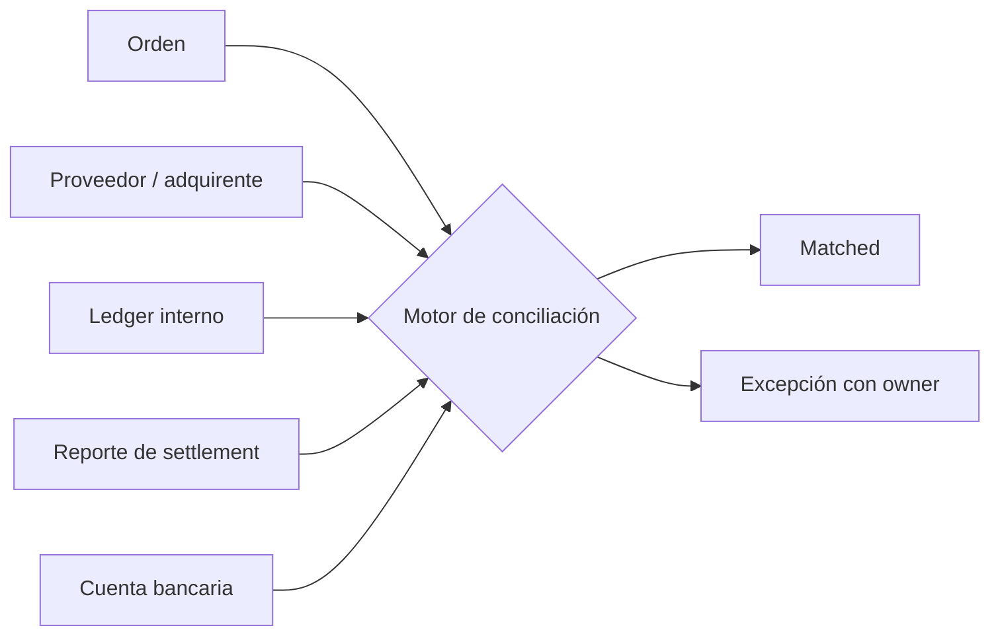

# 🧮 Conciliación, clearing y settlement

## Las cinco fuentes

Conciliar solo API contra DB confirma coherencia técnica, no que el dinero llegó. El cierre financiero necesita el reporte de liquidación y el abono/débito bancario.

## Claves y tolerancias

Prioriza identificadores exactos: provider transaction, merchant reference, capture/refund ID, batch y bank reference. Luego monto bruto, fee, impuesto, reserva, neto, moneda, fecha de proceso y fecha valor. Las tolerancias deben corresponder a redondeo/FX documentado; nunca una tolerancia amplia para esconder diferencias.

## Modelo de diferencias

| Tipo | Ejemplo | Acción |
|---|---|---|
| `LOCAL_ONLY` | intento local sin registro remoto | consultar, revisar pre-envío, cerrar o escalar |
| `REMOTE_ONLY` | proveedor cobró sin registro local | contener payout, reconstruir intento y contabilizar |
| `AMOUNT_MISMATCH` | captura/abono difiere | revisar partial capture, tip, fee, FX o error |
| `CURRENCY_MISMATCH` | moneda inesperada | detener y revisar routing/configuración |
| `STATE_MISMATCH` | local captured, remoto reversed | sincronizar mediante transición compensatoria |
| `FEE_MISMATCH` | MDR/fee distinto | verificar pricing, impuestos y lote |
| `SETTLEMENT_MISSING` | capturado sin abono esperado | abrir caso por lote y antigüedad |
| `DUPLICATE` | dos referencias para una intención | evaluar doble efecto y refund controlado |

## Ledger ilustrativo

Venta por 10.000 CLP con fee de 300 CLP:

| Cuenta | Débito | Crédito |
|---|---:|---:|
| receivable del adquirente | 10.000 | 0 |
| venta/pasivo del comercio | 0 | 10.000 |

Al liquidar:

| Cuenta | Débito | Crédito |
|---|---:|---:|
| banco | 9.700 | 0 |
| gasto/comisión | 300 | 0 |
| receivable del adquirente | 0 | 10.000 |

El chart real depende del rol, contabilidad y regulación. Refund, chargeback, reserva y payout son nuevos journals vinculados, no mutaciones del asiento original.

## Pipeline diario

1. Ingerir archivos/API de proveedor de forma inmutable y registrar checksum.
2. Validar esquema, zona horaria, moneda, signo y completitud.
3. Normalizar sin perder el registro crudo.
4. Hacer matching determinista y luego reglas secundarias auditables.
5. Crear excepciones con severidad, owner y SLA.
6. Comparar totales de control antes/después.
7. Vincular settlement con movimiento bancario.
8. Publicar aging y bloquear payouts cuando el riesgo lo requiera.
9. Resolver mediante evidencia/asiento compensatorio.
10. Retener artefactos según política.

## Controles

- segregación entre quien integra, concilia y aprueba ajuste/payout;
- archivos cifrados, firma/checksum y acceso mínimo;
- invariantes de cantidad y suma por moneda/lote;
- rerun idempotente;
- no cerrar automáticamente diferencias solo por antigüedad;
- dashboard de monto y edad, no solo conteo;
- evidencia del settlement final conforme a las reglas del sistema. Los [PFMI de CPMI-IOSCO](https://www.bis.org/committees/cpmi/pfmi/overview) son la referencia internacional para infraestructuras de mercado.
