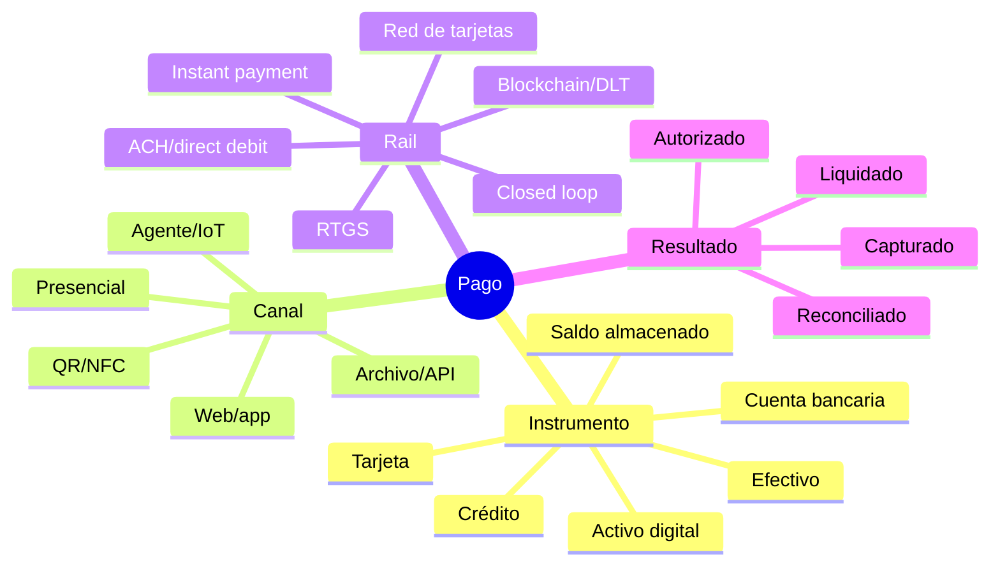
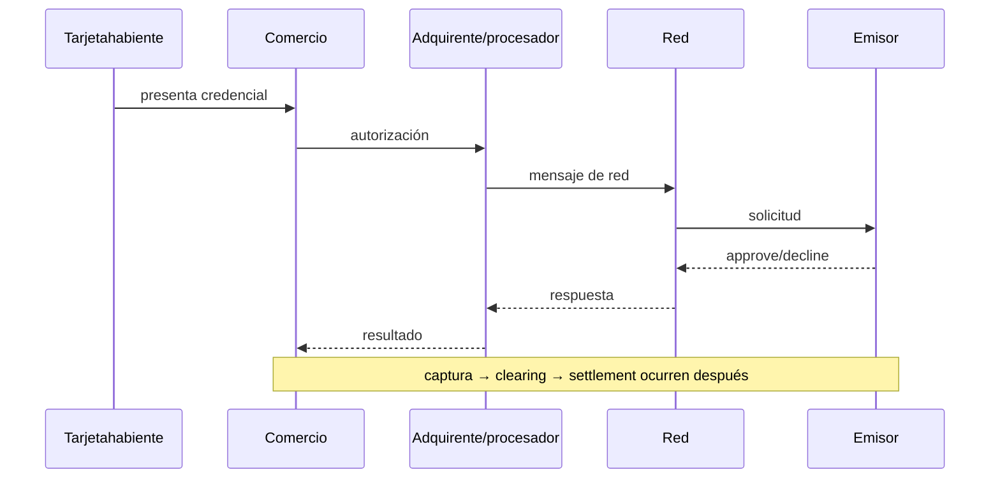

# 💳 Catálogo universal de medios de pago

## Cómo leer el mapa

No existe una lista cerrada de marcas que equivalga a “todos los pagos”. Sí existe una taxonomía completa y extensible que permite ubicar cualquier producto nuevo según cinco ejes:

1. **instrumento**: de dónde nace la orden o el valor;
2. **canal**: dónde interactúan pagador y comercio;
3. **rail/esquema**: reglas y participantes que transportan la instrucción;
4. **modelo de fondos**: push/pull, prefunded/crédito, bruto/neto, inmediato/diferido;
5. **operación**: autenticar, autorizar, capturar, revertir, devolver, disputar y liquidar.

Una wallet no siempre es un rail: puede presentar una tarjeta tokenizada. Un QR no siempre es un medio: puede codificar una transferencia A2A, una tarjeta o saldo cerrado. Una API no determina finalidad: solo expone capacidades del sistema subyacente.

## Matriz maestra

| Familia | Variantes y ejemplos | Modelo | Operaciones esenciales | Riesgo dominante | Acceso real |
|---|---|---|---|---|---|
| Efectivo | caja, cash-in/out, depósito, corresponsal | bearer, liquidación física | recibir, validar, dar cambio, depositar, cuadrar | robo, falsificación, descuadre | caja/procedimiento físico |
| Papel | cheque, vale vista, giro | pull o valor garantizado según instrumento | emitir, presentar, compensar, devolver | fondos insuficientes, fraude documental | banco/cámara |
| Tarjetas | crédito, débito, prepago, comercial | pull sobre cuenta/línea/saldo | auth, capture, reversal, refund, dispute | fraude, chargeback, datos de cuenta | adquirente + certificación |
| Transferencia bancaria | TEF, wire, transferencia programada | push account-to-account | instruir, validar beneficiario, enviar, devolver, conciliar | beneficiario erróneo, APP fraud | banco/PSP autorizado |
| ACH / batch | credit, debit, payroll, bulk | lotes netos, push/pull | originar, aceptar/rechazar, return, settlement | devoluciones tardías, archivos duplicados | ODFI/banco/operador |
| Débito directo | PAC, ACH debit, SEPA DD | pull con mandato | crear mandato, cobrar, revocar, devolver | consentimiento y disputas | acreedor patrocinado |
| Pago instantáneo | Pix, UPI, SPEI, FedNow, RTP, FPS, SCT Inst | push 24x7, finalidad rápida según rail | push, status, return, request-to-pay | fraude autorizado, irrevocabilidad | participante/banco/PSP |
| Wallet tokenizada | Apple Pay, Google Pay, Click to Pay | credencial de tarjeta tokenizada | provisionar token, autenticar, pagar, lifecycle | device/account takeover | issuer/network/acquirer |
| Wallet con saldo | e-money, prepaid account, closed loop | saldo prefundado | top-up, pay, P2P, withdraw, redeem | custodia, safeguarding, AML | emisor/licencia |
| Mobile money | cuenta asociada a teléfono/agente | saldo electrónico | cash-in/out, P2P, merchant, bill pay | agente, SIM swap, liquidez | operador autorizado |
| QR | estático/dinámico; MPM/CPM | canal sobre A2A, wallet o tarjeta | generar, escanear, resolver, confirmar | sustitución de QR, monto adulterado | esquema/app compatible |
| NFC/contactless | EMV, wallet, closed loop, transit | interfaz de proximidad | tap, CVM, cryptogram, auth | relay, terminal comprometido | dispositivo/terminal certificado |
| Link / invoice | payment link, request-to-pay, factura | iniciación sobre otro instrumento | emitir, expirar, pagar, consultar | phishing, enlace reutilizado | PSP/banco |
| Voucher / cash network | boleto, cupón, referencia para caja | push diferido | emitir referencia, pagar, expirar, notificar | pago tardío, referencia duplicada | red de recaudación |
| Contra entrega | efectivo o terminal al recibir | conditional / presencial | despachar, cobrar, devolver, cuadrar | rechazo y efectivo en ruta | logística |
| BNPL / cuotas | pay-in-4, crédito POS, installment card | crédito al consumidor | elegibilidad, disclosure, schedule, repay, refund | affordability, mora, refund complejo | lender/proveedor regulado |
| Gift / loyalty | gift card, puntos, store credit | closed loop / stored value | issue, activate, redeem, expire, breakage | fraude de saldo, reglas contables | emisor/comercio |
| Carrier billing | cargo a factura/saldo móvil | cobro por operador | authorize, charge, reverse, settle | fraude/SIM, comisiones | operador/agregador |
| Marketplace | split, connected accounts, escrow condicionado | multi-parte | onboard/KYB, collect, allocate, payout, reserve | responsabilidad, fondos de terceros | PSP con producto platform |
| B2B | virtual cards, purchasing cards, invoice, EDI | tarjeta/crédito/transferencia | approve, issue, match PO, pay, reconcile | controles de gasto, fraude de factura | banco/issuer/ERP |
| Internacional | SWIFT/corresponsalía, remesa, card cross-border | cadena multi-banco y FX | quote, screen, route, settle, trace | sanciones, fees, FX, datos | instituciones reguladas |
| Alto valor | RTGS/LBTR, wholesale | bruto en dinero de banco central | queue, liquidity, settle, finality | liquidez y riesgo sistémico | participante autorizado |
| Activos digitales | Bitcoin, Lightning, stablecoin, tokenized deposits | UTXO/account/channel/DLT | construct, sign, broadcast, confirm, custody | claves, volatilidad, forks, regulación | wallet/custodio/ramp autorizado |
| CBDC | retail/wholesale según diseño | pasivo de banco central | depende del piloto/esquema | privacidad, resiliencia, acceso | jurisdicción/piloto |
| M2M / IoT | peajes, carga EV, movilidad, usage-based | credencial delegada | meter, authorize, cap, settle | identidad de dispositivo, runaway spend | rail + dispositivo |
| Agentic | agente compra bajo mandato/presupuesto | rail existente + autoridad delegada | quote, approve, pay, evidence, revoke | exceso de autoridad, prompt injection | proveedor + control humano |

## 1. Efectivo y papel

### Efectivo

El efectivo ofrece finalidad práctica inmediata entre las partes, pero desplaza el problema a custodia, autenticidad y transporte. Un sistema serio registra apertura de caja, movimientos, retiros parciales, arqueo por denominación, diferencias, depósito y cadena de custodia. El evento `cash_received` no equivale a `bank_deposit_reconciled`.

### Cheques y documentos

Separar emisión, presentación, clearing, liquidación y devolución. Un cheque recibido puede figurar como valor en tránsito, no como fondos disponibles. La digitalización de imagen cambia el canal de presentación, no elimina las reglas del instrumento.

## 2. Tarjetas

Distinciones obligatorias:

- **card-present** usa terminal y, normalmente, EMV chip/contactless; **CNP** no prueba presencia física.
- **CVM** (PIN, firma, biometría o no-CVM) verifica al portador bajo reglas del kernel/esquema.
- **3-D Secure** autentica en comercio remoto; no reemplaza autorización.
- **network tokenization** sustituye PAN por token con dominio de uso y cryptogramas; token de PSP y token de red no son sinónimos.
- **credential-on-file** exige distinguir customer-initiated y merchant-initiated, consentimiento, indicador y referencia de la transacción inicial.
- **incremental auth**, partial/multiple capture, tips, no-show y offline approval existen solo donde las reglas los admiten.

Tecnologías: ISO 8583 o protocolos propietarios de red, EMV L1/L2/L3, APDU, kernels, PCI DSS, PCI PTS, PCI PIN, P2PE, 3DS, tokenización, HSM/KMS y controles de fraude. Consulta las [especificaciones EMVCo](https://www.emvco.com/emv-technologies/) y la [biblioteca PCI SSC](https://www.pcisecuritystandards.org/document_library/).

## 3. Account-to-account

Una transferencia **push** la inicia el pagador; un débito **pull** lo inicia el beneficiario amparado por mandato. Esta diferencia cambia fraude, disputas, revocación y responsabilidad.

### Rails instantáneos como estudios de diseño

| Rail | Jurisdicción / operador | Rasgo pedagógico | Fuente oficial |
|---|---|---|---|
| Pix | Brasil / Banco Central do Brasil | QR, alias/DICT, API Pix, devolución y Pix Automático | [normas y manuales](https://www.bcb.gov.br/estabilidadefinanceira/pix-normas) |
| UPI | India / NPCI | VPA, apps PSP, push/pull, QR e intent | [UPI](https://www.npci.org.in/product/upi/about-upi) |
| SPEI | México / Banco de México | RTGS 24/7 y comprobante CEP | [información oficial](https://www.banxico.org.mx/servicios/spei_-informacion-banco-mex.html) |
| FedNow | EE. UU. / Federal Reserve | ISO 20022, A2A, liquidez y 24x7x365 | [FedNow](https://www.frbservices.org/financial-services/fednow/about.html) |
| RTP | EE. UU. / The Clearing House | instantáneo, ISO 20022, request for payment | [RTP](https://www.theclearinghouse.org/payment-systems/rtp) |
| Faster Payments | Reino Unido / Pay.UK | pagos retail en segundos y disponibilidad continua | [Faster Payments](https://www.wearepay.uk/what-we-do/payment-systems/faster-payment-system/) |
| SCT Inst | SEPA / European Payments Council | transferencia euro disponible en segundos, rulebook versionado | [rulebook vigente](https://www.europeanpaymentscouncil.eu/what-we-do/epc-payment-schemes/sepa-instant-credit-transfer/sepa-instant-credit-transfer-rulebook) |

No se implementa un rail conectando directamente a una URL pública: onboarding, identidad institucional, mensajería, certificados, liquidez, operaciones y cumplimiento son parte del producto.

## 4. Débitos, mandatos y recurrencia

El objeto central es el mandato: quién consintió, qué acreedor puede cobrar, frecuencia, límites, vigencia y revocación. Debe sobrevivir separado de los cobros individuales. Modelar prenotificación, cutoffs, returns, reintentos permitidos, representación y reembolso. El scheduler no decide por sí solo si el cobro es válido.

## 5. Wallets, QR y proximidad

Clasifica una wallet por la fuente de fondos:

- **pass-through**: presenta una tarjeta o cuenta tokenizada;
- **stored value/e-money**: mantiene saldo emitido por un proveedor;
- **orquestadora**: elige entre instrumentos;
- **custodial crypto**: controla claves/activos por cuenta del usuario.

En QR **merchant-presented** el pagador escanea datos del comercio; en **consumer-presented**, el comercio lee la credencial del cliente. Estático exige introducir/validar monto; dinámico puede vincular orden, monto y expiración. Validar dominio, comercio, moneda, monto, expiración y firma cuando exista.

## 6. Crédito alternativo y valor cerrado

BNPL es crédito, aunque la experiencia parezca un botón. Requiere elegibilidad, disclosures, calendario, mora, refund proporcional y reporting aplicable. Gift cards, store credit y puntos requieren ledger por programa, reglas de expiración/escheatment según jurisdicción y protección contra account takeover.

## 7. Marketplaces y plataformas

Cobrar para terceros altera onboarding, KYB/KYC, beneficiario efectivo, reservas, payout, impuestos, chargebacks y posible custodia. El ledger debe separar fondos del comercio, fees de plataforma, reservas y pasivos por payout. Un `split` en JSON no resuelve el estatus regulatorio.

## 8. Internacional, FX y alto valor

En pagos transfronterizos separar moneda de origen/destino, quote y expiración, tasa, markup, comisiones `OUR/SHA/BEN` cuando apliquen, bancos intermediarios, screening, tracking, fecha valor y finalidad. SWIFT es mensajería/red; no es el activo de liquidación. RTGS/LBTR prioriza finalidad y riesgo de liquidez, no experiencia retail.

## 9. Activos digitales

La operación depende del modelo:

- autocustodia vs custodia;
- on-chain vs canal/capa secundaria;
- confirmación probabilística vs finalidad definida por protocolo;
- activo volátil, stablecoin, depósito tokenizado o CBDC;
- on/off-ramp y obligaciones regulatorias.

Nunca almacenar una seed o private key en `.env` compartido, logs o fixtures. Definir política de confirmaciones/reorg, allowlist de activos/redes, control de direcciones, fees y reconciliación on-chain con el ledger interno.

## 10. Pagos agentic, M2M e IoT

Un agente no debe recibir autoridad financiera ilimitada. El mandato necesita sujeto, propósito, comercio/categoría permitidos, monto por operación y período, moneda, vigencia, autenticación reforzada, revocación y evidencia legible. Una confirmación humana puede ser obligatoria para primera compra, cambio de beneficiario o umbral. Prompt e instrucciones externas son entrada no confiable; nunca sustituyen la policy engine.

## Contrato para agregar un nuevo medio

Antes de marcarlo operativo documenta:

1. roles, elegibilidad contractual y entorno oficial;
2. modelo de fondos y punto de finalidad;
3. operaciones y matriz de estados;
4. autenticación, secretos, firma y verificación de eventos;
5. idempotencia, referencias y semántica de retry;
6. timeout/unknown y recuperación;
7. refund, reversal, dispute/return;
8. fees, FX, clearing, settlement y reportes;
9. modelo de ledger y reconciliación;
10. sandbox/certificación, evidencia sanitizada y criterios de aprobación.
