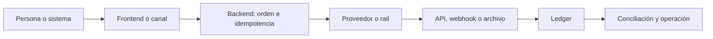

# Tabla pedagógica: los 28 casos de comienzo a fin

No necesitas conocer términos de pagos. Busca una necesidad y lee su fila de izquierda a derecha. Cada columna es una pregunta concreta que una integración real debe responder.

<b>1</b> Necesidad<i>→</i><b>2</b> Inicio<i>→</i><b>3</b> Proceso<i>→</i><b>4</b> Confirmación<i>→</i><b>5</b> Cierre

<section class="matrix-example">
Ejemplo en 30 segundos
<h2>Una compra de $19.990 con Webpay</h2><ol><li><b>Inicio:</b> tu backend crea una orden y una referencia.</li><li><b>Proceso:</b> Transbank presenta la pantalla y procesa la tarjeta.</li><li><b>Confirmar:</b> tu backend ejecuta <code>commit</code>; volver al navegador no basta.</li><li><b>Cerrar:</b> el ledger registra una sola operación y después se concilia con el reporte.</li><li><b>Si hay timeout:</b> queda <code>UNKNOWN</code> y se consulta; no se cobra otra vez a ciegas.</li></ol></section>

## Aquí comienza la tabla: 28 casos

Escribe una palabra para reducir las filas. Por ejemplo: **presencial**, **recurrente**, **Chile**, **banco** o **agente**.

<label class="docs-filter" for="docs-case-filter">Buscar un caso<input id="docs-case-filter" type="search" placeholder="Ej.: Webpay, recurrente, banco"></label>

Mostrando 28 de 28 casos.

<table id="docs-case-table" class="journey-table">
<thead><tr>
<th scope="col">#</th>
<th scope="col">Caso</th>
<th scope="col">¿Para qué sirve?</th>
<th scope="col">1 · Inicio</th>
<th scope="col">2 · Proceso</th>
<th scope="col">3 · Confirmar</th>
<th scope="col">4 · Cerrar</th>
<th scope="col">Si falla</th>
<th scope="col">Para hacerlo real</th>
</tr></thead>
<tbody>
<tr data-search="efectivo y caja cobro presencial sin red electrónica. cajero abre turno y registra monto. recibe efectivo y emite recibo único. cuenta caja con segundo responsable. deposita y concilia recibos contra banco. faltante/sobrante queda como excepción; nunca se borra. caja web + roles + impresora + postgresql + archivo bancario.">
<td class="case-number">01</td>
<th scope="row"><a href="cases/cash.html">Efectivo y caja</a><small><a href="cases/cash.md">abrir guía .md</a></small></th>
<td>Cobro presencial sin red electrónica.</td>
<td>Cajero abre turno y registra monto.</td>
<td>Recibe efectivo y emite recibo único.</td>
<td>Cuenta caja con segundo responsable.</td>
<td>Deposita y concilia recibos contra banco.</td>
<td class="failure-cell">Faltante/sobrante queda como excepción; nunca se borra.</td>
<td class="real-cell">Caja web + roles + impresora + PostgreSQL + archivo bancario.</td>
</tr>
<tr data-search="cheques y órdenes en papel cheque u orden física con cobro diferido. registra emisor, monto, fecha e imagen restringida. entrega el documento al banco y queda pending. el banco informa cobro o devolución. aplica asiento final y concilia cartola. cheque devuelto revierte disponibilidad y abre cobranza. backoffice + custodia + api/archivo bancario + reglas locales.">
<td class="case-number">02</td>
<th scope="row"><a href="cases/paper.html">Cheques y órdenes en papel</a><small><a href="cases/paper.md">abrir guía .md</a></small></th>
<td>Cheque u orden física con cobro diferido.</td>
<td>Registra emisor, monto, fecha e imagen restringida.</td>
<td>Entrega el documento al banco y queda PENDING.</td>
<td>El banco informa cobro o devolución.</td>
<td>Aplica asiento final y concilia cartola.</td>
<td class="failure-cell">Cheque devuelto revierte disponibilidad y abre cobranza.</td>
<td class="real-cell">Backoffice + custodia + API/archivo bancario + reglas locales.</td>
</tr>
<tr data-search="tarjetas pago inmediato con tarjeta física o digital. backend crea order/payment intent. psp tokeniza, autentica y autoriza; luego captura. webhook o consulta confirma la captura. adquirente liquida; comercio concilia fees y disputas. timeout queda unknown; chargeback se registra por separado. checkout alojado + rest api + webhook + postgresql + pci dss.">
<td class="case-number">03</td>
<th scope="row"><a href="cases/cards.html">Tarjetas</a><small><a href="cases/cards.md">abrir guía .md</a></small></th>
<td>Pago inmediato con tarjeta física o digital.</td>
<td>Backend crea order/payment intent.</td>
<td>PSP tokeniza, autentica y autoriza; luego captura.</td>
<td>Webhook o consulta confirma la captura.</td>
<td>Adquirente liquida; comercio concilia fees y disputas.</td>
<td class="failure-cell">Timeout queda UNKNOWN; chargeback se registra por separado.</td>
<td class="real-cell">Checkout alojado + REST API + webhook + PostgreSQL + PCI DSS.</td>
</tr>
<tr data-search="transbank webpay plus tarjetas en chile mediante checkout alojado. backend crea transacción webpay y guarda token. cliente paga en transbank y vuelve al comercio. backend ejecuta commit una sola vez; status recupera timeout. reporte transbank se concilia con ledger y banco. retorno sin commit no prueba pago; unknown se consulta. contrato transbank + rest webpay + callback + credenciales separadas.">
<td class="case-number">04</td>
<th scope="row"><a href="cases/chile-webpay.html">Transbank Webpay Plus</a><small><a href="cases/chile-webpay.md">abrir guía .md</a></small></th>
<td>Tarjetas en Chile mediante checkout alojado.</td>
<td>Backend crea transacción Webpay y guarda token.</td>
<td>Cliente paga en Transbank y vuelve al comercio.</td>
<td>Backend ejecuta commit una sola vez; status recupera timeout.</td>
<td>Reporte Transbank se concilia con ledger y banco.</td>
<td class="failure-cell">Retorno sin commit no prueba pago; UNKNOWN se consulta.</td>
<td class="real-cell">Contrato Transbank + REST Webpay + callback + credenciales separadas.</td>
</tr>
<tr data-search="transbank oneclick mall cobros posteriores a una tarjeta previamente inscrita. start/finish inscribe y entrega tbk_user. backend autoriza por tienda usando token protegido. status confirma; webhook/consulta actualiza la orden. conciliar autorizaciones, refunds y liquidación por tienda. baja o rechazo no permite reutilizar una inscripción inválida. contrato oneclick + rest + vault cifrado + consentimiento y límites.">
<td class="case-number">05</td>
<th scope="row"><a href="cases/chile-oneclick.html">Transbank Oneclick Mall</a><small><a href="cases/chile-oneclick.md">abrir guía .md</a></small></th>
<td>Cobros posteriores a una tarjeta previamente inscrita.</td>
<td>Start/finish inscribe y entrega tbk_user.</td>
<td>Backend autoriza por tienda usando token protegido.</td>
<td>Status confirma; webhook/consulta actualiza la orden.</td>
<td>Conciliar autorizaciones, refunds y liquidación por tienda.</td>
<td class="failure-cell">Baja o rechazo no permite reutilizar una inscripción inválida.</td>
<td class="real-cell">Contrato Oneclick + REST + vault cifrado + consentimiento y límites.</td>
</tr>
<tr data-search="khipu transferencia cuenta a cuenta iniciada desde el comercio. backend crea pago khipu con referencia y callbacks. cliente autoriza en su experiencia bancaria. webhook autenticado o consulta confirma el payment id. abono bancario se concilia contra la misma referencia. callback perdido se recupera consultando; nunca por captura de pantalla. cuenta cobrador + payment api + webhook https + llave en secret manager.">
<td class="case-number">06</td>
<th scope="row"><a href="cases/chile-khipu.html">Khipu</a><small><a href="cases/chile-khipu.md">abrir guía .md</a></small></th>
<td>Transferencia cuenta a cuenta iniciada desde el comercio.</td>
<td>Backend crea pago Khipu con referencia y callbacks.</td>
<td>Cliente autoriza en su experiencia bancaria.</td>
<td>Webhook autenticado o consulta confirma el payment ID.</td>
<td>Abono bancario se concilia contra la misma referencia.</td>
<td class="failure-cell">Callback perdido se recupera consultando; nunca por captura de pantalla.</td>
<td class="real-cell">Cuenta cobrador + Payment API + webhook HTTPS + llave en secret manager.</td>
</tr>
<tr data-search="mercado pago checkout regional con tarjetas y otros medios. frontend tokeniza o redirige; backend crea orden. payments/orders api procesa con idempotency key. webhook validado y consulta fijan el estado. reporte y disponibilidad del dinero se concilian. evento duplicado se reconoce sin repetir ledger ni entrega. cuenta vendedor + app test + sdk frontend + rest backend + webhooks.">
<td class="case-number">07</td>
<th scope="row"><a href="cases/mercado-pago.html">Mercado Pago</a><small><a href="cases/mercado-pago.md">abrir guía .md</a></small></th>
<td>Checkout regional con tarjetas y otros medios.</td>
<td>Frontend tokeniza o redirige; backend crea orden.</td>
<td>Payments/Orders API procesa con idempotency key.</td>
<td>Webhook validado y consulta fijan el estado.</td>
<td>Reporte y disponibilidad del dinero se concilian.</td>
<td class="failure-cell">Evento duplicado se reconoce sin repetir ledger ni entrega.</td>
<td class="real-cell">Cuenta vendedor + app test + SDK frontend + REST backend + webhooks.</td>
</tr>
<tr data-search="pos, mpos y softpos cobro presencial en pos, mpos o softpos. caja envía monto y referencia al terminal. dispositivo certificado lee y autentica la tarjeta. terminal/adquirente devuelve autorización y voucher. cierre de lote se concilia con caja y banco. desconexión exige consulta/reversa; no repetir venta a ciegas. terminal certificado + sdk/protocolo de caja + gestión de dispositivos.">
<td class="case-number">08</td>
<th scope="row"><a href="cases/acceptance-devices.html">POS, mPOS y SoftPOS</a><small><a href="cases/acceptance-devices.md">abrir guía .md</a></small></th>
<td>Cobro presencial en POS, mPOS o SoftPOS.</td>
<td>Caja envía monto y referencia al terminal.</td>
<td>Dispositivo certificado lee y autentica la tarjeta.</td>
<td>Terminal/adquirente devuelve autorización y voucher.</td>
<td>Cierre de lote se concilia con caja y banco.</td>
<td class="failure-cell">Desconexión exige consulta/reversa; no repetir venta a ciegas.</td>
<td class="real-cell">Terminal certificado + SDK/protocolo de caja + gestión de dispositivos.</td>
</tr>
<tr data-search="wallets tokenizadas apple pay, google pay u otra wallet tokenizada. usuario elige wallet en dominio/app registrado. wallet crea token de red y criptograma. backend/psp valida token y confirma autorización. liquidación y disputa siguen el rail de tarjeta. token inválido expira; fallback no debe exponer pan. sdk wallet + validación de dominio + psp + gestión de claves.">
<td class="case-number">09</td>
<th scope="row"><a href="cases/tokenized-wallets.html">Wallets tokenizadas</a><small><a href="cases/tokenized-wallets.md">abrir guía .md</a></small></th>
<td>Apple Pay, Google Pay u otra wallet tokenizada.</td>
<td>Usuario elige wallet en dominio/app registrado.</td>
<td>Wallet crea token de red y criptograma.</td>
<td>Backend/PSP valida token y confirma autorización.</td>
<td>Liquidación y disputa siguen el rail de tarjeta.</td>
<td class="failure-cell">Token inválido expira; fallback no debe exponer PAN.</td>
<td class="real-cell">SDK wallet + validación de dominio + PSP + gestión de claves.</td>
</tr>
<tr data-search="saldo almacenado y gift cards gift card o saldo mantenido por el propio programa. identifica cuenta y saldo disponible. reserva atómica evita gastar dos veces. captura consume saldo o libera la reserva. ledger demuestra saldo y pasivo del programa. carrera o timeout se resuelve por idempotencia y reserva expirable. api propia + postgresql transaccional + ledger + reglas regulatorias.">
<td class="case-number">10</td>
<th scope="row"><a href="cases/stored-value.html">Saldo almacenado y gift cards</a><small><a href="cases/stored-value.md">abrir guía .md</a></small></th>
<td>Gift card o saldo mantenido por el propio programa.</td>
<td>Identifica cuenta y saldo disponible.</td>
<td>Reserva atómica evita gastar dos veces.</td>
<td>Captura consume saldo o libera la reserva.</td>
<td>Ledger demuestra saldo y pasivo del programa.</td>
<td class="failure-cell">Carrera o timeout se resuelve por idempotencia y reserva expirable.</td>
<td class="real-cell">API propia + PostgreSQL transaccional + ledger + reglas regulatorias.</td>
</tr>
<tr data-search="mobile money pago desde saldo móvil con red de agentes. identifica wallet, cliente y agente. operador valida pin/otp y mueve saldo. referencia del operador confirma el pago. saldos, comisiones y float de agentes se concilian. falta de liquidez o reversa abre una excepción trazable. contrato operador + api/ussd + kyc + gestión de agentes y float.">
<td class="case-number">11</td>
<th scope="row"><a href="cases/mobile-money.html">Mobile money</a><small><a href="cases/mobile-money.md">abrir guía .md</a></small></th>
<td>Pago desde saldo móvil con red de agentes.</td>
<td>Identifica wallet, cliente y agente.</td>
<td>Operador valida PIN/OTP y mueve saldo.</td>
<td>Referencia del operador confirma el pago.</td>
<td>Saldos, comisiones y float de agentes se concilian.</td>
<td class="failure-cell">Falta de liquidez o reversa abre una excepción trazable.</td>
<td class="real-cell">Contrato operador + API/USSD + KYC + gestión de agentes y float.</td>
</tr>
<tr data-search="pagos qr iniciar un pago escaneando un código. genera qr firmado, único y expirable. app interpreta datos e inicia el rail subyacente. api/webhook del rail confirma; el qr no confirma. conciliar referencia qr contra abono o adquirente. qr sustituido/expirado se rechaza; duplicado no reaplica. estándar qr + firma + backend + proveedor bancario o wallet.">
<td class="case-number">12</td>
<th scope="row"><a href="cases/qr.html">Pagos QR</a><small><a href="cases/qr.md">abrir guía .md</a></small></th>
<td>Iniciar un pago escaneando un código.</td>
<td>Genera QR firmado, único y expirable.</td>
<td>App interpreta datos e inicia el rail subyacente.</td>
<td>API/webhook del rail confirma; el QR no confirma.</td>
<td>Conciliar referencia QR contra abono o adquirente.</td>
<td class="failure-cell">QR sustituido/expirado se rechaza; duplicado no reaplica.</td>
<td class="real-cell">Estándar QR + firma + backend + proveedor bancario o wallet.</td>
</tr>
<tr data-search="transferencia bancaria pago directo entre cuentas bancarias. entrega beneficiario y referencia irrepetible. cliente o api bancaria instruye transferencia. cartola/api autoritativa confirma el abono. concilia monto, moneda, referencia y fecha valor. comprobante visual se ignora; diferencia queda pendiente. cuenta empresa + api/open banking o archivos + conciliador.">
<td class="case-number">13</td>
<th scope="row"><a href="cases/bank-transfer.html">Transferencia bancaria</a><small><a href="cases/bank-transfer.md">abrir guía .md</a></small></th>
<td>Pago directo entre cuentas bancarias.</td>
<td>Entrega beneficiario y referencia irrepetible.</td>
<td>Cliente o API bancaria instruye transferencia.</td>
<td>Cartola/API autoritativa confirma el abono.</td>
<td>Concilia monto, moneda, referencia y fecha valor.</td>
<td class="failure-cell">Comprobante visual se ignora; diferencia queda pendiente.</td>
<td class="real-cell">Cuenta empresa + API/open banking o archivos + conciliador.</td>
</tr>
<tr data-search="ach y transferencias batch transferencias masivas diferidas por lote. crea lote válido, totales de control y fecha. operador acepta archivo y procesa entries. acuse y settlement reportan cada entry. returns posteriores ajustan ledger y conciliación. lote rechazado se corrige completo; return no se oculta. acuerdo odfi/operador + formato nacha/local + sftp/api + scheduler.">
<td class="case-number">14</td>
<th scope="row"><a href="cases/ach.html">ACH y transferencias batch</a><small><a href="cases/ach.md">abrir guía .md</a></small></th>
<td>Transferencias masivas diferidas por lote.</td>
<td>Crea lote válido, totales de control y fecha.</td>
<td>Operador acepta archivo y procesa entries.</td>
<td>Acuse y settlement reportan cada entry.</td>
<td>Returns posteriores ajustan ledger y conciliación.</td>
<td class="failure-cell">Lote rechazado se corrige completo; return no se oculta.</td>
<td class="real-cell">Acuerdo ODFI/operador + formato NACHA/local + SFTP/API + scheduler.</td>
</tr>
<tr data-search="débito directo cobros recurrentes autorizados desde cuenta. captura mandato, versión y consentimiento. presenta débito en la fecha notificada. banco informa aceptación o return. liquida y concilia por mandato/referencia. revocación o fondo insuficiente detiene nuevos intentos según regla. proveedor dd + vault de mandatos + batch/api + calendario y avisos.">
<td class="case-number">15</td>
<th scope="row"><a href="cases/direct-debit.html">Débito directo</a><small><a href="cases/direct-debit.md">abrir guía .md</a></small></th>
<td>Cobros recurrentes autorizados desde cuenta.</td>
<td>Captura mandato, versión y consentimiento.</td>
<td>Presenta débito en la fecha notificada.</td>
<td>Banco informa aceptación o return.</td>
<td>Liquida y concilia por mandato/referencia.</td>
<td class="failure-cell">Revocación o fondo insuficiente detiene nuevos intentos según regla.</td>
<td class="real-cell">Proveedor DD + vault de mandatos + batch/API + calendario y avisos.</td>
</tr>
<tr data-search="pagos instantáneos transferencia cuenta a cuenta casi inmediata 24/7. resuelve alias/cuenta y crea referencia end-to-end. rail valida e instruye en tiempo real. confirmación con finalidad declarada cierra el pago. concilia mensajes, cuentas técnicas y banco. unknown exige status; rapidez no autoriza duplicar. participante/proveedor + api iso 20022/local + operación 24/7.">
<td class="case-number">16</td>
<th scope="row"><a href="cases/instant-payments.html">Pagos instantáneos</a><small><a href="cases/instant-payments.md">abrir guía .md</a></small></th>
<td>Transferencia cuenta a cuenta casi inmediata 24/7.</td>
<td>Resuelve alias/cuenta y crea referencia end-to-end.</td>
<td>Rail valida e instruye en tiempo real.</td>
<td>Confirmación con finalidad declarada cierra el pago.</td>
<td>Concilia mensajes, cuentas técnicas y banco.</td>
<td class="failure-cell">UNKNOWN exige status; rapidez no autoriza duplicar.</td>
<td class="real-cell">Participante/proveedor + API ISO 20022/local + operación 24/7.</td>
</tr>
<tr data-search="links y solicitud de pago cobrar mediante link o solicitud compartible. crea orden firmada, expirable y de un solo uso. cliente abre link y elige el rail final. backend confirma por api/webhook del rail. atribuye liquidación a orden, campaña o factura. link reutilizado o phishing se bloquea por firma/dominio. frontend de checkout + url firmada + psp + antifraude.">
<td class="case-number">17</td>
<th scope="row"><a href="cases/payment-initiation.html">Links y solicitud de pago</a><small><a href="cases/payment-initiation.md">abrir guía .md</a></small></th>
<td>Cobrar mediante link o solicitud compartible.</td>
<td>Crea orden firmada, expirable y de un solo uso.</td>
<td>Cliente abre link y elige el rail final.</td>
<td>Backend confirma por API/webhook del rail.</td>
<td>Atribuye liquidación a orden, campaña o factura.</td>
<td class="failure-cell">Link reutilizado o phishing se bloquea por firma/dominio.</td>
<td class="real-cell">Frontend de checkout + URL firmada + PSP + antifraude.</td>
</tr>
<tr data-search="voucher pagable en efectivo orden digital pagada posteriormente en una red física. genera barcode/referencia y vencimiento. recaudador recibe efectivo y reporta la operación. archivo/api de la red confirma una sola vez. settlement del recaudador se concilia con voucher. voucher vencido/duplicado se rechaza o queda en excepción. contrato recaudador + barcode + api/archivo + conciliación diferida.">
<td class="case-number">18</td>
<th scope="row"><a href="cases/cash-voucher.html">Voucher pagable en efectivo</a><small><a href="cases/cash-voucher.md">abrir guía .md</a></small></th>
<td>Orden digital pagada posteriormente en una red física.</td>
<td>Genera barcode/referencia y vencimiento.</td>
<td>Recaudador recibe efectivo y reporta la operación.</td>
<td>Archivo/API de la red confirma una sola vez.</td>
<td>Settlement del recaudador se concilia con voucher.</td>
<td class="failure-cell">Voucher vencido/duplicado se rechaza o queda en excepción.</td>
<td class="real-cell">Contrato recaudador + barcode + API/archivo + conciliación diferida.</td>
</tr>
<tr data-search="bnpl y crédito alternativo compra financiada en cuotas por un tercero. solicita evaluación y muestra costo total. cliente consiente; financiador aprueba y paga comercio. api confirma contrato y desembolso. comercio concilia neto; financiador administra cuotas. rechazo, mora o devolución siguen flujos separados. proveedor bnpl + api/sdk + consentimiento + regulación de crédito.">
<td class="case-number">19</td>
<th scope="row"><a href="cases/credit-alternatives.html">BNPL y crédito alternativo</a><small><a href="cases/credit-alternatives.md">abrir guía .md</a></small></th>
<td>Compra financiada en cuotas por un tercero.</td>
<td>Solicita evaluación y muestra costo total.</td>
<td>Cliente consiente; financiador aprueba y paga comercio.</td>
<td>API confirma contrato y desembolso.</td>
<td>Comercio concilia neto; financiador administra cuotas.</td>
<td class="failure-cell">Rechazo, mora o devolución siguen flujos separados.</td>
<td class="real-cell">Proveedor BNPL + API/SDK + consentimiento + regulación de crédito.</td>
</tr>
<tr data-search="cobro mediante operador móvil cargo a factura o saldo del operador móvil. verifica línea, elegibilidad y límite. usuario confirma con otp/consentimiento. operador devuelve transaction id. reporte divide ingreso entre comercio y operador. suscripción o cargo discutido se revierte con evidencia. contrato carrier/agregador + api + otp + gestión de suscripciones.">
<td class="case-number">20</td>
<th scope="row"><a href="cases/carrier-billing.html">Cobro mediante operador móvil</a><small><a href="cases/carrier-billing.md">abrir guía .md</a></small></th>
<td>Cargo a factura o saldo del operador móvil.</td>
<td>Verifica línea, elegibilidad y límite.</td>
<td>Usuario confirma con OTP/consentimiento.</td>
<td>Operador devuelve transaction ID.</td>
<td>Reporte divide ingreso entre comercio y operador.</td>
<td class="failure-cell">Suscripción o cargo discutido se revierte con evidencia.</td>
<td class="real-cell">Contrato carrier/agregador + API + OTP + gestión de suscripciones.</td>
</tr>
<tr data-search="marketplaces, splits y payouts marketplace que cobra y paga a terceros. onboarding/kyb habilita cada beneficiario. cobro crea split inmutable, comisión y reserva. webhook confirma entrada y subledger distribuye. payout liquida a vendedores y se concilia. refund/chargeback reasigna saldos sin perder el bruto original. psp marketplace + cuentas conectadas + subledger + motor de payouts.">
<td class="case-number">21</td>
<th scope="row"><a href="cases/platform-payments.html">Marketplaces, splits y payouts</a><small><a href="cases/platform-payments.md">abrir guía .md</a></small></th>
<td>Marketplace que cobra y paga a terceros.</td>
<td>Onboarding/KYB habilita cada beneficiario.</td>
<td>Cobro crea split inmutable, comisión y reserva.</td>
<td>Webhook confirma entrada y subledger distribuye.</td>
<td>Payout liquida a vendedores y se concilia.</td>
<td class="failure-cell">Refund/chargeback reasigna saldos sin perder el bruto original.</td>
<td class="real-cell">PSP marketplace + cuentas conectadas + subledger + motor de payouts.</td>
</tr>
<tr data-search="pagos b2b y tesorería pago de facturas con aprobaciones empresariales. ingiere factura y valida proveedor. segregación de funciones aprueba instrucción. banco confirma ejecución y remittance. erp, banco y factura se concilian. duplicado/cambio de cuenta bloquea pago y escala revisión. erp + workflow de aprobación + api bancaria/sftp + sanciones.">
<td class="case-number">22</td>
<th scope="row"><a href="cases/b2b.html">Pagos B2B y tesorería</a><small><a href="cases/b2b.md">abrir guía .md</a></small></th>
<td>Pago de facturas con aprobaciones empresariales.</td>
<td>Ingiere factura y valida proveedor.</td>
<td>Segregación de funciones aprueba instrucción.</td>
<td>Banco confirma ejecución y remittance.</td>
<td>ERP, banco y factura se concilian.</td>
<td class="failure-cell">Duplicado/cambio de cuenta bloquea pago y escala revisión.</td>
<td class="real-cell">ERP + workflow de aprobación + API bancaria/SFTP + sanciones.</td>
</tr>
<tr data-search="pagos internacionales pago entre países con fx y corresponsales. cotiza tasa, fees, beneficiario y vigencia. screening y red corresponsal procesan instrucción. tracking confirma estado y monto recibido. fecha valor, fx y fees se concilian. sanción, repair o devolución mantiene trazabilidad del original. proveedor cross-border + kyc/aml + fx + swift/iso 20022.">
<td class="case-number">23</td>
<th scope="row"><a href="cases/international.html">Pagos internacionales</a><small><a href="cases/international.md">abrir guía .md</a></small></th>
<td>Pago entre países con FX y corresponsales.</td>
<td>Cotiza tasa, fees, beneficiario y vigencia.</td>
<td>Screening y red corresponsal procesan instrucción.</td>
<td>Tracking confirma estado y monto recibido.</td>
<td>Fecha valor, FX y fees se concilian.</td>
<td class="failure-cell">Sanción, repair o devolución mantiene trazabilidad del original.</td>
<td class="real-cell">Proveedor cross-border + KYC/AML + FX + SWIFT/ISO 20022.</td>
</tr>
<tr data-search="rtgs y alto valor transferencia urgente de alto valor por rtgs. operador autorizado crea instrucción. segundo aprobador firma; rail gestiona cola/liquidez. mensaje de finalidad confirma irrevocabilidad. tesorería concilia intradía y posición de liquidez. rechazo/cola no se marca pagado; escala a operación crítica. acceso institucional + pki/hsm + doble control + monitoreo rtgs.">
<td class="case-number">24</td>
<th scope="row"><a href="cases/high-value.html">RTGS y alto valor</a><small><a href="cases/high-value.md">abrir guía .md</a></small></th>
<td>Transferencia urgente de alto valor por RTGS.</td>
<td>Operador autorizado crea instrucción.</td>
<td>Segundo aprobador firma; rail gestiona cola/liquidez.</td>
<td>Mensaje de finalidad confirma irrevocabilidad.</td>
<td>Tesorería concilia intradía y posición de liquidez.</td>
<td class="failure-cell">Rechazo/cola no se marca pagado; escala a operación crítica.</td>
<td class="real-cell">Acceso institucional + PKI/HSM + doble control + monitoreo RTGS.</td>
</tr>
<tr data-search="open finance e iniciación iniciar pago desde una app con consentimiento bancario. tpp crea consentimiento con alcance y expiración. cliente autentica en banco; fapi entrega token ligado. payment id se consulta hasta estado final. banco y comercio concilian referencia end-to-end. consentimiento revocado/token vencido exige nueva autorización. registro/licencia tpp + oauth/oidc fapi + mtls + api bancaria.">
<td class="case-number">25</td>
<th scope="row"><a href="cases/open-finance.html">Open Finance e iniciación</a><small><a href="cases/open-finance.md">abrir guía .md</a></small></th>
<td>Iniciar pago desde una app con consentimiento bancario.</td>
<td>TPP crea consentimiento con alcance y expiración.</td>
<td>Cliente autentica en banco; FAPI entrega token ligado.</td>
<td>Payment ID se consulta hasta estado final.</td>
<td>Banco y comercio concilian referencia end-to-end.</td>
<td class="failure-cell">Consentimiento revocado/token vencido exige nueva autorización.</td>
<td class="real-cell">Registro/licencia TPP + OAuth/OIDC FAPI + mTLS + API bancaria.</td>
</tr>
<tr data-search="bitcoin, lightning y activos digitales transferir bitcoin, lightning u otro activo. genera address/invoice y política de expiración. wallet firma y red propaga o enruta. confirmaciones o payment hash prueban resultado. custodia, fees y conversión fiat se concilian. reorg, fee insuficiente o pérdida de clave usa runbook específico. nodo/custodio + wallet segura + indexador + compliance y recovery.">
<td class="case-number">26</td>
<th scope="row"><a href="cases/digital-assets.html">Bitcoin, Lightning y activos digitales</a><small><a href="cases/digital-assets.md">abrir guía .md</a></small></th>
<td>Transferir Bitcoin, Lightning u otro activo.</td>
<td>Genera address/invoice y política de expiración.</td>
<td>Wallet firma y red propaga o enruta.</td>
<td>Confirmaciones o payment hash prueban resultado.</td>
<td>Custodia, fees y conversión fiat se concilian.</td>
<td class="failure-cell">Reorg, fee insuficiente o pérdida de clave usa runbook específico.</td>
<td class="real-cell">Nodo/custodio + wallet segura + indexador + compliance y recovery.</td>
</tr>
<tr data-search="pagos máquina a máquina dispositivo paga automáticamente por uso. identidad del equipo recibe presupuesto y política. medición genera autorización de alcance mínimo. servicio confirma consumo y cargo firmado. agrega micropagos y concilia por dispositivo. equipo comprometido se revoca; límite evita gasto ilimitado. identidad de dispositivo + attestation + api + wallet/rail + límites.">
<td class="case-number">27</td>
<th scope="row"><a href="cases/machine-payments.html">Pagos máquina a máquina</a><small><a href="cases/machine-payments.md">abrir guía .md</a></small></th>
<td>Dispositivo paga automáticamente por uso.</td>
<td>Identidad del equipo recibe presupuesto y política.</td>
<td>Medición genera autorización de alcance mínimo.</td>
<td>Servicio confirma consumo y cargo firmado.</td>
<td>Agrega micropagos y concilia por dispositivo.</td>
<td class="failure-cell">Equipo comprometido se revoca; límite evita gasto ilimitado.</td>
<td class="real-cell">Identidad de dispositivo + attestation + API + wallet/rail + límites.</td>
</tr>
<tr data-search="pagos realizados por agentes un agente de software compra bajo mandato. humano define propósito, presupuesto y expiración. motor de políticas decide y pide aprobación si corresponde. backend ejecuta y guarda evidencia de mandato/resultado. ledger y conciliación atribuyen gasto al responsable. ambigüedad o exceso de límite detiene, no improvisa. agent api + policy engine + aprobación humana + credencial limitada.">
<td class="case-number">28</td>
<th scope="row"><a href="cases/agentic-payments.html">Pagos realizados por agentes</a><small><a href="cases/agentic-payments.md">abrir guía .md</a></small></th>
<td>Un agente de software compra bajo mandato.</td>
<td>Humano define propósito, presupuesto y expiración.</td>
<td>Motor de políticas decide y pide aprobación si corresponde.</td>
<td>Backend ejecuta y guarda evidencia de mandato/resultado.</td>
<td>Ledger y conciliación atribuyen gasto al responsable.</td>
<td class="failure-cell">Ambigüedad o exceso de límite detiene, no improvisa.</td>
<td class="real-cell">Agent API + policy engine + aprobación humana + credencial limitada.</td>
</tr>
</tbody>
</table>

## Qué debes poder explicar después de elegir una fila

1. **Quién crea la referencia:** normalmente tu backend.
2. **Quién tiene autoridad para confirmar:** API, webhook, banco, operador o archivo; nunca una captura.
3. **Qué pasa si no sabes el resultado:** conservar `UNKNOWN`, consultar y evitar un segundo efecto.
4. **Cómo pruebas el dinero:** ledger balanceado y conciliación contra la fuente externa.
5. **Qué falta para LIVE:** contrato, credenciales separadas, seguridad, operación y regulación.

Después abre el [laboratorio en localhost](../LOCALHOST_AND_CONFIGURATION.html) para ejecutar cuatro fallos, o el [casebook detallado](CASEBOOK.html) para revisar cada modalidad.

## La arquitectura común

**En una frase:** la tecnología cambia por fila; las responsabilidades no. El backend decide, una fuente autoritativa confirma y la conciliación demuestra.
