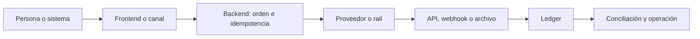

# Los 28 casos, de comienzo a fin

Esta es la vista central del producto. Cada fila responde: <strong>cuándo usar el caso, cómo comienza, quién procesa, cómo se confirma, cómo se cierra, qué hacer si falla y qué construir en un sistema real.</strong>

<b>1</b> Necesidad<i>→</i><b>2</b> Inicio<i>→</i><b>3</b> Proceso<i>→</i><b>4</b> Confirmación<i>→</i><b>5</b> Cierre

> Confirmar responde «¿ocurrió?». Cerrar responde «¿el ledger, el proveedor y el banco explican el mismo dinero?». Un retorno del navegador o una captura nunca bastan.

| # / caso / cuándo | Inicio → proceso | Confirmación → cierre | Si falla | Implementación real |
|---|---|---|---|---|
| **1. Efectivo y caja** Cobro presencial sin red electrónica. | **Inicio:** Cajero abre turno y registra monto. **Proceso:** Recibe efectivo y emite recibo único. | **Confirmar:** Cuenta caja con segundo responsable. **Cerrar:** Deposita y concilia recibos contra banco. | Faltante/sobrante queda como excepción; nunca se borra. | Caja web + roles + impresora + PostgreSQL + archivo bancario. |
| **2. Cheques y órdenes en papel** Cheque u orden física con cobro diferido. | **Inicio:** Registra emisor, monto, fecha e imagen restringida. **Proceso:** Entrega el documento al banco y queda PENDING. | **Confirmar:** El banco informa cobro o devolución. **Cerrar:** Aplica asiento final y concilia cartola. | Cheque devuelto revierte disponibilidad y abre cobranza. | Backoffice + custodia + API/archivo bancario + reglas locales. |
| **3. Tarjetas** Pago inmediato con tarjeta física o digital. | **Inicio:** Backend crea order/payment intent. **Proceso:** PSP tokeniza, autentica y autoriza; luego captura. | **Confirmar:** Webhook o consulta confirma la captura. **Cerrar:** Adquirente liquida; comercio concilia fees y disputas. | Timeout queda UNKNOWN; chargeback se registra por separado. | Checkout alojado + REST API + webhook + PostgreSQL + PCI DSS. |
| **4. Transbank Webpay Plus** Tarjetas en Chile mediante checkout alojado. | **Inicio:** Backend crea transacción Webpay y guarda token. **Proceso:** Cliente paga en Transbank y vuelve al comercio. | **Confirmar:** Backend ejecuta commit una sola vez; status recupera timeout. **Cerrar:** Reporte Transbank se concilia con ledger y banco. | Retorno sin commit no prueba pago; UNKNOWN se consulta. | Contrato Transbank + REST Webpay + callback + credenciales separadas. |
| **5. Transbank Oneclick Mall** Cobros posteriores a una tarjeta previamente inscrita. | **Inicio:** Start/finish inscribe y entrega tbk_user. **Proceso:** Backend autoriza por tienda usando token protegido. | **Confirmar:** Status confirma; webhook/consulta actualiza la orden. **Cerrar:** Conciliar autorizaciones, refunds y liquidación por tienda. | Baja o rechazo no permite reutilizar una inscripción inválida. | Contrato Oneclick + REST + vault cifrado + consentimiento y límites. |
| **6. Khipu** Transferencia cuenta a cuenta iniciada desde el comercio. | **Inicio:** Backend crea pago Khipu con referencia y callbacks. **Proceso:** Cliente autoriza en su experiencia bancaria. | **Confirmar:** Webhook autenticado o consulta confirma el payment ID. **Cerrar:** Abono bancario se concilia contra la misma referencia. | Callback perdido se recupera consultando; nunca por captura de pantalla. | Cuenta cobrador + Payment API + webhook HTTPS + llave en secret manager. |
| **7. Mercado Pago** Checkout regional con tarjetas y otros medios. | **Inicio:** Frontend tokeniza o redirige; backend crea orden. **Proceso:** Payments/Orders API procesa con idempotency key. | **Confirmar:** Webhook validado y consulta fijan el estado. **Cerrar:** Reporte y disponibilidad del dinero se concilian. | Evento duplicado se reconoce sin repetir ledger ni entrega. | Cuenta vendedor + app test + SDK frontend + REST backend + webhooks. |
| **8. POS, mPOS y SoftPOS** Cobro presencial en POS, mPOS o SoftPOS. | **Inicio:** Caja envía monto y referencia al terminal. **Proceso:** Dispositivo certificado lee y autentica la tarjeta. | **Confirmar:** Terminal/adquirente devuelve autorización y voucher. **Cerrar:** Cierre de lote se concilia con caja y banco. | Desconexión exige consulta/reversa; no repetir venta a ciegas. | Terminal certificado + SDK/protocolo de caja + gestión de dispositivos. |
| **9. Wallets tokenizadas** Apple Pay, Google Pay u otra wallet tokenizada. | **Inicio:** Usuario elige wallet en dominio/app registrado. **Proceso:** Wallet crea token de red y criptograma. | **Confirmar:** Backend/PSP valida token y confirma autorización. **Cerrar:** Liquidación y disputa siguen el rail de tarjeta. | Token inválido expira; fallback no debe exponer PAN. | SDK wallet + validación de dominio + PSP + gestión de claves. |
| **10. Saldo almacenado y gift cards** Gift card o saldo mantenido por el propio programa. | **Inicio:** Identifica cuenta y saldo disponible. **Proceso:** Reserva atómica evita gastar dos veces. | **Confirmar:** Captura consume saldo o libera la reserva. **Cerrar:** Ledger demuestra saldo y pasivo del programa. | Carrera o timeout se resuelve por idempotencia y reserva expirable. | API propia + PostgreSQL transaccional + ledger + reglas regulatorias. |
| **11. Mobile money** Pago desde saldo móvil con red de agentes. | **Inicio:** Identifica wallet, cliente y agente. **Proceso:** Operador valida PIN/OTP y mueve saldo. | **Confirmar:** Referencia del operador confirma el pago. **Cerrar:** Saldos, comisiones y float de agentes se concilian. | Falta de liquidez o reversa abre una excepción trazable. | Contrato operador + API/USSD + KYC + gestión de agentes y float. |
| **12. Pagos QR** Iniciar un pago escaneando un código. | **Inicio:** Genera QR firmado, único y expirable. **Proceso:** App interpreta datos e inicia el rail subyacente. | **Confirmar:** API/webhook del rail confirma; el QR no confirma. **Cerrar:** Conciliar referencia QR contra abono o adquirente. | QR sustituido/expirado se rechaza; duplicado no reaplica. | Estándar QR + firma + backend + proveedor bancario o wallet. |
| **13. Transferencia bancaria** Pago directo entre cuentas bancarias. | **Inicio:** Entrega beneficiario y referencia irrepetible. **Proceso:** Cliente o API bancaria instruye transferencia. | **Confirmar:** Cartola/API autoritativa confirma el abono. **Cerrar:** Concilia monto, moneda, referencia y fecha valor. | Comprobante visual se ignora; diferencia queda pendiente. | Cuenta empresa + API/open banking o archivos + conciliador. |
| **14. ACH y transferencias batch** Transferencias masivas diferidas por lote. | **Inicio:** Crea lote válido, totales de control y fecha. **Proceso:** Operador acepta archivo y procesa entries. | **Confirmar:** Acuse y settlement reportan cada entry. **Cerrar:** Returns posteriores ajustan ledger y conciliación. | Lote rechazado se corrige completo; return no se oculta. | Acuerdo ODFI/operador + formato NACHA/local + SFTP/API + scheduler. |
| **15. Débito directo** Cobros recurrentes autorizados desde cuenta. | **Inicio:** Captura mandato, versión y consentimiento. **Proceso:** Presenta débito en la fecha notificada. | **Confirmar:** Banco informa aceptación o return. **Cerrar:** Liquida y concilia por mandato/referencia. | Revocación o fondo insuficiente detiene nuevos intentos según regla. | Proveedor DD + vault de mandatos + batch/API + calendario y avisos. |
| **16. Pagos instantáneos** Transferencia cuenta a cuenta casi inmediata 24/7. | **Inicio:** Resuelve alias/cuenta y crea referencia end-to-end. **Proceso:** Rail valida e instruye en tiempo real. | **Confirmar:** Confirmación con finalidad declarada cierra el pago. **Cerrar:** Concilia mensajes, cuentas técnicas y banco. | UNKNOWN exige status; rapidez no autoriza duplicar. | Participante/proveedor + API ISO 20022/local + operación 24/7. |
| **17. Links y solicitud de pago** Cobrar mediante link o solicitud compartible. | **Inicio:** Crea orden firmada, expirable y de un solo uso. **Proceso:** Cliente abre link y elige el rail final. | **Confirmar:** Backend confirma por API/webhook del rail. **Cerrar:** Atribuye liquidación a orden, campaña o factura. | Link reutilizado o phishing se bloquea por firma/dominio. | Frontend de checkout + URL firmada + PSP + antifraude. |
| **18. Voucher pagable en efectivo** Orden digital pagada posteriormente en una red física. | **Inicio:** Genera barcode/referencia y vencimiento. **Proceso:** Recaudador recibe efectivo y reporta la operación. | **Confirmar:** Archivo/API de la red confirma una sola vez. **Cerrar:** Settlement del recaudador se concilia con voucher. | Voucher vencido/duplicado se rechaza o queda en excepción. | Contrato recaudador + barcode + API/archivo + conciliación diferida. |
| **19. BNPL y crédito alternativo** Compra financiada en cuotas por un tercero. | **Inicio:** Solicita evaluación y muestra costo total. **Proceso:** Cliente consiente; financiador aprueba y paga comercio. | **Confirmar:** API confirma contrato y desembolso. **Cerrar:** Comercio concilia neto; financiador administra cuotas. | Rechazo, mora o devolución siguen flujos separados. | Proveedor BNPL + API/SDK + consentimiento + regulación de crédito. |
| **20. Cobro mediante operador móvil** Cargo a factura o saldo del operador móvil. | **Inicio:** Verifica línea, elegibilidad y límite. **Proceso:** Usuario confirma con OTP/consentimiento. | **Confirmar:** Operador devuelve transaction ID. **Cerrar:** Reporte divide ingreso entre comercio y operador. | Suscripción o cargo discutido se revierte con evidencia. | Contrato carrier/agregador + API + OTP + gestión de suscripciones. |
| **21. Marketplaces, splits y payouts** Marketplace que cobra y paga a terceros. | **Inicio:** Onboarding/KYB habilita cada beneficiario. **Proceso:** Cobro crea split inmutable, comisión y reserva. | **Confirmar:** Webhook confirma entrada y subledger distribuye. **Cerrar:** Payout liquida a vendedores y se concilia. | Refund/chargeback reasigna saldos sin perder el bruto original. | PSP marketplace + cuentas conectadas + subledger + motor de payouts. |
| **22. Pagos B2B y tesorería** Pago de facturas con aprobaciones empresariales. | **Inicio:** Ingiere factura y valida proveedor. **Proceso:** Segregación de funciones aprueba instrucción. | **Confirmar:** Banco confirma ejecución y remittance. **Cerrar:** ERP, banco y factura se concilian. | Duplicado/cambio de cuenta bloquea pago y escala revisión. | ERP + workflow de aprobación + API bancaria/SFTP + sanciones. |
| **23. Pagos internacionales** Pago entre países con FX y corresponsales. | **Inicio:** Cotiza tasa, fees, beneficiario y vigencia. **Proceso:** Screening y red corresponsal procesan instrucción. | **Confirmar:** Tracking confirma estado y monto recibido. **Cerrar:** Fecha valor, FX y fees se concilian. | Sanción, repair o devolución mantiene trazabilidad del original. | Proveedor cross-border + KYC/AML + FX + SWIFT/ISO 20022. |
| **24. RTGS y alto valor** Transferencia urgente de alto valor por RTGS. | **Inicio:** Operador autorizado crea instrucción. **Proceso:** Segundo aprobador firma; rail gestiona cola/liquidez. | **Confirmar:** Mensaje de finalidad confirma irrevocabilidad. **Cerrar:** Tesorería concilia intradía y posición de liquidez. | Rechazo/cola no se marca pagado; escala a operación crítica. | Acceso institucional + PKI/HSM + doble control + monitoreo RTGS. |
| **25. Open Finance e iniciación** Iniciar pago desde una app con consentimiento bancario. | **Inicio:** TPP crea consentimiento con alcance y expiración. **Proceso:** Cliente autentica en banco; FAPI entrega token ligado. | **Confirmar:** Payment ID se consulta hasta estado final. **Cerrar:** Banco y comercio concilian referencia end-to-end. | Consentimiento revocado/token vencido exige nueva autorización. | Registro/licencia TPP + OAuth/OIDC FAPI + mTLS + API bancaria. |
| **26. Bitcoin, Lightning y activos digitales** Transferir Bitcoin, Lightning u otro activo. | **Inicio:** Genera address/invoice y política de expiración. **Proceso:** Wallet firma y red propaga o enruta. | **Confirmar:** Confirmaciones o payment hash prueban resultado. **Cerrar:** Custodia, fees y conversión fiat se concilian. | Reorg, fee insuficiente o pérdida de clave usa runbook específico. | Nodo/custodio + wallet segura + indexador + compliance y recovery. |
| **27. Pagos máquina a máquina** Dispositivo paga automáticamente por uso. | **Inicio:** Identidad del equipo recibe presupuesto y política. **Proceso:** Medición genera autorización de alcance mínimo. | **Confirmar:** Servicio confirma consumo y cargo firmado. **Cerrar:** Agrega micropagos y concilia por dispositivo. | Equipo comprometido se revoca; límite evita gasto ilimitado. | Identidad de dispositivo + attestation + API + wallet/rail + límites. |
| **28. Pagos realizados por agentes** Un agente de software compra bajo mandato. | **Inicio:** Humano define propósito, presupuesto y expiración. **Proceso:** Motor de políticas decide y pide aprobación si corresponde. | **Confirmar:** Backend ejecuta y guarda evidencia de mandato/resultado. **Cerrar:** Ledger y conciliación atribuyen gasto al responsable. | Ambigüedad o exceso de límite detiene, no improvisa. | Agent API + policy engine + aprobación humana + credencial limitada. |

## Cómo usar esta tabla

1. Encuentra la necesidad en la primera columna.
2. Implementa primero el camino feliz de las dos columnas centrales.
3. Antes de liberar, reproduce el fallo descrito y demuestra que no duplica dinero ni evidencia.
4. Abre el [laboratorio en localhost](../LOCALHOST_AND_CONFIGURATION.html) para ejecutar cuatro escenarios.
5. Usa el [casebook detallado](CASEBOOK.html) para revisar alta, seguridad y salida a producción.

## La arquitectura común

La tecnología cambia por fila; las responsabilidades no: el backend decide, la fuente autoritativa confirma y la conciliación demuestra.
