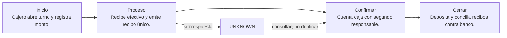

# 01. Efectivo y caja

[← Volver a la tabla](../END_TO_END_MATRIX.html) · [Ver esta guía .md en GitHub](https://github.com/vladimiracunadev-create/universal-payments-engineering-lab/blob/main/docs/payment-methods/cases/cash.md)

## En una frase

**Sirve para:** Cobro presencial sin red electrónica.

**Modelo mental:** El dinero cambia de manos ahora, pero la evidencia digital y el depósito aparecen después.

## Ejemplo concreto

<article>Situación
Una cafetería cobra $12.500 en efectivo. Al cierre, el recibo, la caja física y el depósito del día siguiente deben explicar esos mismos $12.500.
</article>
<article>Detrás de la pantalla
Cajero abre turno y registra monto. Recibe efectivo y emite recibo único.
</article>
<article>Se acepta como pagado cuando
Cuenta caja con segundo responsable. Después: Deposita y concilia recibos contra banco.
</article>

### No confundas estas tres cosas

| Lo que ocurre | Lo que significa | Lo que NO significa |
|---|---|---|
| El usuario vuelve a tu web | Terminó la experiencia del navegador | Que el dinero esté confirmado |
| El proveedor autoriza/confirma | Existe evidencia operativa del proveedor | Que el abono bancario ya esté conciliado |
| El reporte y el ledger cuadran | Puedes explicar el cierre financiero | Que nunca pueda existir devolución o disputa |

## Quién participa

- Cliente o pagador
- Comercio/cajero
- Custodio o recaudador
- Banco y equipo de conciliación

## Recorrido completo, paso a paso

| Etapa | Qué ocurre | Pregunta de control |
|---|---|---|
| 1. Inicio | Cajero abre turno y registra monto. | ¿Existe una referencia propia, monto, moneda y expiración? |
| 2. Proceso | Recibe efectivo y emite recibo único. | ¿Qué sistema externo puede producir el efecto financiero? |
| 3. Confirmación | Cuenta caja con segundo responsable. | ¿La evidencia viene de una API, webhook, banco o archivo autoritativo? |
| 4. Cierre | Deposita y concilia recibos contra banco. | ¿Ledger, proveedor y banco pueden explicar el mismo resultado? |

## Qué ocurre si falla

**Fallo característico:** Faltante/sobrante queda como excepción; nunca se borra.

Regla operativa: un timeout no equivale a rechazo. Conserva la operación como `UNKNOWN`, consulta mediante la misma referencia y permite un nuevo intento sólo cuando puedas demostrar que el anterior no produjo efecto.

Escenarios que debes probar:

- Happy path con montos mínimos, normales y límites documentados.
- Rechazo, cancelación del usuario, expiración y retorno del navegador manipulado.
- Timeout antes y después de enviar, webhook tardío, duplicado y fuera de orden.
- Refund total/parcial cuando aplique y conciliación con una diferencia intencional.
- Prueba end-to-end en sandbox/certificación con credenciales separadas; producción solo después de aprobar el checklist.

## Cómo llevarlo a una aplicación real

**Primer incremento de desarrollo:**

- Registrar apertura de caja y responsable.
- Emitir recibo por cada recepción.
- Cerrar, depositar y conciliar diferencia por turno.

**Evidencia para considerarlo exitoso:** Recibo + arqueo + comprobante de depósito asociados a la misma referencia.

**Construcción concreta:** Caja web + roles + impresora + PostgreSQL + archivo bancario.

### Lenguaje, API y almacenamiento

| Capa | Recomendación para este laboratorio | Responsabilidad |
|---|---|---|
| Frontend | Interfaz web administrativa para registrar recepción, custodia y diferencias; no inicia una red de pagos. | Experiencia; nunca secretos. |
| Backend | Python/FastAPI o el stack transaccional existente del comercio. | Orden, autenticación, idempotencia y estados. |
| API/canal | API interna REST/JSON y, cuando exista, archivo/API de banco o red externa. | Comunicar con proveedor o rail. |
| Datos | PostgreSQL con auditoría inmutable y ledger de doble entrada. | Evidencia, ledger y auditoría. |
| Operación | Control de acceso por rol, doble aprobación, respaldos y conciliación diaria. | Despliegue, observabilidad y recuperación. |

**Tecnologías del catálogo:** `cash-management`, `counterfeit-detection`, `chain-of-custody`

**Operaciones cubiertas:** `cash-register`, `cash-on-delivery`, `cash-in`, `cash-out`, `bank-deposit`

### Alta, contrato y costo

- **Dónde comenzar:** Elegir un proveedor regulado que ofrezca esta modalidad en tu país, abrir cuenta comercial, verificar la empresa y solicitar sandbox.
- **Costo:** El DEMO cuesta $0. Precio, impuestos, reservas y plazo de liquidación dependen del proveedor, país y volumen; pedir cotización vigente.
- **Decisión:** Usa Efectivo y caja solo si su cobertura, experiencia, reversibilidad y conciliación resuelven tu caso; compara al menos dos proveedores antes de LIVE.

### Variables y callbacks

| Variable | Obligatoria | Tratamiento | Propósito |
|---|---|---|---|
| `PAYLAB_HOST` | No | No secreta | Interfaz local. Solo se aceptan direcciones loopback. |
| `PAYLAB_PORT` | No | No secreta | Puerto del portal localhost. |
| `PAYLAB_CONFIG_DIR` | No | No secreta | Directorio alternativo para catálogo y guías. |

**Callbacks previstos:**

- No hay callback concreto hasta seleccionar un proveedor.

> GitHub Pages nunca usa estas variables. Configúralas únicamente en localhost, CI protegido o el secret manager del backend.

### Orden recomendado de implementación

1. Crear una orden/intención propia en el backend y fijar monto, moneda, comercio y expiración.
2. Enviar al proveedor desde el backend con credencial secreta e idempotency key; persistir referencia y request seguro.
3. Entregar al frontend solo el token, QR o URL de redirección de alcance mínimo.
4. Tratar el retorno del navegador como experiencia, no como prueba de pago; confirmar por API/webhook.
5. Validar y deduplicar el webhook, aplicar una máquina de estados monotónica y contabilizar una sola vez.
6. Consultar operaciones UNKNOWN y conciliar diariamente contra proveedor/banco; gestionar refunds y disputas.

## Seguridad de datos

- El monto, moneda, beneficiario y referencia nacen o se validan en el backend; nunca se confía en el navegador.
- Secretos en un gestor de secretos, rotación y mínimo privilegio; jamás en JavaScript, Git o logs.
- TLS, validación de firma/origen de webhooks, deduplicación persistente e idempotency key por operación.
- Minimizar datos: almacenar tokens y referencias del proveedor, no PAN, CVV, claves ni credenciales bancarias.
- Cifrado en reposo, control de acceso, trazabilidad y política de retención/borrado.

## Ventajas y desventajas

### Ventajas

- Amplía las opciones de pago y desacopla el comercio de la red subyacente.

### Desventajas

- Disponibilidad, costos y reglas dependen del proveedor y la regulación local.

## Checklist antes de LIVE

- [ ] Contrato y cuenta comercial aprobados; costos y plazos confirmados directamente con el proveedor.
- [ ] Credenciales productivas separadas, callbacks HTTPS públicos, dominios permitidos y rotación documentada.
- [ ] Alertas, runbook, soporte, refund/disputa y conciliación ensayados con responsables definidos.
- [ ] Piloto con límites y monitoreo reforzado; rollback que detiene nuevas operaciones sin perder evidencia.

## Qué demuestra el DEMO y qué no

El DEMO permite observar el recorrido de **Efectivo y caja**, incluyendo éxito, timeout recuperado, evento duplicado y diferencia de conciliación. No contacta al proveedor, no valida credenciales, no certifica cumplimiento y no mueve dinero.

## Fuentes

- [OWASP · Application Security Verification Standard](https://owasp.org/www-project-application-security-verification-standard/)
- [PCI SSC · PCI DSS](https://www.pcisecuritystandards.org/standards/pci-dss/)

---

[Abrir Efectivo y caja en la tabla web](../END_TO_END_MATRIX.html) · [Configurar localhost](../../LOCALHOST_AND_CONFIGURATION.html)
