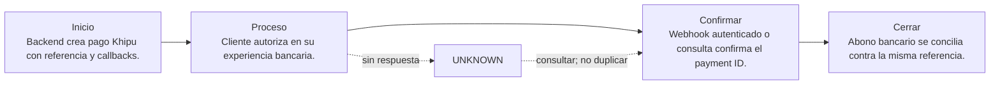

# 06. Khipu

[← Volver a la tabla web](../END_TO_END_MATRIX.html) · [← Volver a la tabla Markdown](../END_TO_END_MATRIX.md)

## En una frase

**Sirve para:** Transferencia cuenta a cuenta iniciada desde el comercio.

**Modelo mental:** El cliente autoriza una transferencia en la experiencia bancaria; tu comercio conserva referencia y estado.

## Ejemplo concreto

Imagina esta necesidad: Transferencia cuenta a cuenta iniciada desde el comercio. El negocio no puede limitarse a mostrar «pago exitoso»; debe conservar una referencia, obtener una confirmación autoritativa y demostrar después cómo terminó el dinero.

## Quién participa

- Pagador
- Backend del comercio o TPP
- Proveedor/API bancaria
- Banco pagador
- Banco receptor
- Operaciones y conciliación

## Recorrido completo, paso a paso

| Etapa | Qué ocurre | Pregunta de control |
|---|---|---|
| 1. Inicio | Backend crea pago Khipu con referencia y callbacks. | ¿Existe una referencia propia, monto, moneda y expiración? |
| 2. Proceso | Cliente autoriza en su experiencia bancaria. | ¿Qué sistema externo puede producir el efecto financiero? |
| 3. Confirmación | Webhook autenticado o consulta confirma el payment ID. | ¿La evidencia viene de una API, webhook, banco o archivo autoritativo? |
| 4. Cierre | Abono bancario se concilia contra la misma referencia. | ¿Ledger, proveedor y banco pueden explicar el mismo resultado? |

## Qué ocurre si falla

**Fallo característico:** Callback perdido se recupera consultando; nunca por captura de pantalla.

Regla operativa: un timeout no equivale a rechazo. Conserva la operación como `UNKNOWN`, consulta mediante la misma referencia y permite un nuevo intento sólo cuando puedas demostrar que el anterior no produjo efecto.

Escenarios que debes probar:

- Happy path con montos mínimos, normales y límites documentados.
- Rechazo, cancelación del usuario, expiración y retorno del navegador manipulado.
- Timeout antes y después de enviar, webhook tardío, duplicado y fuera de orden.
- Refund total/parcial cuando aplique y conciliación con una diferencia intencional.
- Prueba end-to-end en sandbox/certificación con credenciales separadas; producción solo después de aprobar el checklist.

## Cómo llevarlo a una aplicación real

**Primer incremento de desarrollo:**

- Crear pago con retorno y notificación.
- Abrir la experiencia indicada por Khipu.
- Verificar webhook y consultar por payment_id.

**Evidencia para considerarlo exitoso:** Payment ID confirmado por API/evento y conciliado con el abono.

**Construcción concreta:** Cuenta cobrador + Payment API + webhook HTTPS + llave en secret manager.

### Lenguaje, API y almacenamiento

| Capa | Recomendación para este laboratorio | Responsabilidad |
|---|---|---|
| Frontend | TypeScript + HTML/CSS. El navegador presenta el checkout y recibe el retorno; no guarda secretos. | Experiencia; nunca secretos. |
| Backend | Python 3.11+ con FastAPI para este laboratorio. Node.js/TypeScript, Java, .NET o Go son equivalentes si el equipo los opera mejor. | Orden, autenticación, idempotencia y estados. |
| API/canal | REST de pagos instantáneos: autenticar, crear pago, redirigir/abrir experiencia, consultar y recibir webhook. | Comunicar con proveedor o rail. |
| Datos | PostgreSQL para intents, eventos, idempotencia y ledger; Redis solo para cache/locks, nunca como libro contable. | Evidencia, ledger y auditoría. |
| Operación | Docker, gestor de secretos, logs estructurados, métricas, alertas y job de conciliación. | Despliegue, observabilidad y recuperación. |

**Tecnologías del catálogo:** `rest-json`, `api-key`, `webhook`

**Operaciones cubiertas:** `instant-payment`, `query`, `delete`, `webhook`

### Alta, contrato y costo

- **Dónde comenzar:** Registrarse como cobrador en Khipu, crear llaves/API y activar el ambiente indicado por el proveedor.
- **Costo:** El DEMO cuesta $0. Comisiones y liquidación varían por servicio/contrato; confirmar la tabla vigente con Khipu.
- **Decisión:** Usa Khipu solo si su cobertura, experiencia, reversibilidad y conciliación resuelven tu caso; compara al menos dos proveedores antes de LIVE.

### Variables y callbacks

| Variable | Obligatoria | Tratamiento | Propósito |
|---|---|---|---|
| `PAYLAB_HOST` | No | No secreta | Interfaz local. Solo se aceptan direcciones loopback. |
| `PAYLAB_PORT` | No | No secreta | Puerto del portal localhost. |
| `PAYLAB_CONFIG_DIR` | No | No secreta | Directorio alternativo para catálogo y guías. |
| `KHIPU_API_KEY` | Sí | Secreta | Autenticar la API de Khipu. |

**Callbacks previstos:**

- /webhooks/khipu
- /payments/khipu/return

> GitHub Pages nunca usa estas variables. Configúralas únicamente en localhost, CI protegido o el secret manager del backend.

### Orden recomendado de implementación

1. Crear una orden/intención propia en el backend y fijar monto, moneda, comercio y expiración.
2. Enviar al proveedor desde el backend con credencial secreta e idempotency key; persistir referencia y request seguro.
3. Entregar al frontend solo el token, QR o URL de redirección de alcance mínimo.
4. Tratar el retorno del navegador como experiencia, no como prueba de pago; confirmar por API/webhook.
5. Validar y deduplicar el webhook, aplicar una máquina de estados monotónica y contabilizar una sola vez.
6. Consultar operaciones UNKNOWN y conciliar diariamente contra proveedor/banco; gestionar refunds y disputas.

## Seguridad de datos

- El monto, moneda, beneficiario y referencia nacen o se validan en el backend; nunca se confía en el navegador.
- Secretos en un gestor de secretos, rotación y mínimo privilegio; jamás en JavaScript, Git o logs.
- TLS, validación de firma/origen de webhooks, deduplicación persistente e idempotency key por operación.
- Minimizar datos: almacenar tokens y referencias del proveedor, no PAN, CVV, claves ni credenciales bancarias.
- Cifrado en reposo, control de acceso, trazabilidad y política de retención/borrado.

## Ventajas y desventajas

### Ventajas

- Cuenta a cuenta y sin capturar claves bancarias.
- Confirmación asíncrona consultable.

### Desventajas

- Cobertura depende de bancos/producto.
- La experiencia puede salir del comercio.

## Checklist antes de LIVE

- [ ] Contrato y cuenta comercial aprobados; costos y plazos confirmados directamente con el proveedor.
- [ ] Credenciales productivas separadas, callbacks HTTPS públicos, dominios permitidos y rotación documentada.
- [ ] Alertas, runbook, soporte, refund/disputa y conciliación ensayados con responsables definidos.
- [ ] Piloto con límites y monitoreo reforzado; rollback que detiene nuevas operaciones sin perder evidencia.

## Qué demuestra el DEMO y qué no

El DEMO permite observar el recorrido de **Khipu**, incluyendo éxito, timeout recuperado, evento duplicado y diferencia de conciliación. No contacta al proveedor, no valida credenciales, no certifica cumplimiento y no mueve dinero.

## Fuentes

- [Khipu · Guía de implementación](https://www.khipu.com/en-us/page/guia-de-implementacion)
- [Khipu · Payment API](https://docs.khipu.com/en/payment-solutions/instant-payments/payment-api)

---

[Abrir Khipu en la tabla web](../END_TO_END_MATRIX.html) · [Configurar localhost](../../LOCALHOST_AND_CONFIGURATION.html)
