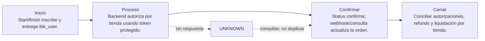

# 05. Transbank Oneclick Mall

[← Volver a la tabla web](../END_TO_END_MATRIX.html) · [← Volver a la tabla Markdown](../END_TO_END_MATRIX.md)

## En una frase

**Sirve para:** Cobros posteriores a una tarjeta previamente inscrita.

**Modelo mental:** Primero se inscribe la tarjeta y luego se cobra usando un token, nunca guardando sus datos completos.

## Ejemplo concreto

Imagina esta necesidad: Cobros posteriores a una tarjeta previamente inscrita. El negocio no puede limitarse a mostrar «pago exitoso»; debe conservar una referencia, obtener una confirmación autoritativa y demostrar después cómo terminó el dinero.

## Quién participa

- Cliente
- Frontend del comercio
- Backend del comercio
- PSP/adquirente/red
- Banco emisor
- Operaciones y conciliación

## Recorrido completo, paso a paso

| Etapa | Qué ocurre | Pregunta de control |
|---|---|---|
| 1. Inicio | Start/finish inscribe y entrega tbk_user. | ¿Existe una referencia propia, monto, moneda y expiración? |
| 2. Proceso | Backend autoriza por tienda usando token protegido. | ¿Qué sistema externo puede producir el efecto financiero? |
| 3. Confirmación | Status confirma; webhook/consulta actualiza la orden. | ¿La evidencia viene de una API, webhook, banco o archivo autoritativo? |
| 4. Cierre | Conciliar autorizaciones, refunds y liquidación por tienda. | ¿Ledger, proveedor y banco pueden explicar el mismo resultado? |

## Qué ocurre si falla

**Fallo característico:** Baja o rechazo no permite reutilizar una inscripción inválida.

Regla operativa: un timeout no equivale a rechazo. Conserva la operación como `UNKNOWN`, consulta mediante la misma referencia y permite un nuevo intento sólo cuando puedas demostrar que el anterior no produjo efecto.

Escenarios que debes probar:

- Happy path con montos mínimos, normales y límites documentados.
- Rechazo, cancelación del usuario, expiración y retorno del navegador manipulado.
- Timeout antes y después de enviar, webhook tardío, duplicado y fuera de orden.
- Refund total/parcial cuando aplique y conciliación con una diferencia intencional.
- Prueba end-to-end en sandbox/certificación con credenciales separadas; producción solo después de aprobar el checklist.

## Cómo llevarlo a una aplicación real

**Primer incremento de desarrollo:**

- Completar start/finish de inscripción.
- Cifrar y asociar tbk_user al cliente.
- Autorizar con límites, status, refund y baja.

**Evidencia para considerarlo exitoso:** Inscripción terminada, autorización por tienda y consentimiento auditables.

**Construcción concreta:** Contrato Oneclick + REST + vault cifrado + consentimiento y límites.

### Lenguaje, API y almacenamiento

| Capa | Recomendación para este laboratorio | Responsabilidad |
|---|---|---|
| Frontend | TypeScript + HTML/CSS. El navegador presenta el checkout y recibe el retorno; no guarda secretos. | Experiencia; nunca secretos. |
| Backend | Python 3.11+ con FastAPI para este laboratorio. Node.js/TypeScript, Java, .NET o Go son equivalentes si el equipo los opera mejor. | Orden, autenticación, idempotencia y estados. |
| API/canal | REST Oneclick: start/finish de inscripción; authorize/status/refund para cobros; delete para baja. | Comunicar con proveedor o rail. |
| Datos | PostgreSQL para intents, eventos, idempotencia y ledger; Redis solo para cache/locks, nunca como libro contable. | Evidencia, ledger y auditoría. |
| Operación | Docker, gestor de secretos, logs estructurados, métricas, alertas y job de conciliación. | Despliegue, observabilidad y recuperación. |

**Tecnologías del catálogo:** `rest-json`, `redirect`, `tokenization`, `stored-credential`, `tls`

**Operaciones cubiertas:** `enrollment-start`, `enrollment-finish`, `authorize`, `status`, `refund`, `delete-enrollment`

### Alta, contrato y costo

- **Dónde comenzar:** Solicitar/contratar Oneclick Mall y usar primero sus credenciales y tarjetas de integración.
- **Costo:** El DEMO cuesta $0; afiliación y transacciones reales se cotizan/contratan con Transbank.
- **Decisión:** Usa Transbank Oneclick Mall solo si su cobertura, experiencia, reversibilidad y conciliación resuelven tu caso; compara al menos dos proveedores antes de LIVE.

### Variables y callbacks

| Variable | Obligatoria | Tratamiento | Propósito |
|---|---|---|---|
| `PAYLAB_HOST` | No | No secreta | Interfaz local. Solo se aceptan direcciones loopback. |
| `PAYLAB_PORT` | No | No secreta | Puerto del portal localhost. |
| `PAYLAB_CONFIG_DIR` | No | No secreta | Directorio alternativo para catálogo y guías. |
| `TRANSBANK_ONECLICK_COMMERCE_CODE` | Sí | No secreta | Identificar el comercio Oneclick. |
| `TRANSBANK_ONECLICK_API_KEY` | Sí | Secreta | Autenticar la API Oneclick. |
| `TRANSBANK_ONECLICK_BASE_URL` | Sí | No secreta | Separar explícitamente integración y producción. |

**Callbacks previstos:**

- /payments/oneclick/return

> GitHub Pages nunca usa estas variables. Configúralas únicamente en localhost, CI protegido o el secret manager del backend.

### Orden recomendado de implementación

1. Crear una orden/intención propia en el backend y fijar monto, moneda, comercio y expiración.
2. Enviar al proveedor desde el backend con credencial secreta e idempotency key; persistir referencia y request seguro.
3. Entregar al frontend solo el token, QR o URL de redirección de alcance mínimo.
4. Tratar el retorno del navegador como experiencia, no como prueba de pago; confirmar por API/webhook.
5. Validar y deduplicar el webhook, aplicar una máquina de estados monotónica y contabilizar una sola vez.
6. Consultar operaciones UNKNOWN y conciliar diariamente contra proveedor/banco; gestionar refunds y disputas.

## Seguridad de datos

- El monto, moneda, beneficiario y referencia nacen o se validan en el backend; nunca se confía en el navegador.
- Secretos en un gestor de secretos, rotación y mínimo privilegio; jamás en JavaScript, Git o logs.
- TLS, validación de firma/origen de webhooks, deduplicación persistente e idempotency key por operación.
- Minimizar datos: almacenar tokens y referencias del proveedor, no PAN, CVV, claves ni credenciales bancarias.
- Cifrado en reposo, control de acceso, trazabilidad y política de retención/borrado.

## Ventajas y desventajas

### Ventajas

- Cobros posteriores sin volver a ingresar tarjeta.
- Token alojado por Transbank.

### Desventajas

- Mayor riesgo por cobro recurrente.
- Exige consentimiento, baja y protección estricta de tbk_user.

## Checklist antes de LIVE

- [ ] Contrato y cuenta comercial aprobados; costos y plazos confirmados directamente con el proveedor.
- [ ] Credenciales productivas separadas, callbacks HTTPS públicos, dominios permitidos y rotación documentada.
- [ ] Alertas, runbook, soporte, refund/disputa y conciliación ensayados con responsables definidos.
- [ ] Piloto con límites y monitoreo reforzado; rollback que detiene nuevas operaciones sin perder evidencia.

## Qué demuestra el DEMO y qué no

El DEMO permite observar el recorrido de **Transbank Oneclick Mall**, incluyendo éxito, timeout recuperado, evento duplicado y diferencia de conciliación. No contacta al proveedor, no valida credenciales, no certifica cumplimiento y no mueve dinero.

## Fuentes

- [Transbank · API Oneclick](https://www.transbankdevelopers.cl/referencia/oneclick)
- [Transbank · Cómo empezar](https://www.transbankdevelopers.cl/documentacion/como_empezar)

---

[Abrir Transbank Oneclick Mall en la tabla web](../END_TO_END_MATRIX.html) · [Configurar localhost](../../LOCALHOST_AND_CONFIGURATION.html)
