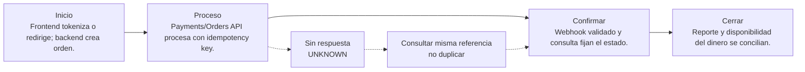

# 07. Mercado Pago

[← Volver a la tabla](../END_TO_END_MATRIX.md) · [Ver esta guía .md en GitHub](https://github.com/vladimiracunadev-create/universal-payments-engineering-lab/blob/main/docs/payment-methods/cases/mercado-pago.md)

## El mismo caso en tres formatos

| Formato | Para qué sirve | Enlace |
|---|---|---|
| Markdown | Fuente única, revisable en GitHub. | [Abrir fuente .md](https://github.com/vladimiracunadev-create/universal-payments-engineering-lab/blob/main/docs/payment-methods/cases/mercado-pago.md) |
| HTML | Página generada automáticamente para navegar. | [Abrir en GitHub Pages](https://vladimiracunadev-create.github.io/universal-payments-engineering-lab/payment-methods/cases/mercado-pago.html) |
| PDF | Manual descargable; el índice lleva a este caso. | [Abrir PDF en este caso](https://vladimiracunadev-create.github.io/universal-payments-engineering-lab/downloads/universal-payments-engineering-lab.pdf#nameddest=case-mercado-pago) |

Los tres muestran el mismo catálogo. Markdown es la fuente; HTML y PDF son salidas generadas y verificadas.

## En una frase

**Sirve para:** Checkout regional con tarjetas y otros medios.

**Modelo mental:** El frontend obtiene un token o abre un checkout; el access token y la creación viven en backend.

## Ejemplo concreto

<article>Situación
Una tienda cobra $24.990 con Checkout. El frontend obtiene un token o redirección; el access token permanece en backend y el webhook se deduplica.
</article>
<article>Detrás de la pantalla
Frontend tokeniza o redirige; backend crea orden. Payments/Orders API procesa con idempotency key.
</article>
<article>Se acepta como pagado cuando
Webhook validado y consulta fijan el estado. Después: Reporte y disponibilidad del dinero se concilian.
</article>

### No confundas estas tres cosas

| Lo que ocurre | Lo que significa | Lo que NO significa |
|---|---|---|
| El usuario vuelve a tu web | Terminó la experiencia del navegador | Que el dinero esté confirmado |
| El proveedor autoriza/confirma | Existe evidencia operativa del proveedor | Que el abono bancario ya esté conciliado |
| El reporte y el ledger cuadran | Puedes explicar el cierre financiero | Que nunca pueda existir devolución o disputa |

## Quién participa

- Pagador
- Canal o frontend
- Backend del negocio
- Proveedor o rail
- Operaciones y conciliación

## Recorrido completo, paso a paso

| Etapa | Qué ocurre | Pregunta de control |
|---|---|---|
| 1. Inicio | Frontend tokeniza o redirige; backend crea orden. | ¿Existe una referencia propia, monto, moneda y expiración? |
| 2. Proceso | Payments/Orders API procesa con idempotency key. | ¿Qué sistema externo puede producir el efecto financiero? |
| 3. Confirmación | Webhook validado y consulta fijan el estado. | ¿La evidencia viene de una API, webhook, banco o archivo autoritativo? |
| 4. Cierre | Reporte y disponibilidad del dinero se concilian. | ¿Ledger, proveedor y banco pueden explicar el mismo resultado? |

## Qué ocurre si falla

**Fallo característico:** Evento duplicado se reconoce sin repetir ledger ni entrega.

Regla operativa: un timeout no equivale a rechazo. Conserva la operación como `UNKNOWN`, consulta mediante la misma referencia y permite un nuevo intento sólo cuando puedas demostrar que el anterior no produjo efecto.

Escenarios que debes probar:

- Happy path con montos mínimos, normales y límites documentados.
- Rechazo, cancelación del usuario, expiración y retorno del navegador manipulado.
- Timeout antes y después de enviar, webhook tardío, duplicado y fuera de orden.
- Refund total/parcial cuando aplique y conciliación con una diferencia intencional.
- Prueba end-to-end en sandbox/certificación con credenciales separadas; producción solo después de aprobar el checklist.

## Cómo llevarlo a una aplicación real

**Primer incremento de desarrollo:**

- Crear aplicación y credenciales de prueba.
- Tokenizar/iniciar en frontend sin exponer secreto.
- Crear con idempotencia, recibir webhook y consultar.

**Evidencia para considerarlo exitoso:** Payment/order ID con estado aprobado, webhook validado y movimiento conciliado.

**Construcción concreta:** Cuenta vendedor + app test + SDK frontend + REST backend + webhooks.

### Lenguaje, API y almacenamiento

| Capa | Recomendación para este laboratorio | Responsabilidad |
|---|---|---|
| Frontend | TypeScript + HTML/CSS. El navegador presenta el checkout y recibe el retorno; no guarda secretos. | Experiencia; nunca secretos. |
| Backend | Python 3.11+ con FastAPI para este laboratorio. Node.js/TypeScript, Java, .NET o Go son equivalentes si el equipo los opera mejor. | Orden, autenticación, idempotencia y estados. |
| API/canal | REST/JSON Payments API existente; evaluar Orders API para una integración nueva. Tokenización en frontend y cobro en backend. | Comunicar con proveedor o rail. |
| Datos | PostgreSQL para intents, eventos, idempotencia y ledger; Redis solo para cache/locks, nunca como libro contable. | Evidencia, ledger y auditoría. |
| Operación | Docker, gestor de secretos, logs estructurados, métricas, alertas y job de conciliación. | Despliegue, observabilidad y recuperación. |

**Tecnologías del catálogo:** `rest-json`, `oauth-token`, `idempotency`, `webhook`

**Operaciones cubiertas:** `payments-api`, `query`, `refund`

### Alta, contrato y costo

- **Dónde comenzar:** Crear cuenta de vendedor y una aplicación en Mercado Pago Developers; separar credenciales de prueba y producción.
- **Costo:** El DEMO cuesta $0. La comisión real cambia por país, producto y plazo de disponibilidad: usar el enlace de costos de la cuenta.
- **Decisión:** Usa Mercado Pago solo si su cobertura, experiencia, reversibilidad y conciliación resuelven tu caso; compara al menos dos proveedores antes de LIVE.

### Variables y callbacks

| Variable | Obligatoria | Tratamiento | Propósito |
|---|---|---|---|
| `PAYLAB_HOST` | No | No secreta | Interfaz local. Solo se aceptan direcciones loopback. |
| `PAYLAB_PORT` | No | No secreta | Puerto del portal localhost. |
| `PAYLAB_CONFIG_DIR` | No | No secreta | Directorio alternativo para catálogo y guías. |
| `MERCADOPAGO_ACCESS_TOKEN` | Sí | Secreta | Autenticar llamadas servidor a servidor. |

**Callbacks previstos:**

- /webhooks/mercado-pago
- /payments/mercado-pago/return

> GitHub Pages nunca usa estas variables. Configúralas únicamente en localhost, CI protegido o el secret manager del backend.

### Orden recomendado de implementación

1. Crear una orden/intención propia en el backend y fijar monto, moneda, comercio y expiración.
2. Enviar al proveedor desde el backend con credencial secreta e idempotency key; persistir referencia y request seguro.
3. Entregar al frontend solo el token, QR o URL de redirección de alcance mínimo.
4. Tratar el retorno del navegador como experiencia, no como prueba de pago; confirmar por API/webhook.
5. Validar y deduplicar el webhook, aplicar una máquina de estados monotónica y contabilizar una sola vez.
6. Consultar operaciones UNKNOWN y conciliar diariamente contra proveedor/banco; gestionar refunds y disputas.

## Seguridad de datos

- El monto, moneda, beneficiario y referencia nacen o se validan en el backend; nunca se confía en el navegador.
- Secretos en un gestor de secretos, rotación y mínimo privilegio; jamás en JavaScript, Git o logs.
- TLS, validación de firma/origen de webhooks, deduplicación persistente e idempotency key por operación.
- Minimizar datos: almacenar tokens y referencias del proveedor, no PAN, CVV, claves ni credenciales bancarias.
- Cifrado en reposo, control de acceso, trazabilidad y política de retención/borrado.

## Ventajas y desventajas

### Ventajas

- Varios medios y SDKs.
- Sandbox, webhooks, consulta y refunds.

### Desventajas

- Superficie API amplia y reglas por país.
- La disponibilidad del dinero afecta la tarifa.

## Checklist antes de LIVE

- [ ] Contrato y cuenta comercial aprobados; costos y plazos confirmados directamente con el proveedor.
- [ ] Credenciales productivas separadas, callbacks HTTPS públicos, dominios permitidos y rotación documentada.
- [ ] Alertas, runbook, soporte, refund/disputa y conciliación ensayados con responsables definidos.
- [ ] Piloto con límites y monitoreo reforzado; rollback que detiene nuevas operaciones sin perder evidencia.

## Qué demuestra el DEMO y qué no

El DEMO permite observar el recorrido de **Mercado Pago**, incluyendo éxito, timeout recuperado, evento duplicado y diferencia de conciliación. No contacta al proveedor, no valida credenciales, no certifica cumplimiento y no mueve dinero.

## Fuentes

- [Mercado Pago · Primeros pasos](https://www.mercadopago.cl/developers/es/docs/getting-started)
- [Mercado Pago · Payments API](https://www.mercadopago.cl/developers/es/docs/checkout-api-payments/overview)

---

[Abrir Mercado Pago en la tabla](../END_TO_END_MATRIX.md) · [Configurar localhost](../../LOCALHOST_AND_CONFIGURATION.md)
