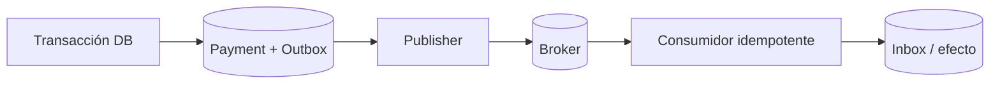

# ⚙️ Tecnologías de una plataforma de pagos

## Vista por capas

| Capa | Tecnologías | Para qué sirven | No garantizan |
|---|---|---|---|
| experiencia | Web, apps, POS, QR, NFC, deep links | iniciar y autenticar interacción | que el dinero se liquidó |
| API | REST/JSON, SOAP/XML, gRPC, GraphQL | contratos síncronos | exactly-once financiero |
| eventos | webhooks, queues, streams, CDC | propagación asíncrona | orden ni entrega única por defecto |
| archivos | SFTP, object storage, CSV/fixed-width | clearing, settlement y conciliación batch | semántica uniforme |
| mensajería financiera | ISO 8583, ISO 20022, formatos de esquema | intercambio entre participantes | implementación idéntica entre comunidades |
| identidad/API security | OAuth 2.0, OIDC, FAPI 2.0, mTLS, DPoP, private_key_jwt | autorización y vinculación de cliente/token | consentimiento legal por sí solos |
| tarjeta | EMV, 3DS, SRC, tokenización | interoperabilidad presencial/remota | certificación automática |
| claves | HSM, KMS, PKI, DUKPT/TR-31 según dominio | custodia, derivación y uso controlado | buen gobierno sin procesos |
| datos | ledger, OLTP, outbox, warehouse | estado, auditoría y análisis | verdad externa sin conciliación |
| operación | OpenTelemetry, logs, metrics, traces, SIEM | detectar y explicar | permiso para registrar datos sensibles |

## REST y contratos

Un endpoint monetario debe especificar:

- identificador e idempotency key;
- monto como unidades menores enteras o decimal serializado, moneda y reglas de redondeo;
- semántica de `POST`, `GET`, cancelación y refund;
- estado, versión y timestamps;
- códigos de error que distingan rechazo de negocio, error del cliente, indisponibilidad y resultado desconocido;
- límites, timeout, rate limit y política de retry;
- esquema de firma/webhook y proceso de rotación;
- versionado y compatibilidad.

`HTTP 409` puede representar conflicto idempotente; `202` procesamiento asíncrono; `5xx` no implica que no hubo efecto. La semántica del proveedor manda sobre una interpretación genérica.

## Entrega asíncrona

El patrón outbox evita confirmar base de datos y publicar evento como dos commits independientes. El consumidor debe ser idempotente. Una cola con entrega *at least once* es normal; “exactly once” de infraestructura no elimina la necesidad de identidad de negocio.

## ISO 8583

Marco de mensajería habitual en tarjetas: MTI, bitmap y data elements. La especificación concreta depende de red/procesador: campos, codificación, MAC, reversas y timeouts varían. Un simulador enseña parsing y estados, pero no acredita interoperabilidad. Conceptos a dominar: request/response/advice, STAN, RRN, transmission/local time, response code, original data elements, reversal y network management.

## ISO 20022

Modelo de mensajes financieros con definiciones y esquemas versionados. Familias frecuentes:

- `pain`: iniciación y estados cliente-banco;
- `pacs`: clearing y settlement interbancario;
- `camt`: cash management, reportes y notificaciones;
- `remt`: información de remesa.

Cada comunidad define usage guidelines, versión, campos obligatorios y reglas. No existe una certificación universal de ISO 20022; se valida conformidad contra el esquema y perfil de la comunidad. Fuente: [catálogo oficial ISO 20022](https://www.iso20022.org/catalogue-messages).

## Open Banking y FAPI

OAuth/OIDC no se implementan desde cero. Para APIs de alto valor, FAPI 2.0 define un perfil de seguridad con tokens ligados al emisor mediante mTLS o DPoP, authorization code, PKCE y PAR, entre otros controles. La selección final depende del perfil local. Fuentes: [FAPI 2.0 Security Profile](https://openid.net/specs/fapi-security-profile-2_0-final.html) y [OAuth 2.0 Security BCP (RFC 9700)](https://www.rfc-editor.org/rfc/rfc9700.html).

Controles de integración:

- redirect URI exacta y `state`/`nonce`/PKCE según flujo;
- PAR y request objects cuando el perfil los exige;
- autenticación asimétrica del cliente;
- access tokens sender-constrained;
- consentimiento con alcance, finalidad y vigencia;
- directorio/registro, certificados y rotación;
- validación de issuer, audience, algoritmo y tiempo;
- no usar ID token como autorización de pagos.

## EMV y pagos remotos

- **EMV Chip L1**: interfaz física/eléctrica/radio.
- **L2/kernel**: lógica de aplicación EMV.
- **L3**: integración terminal-adquirente/esquema.
- **EMV 3DS**: autenticación del consumidor para CNP, frictionless o challenge según riesgo.
- **EMV Payment Tokenisation**: reemplazo del PAN con dominio de uso.
- **EMV SRC / Click to Pay**: experiencia interoperable de checkout remoto.

Las especificaciones y programas vigentes deben obtenerse desde [EMVCo](https://www.emvco.com/emv-technologies/).

## Criptografía y secretos

No confundir cifrado con tokenización. Cifrar PAN sigue dejando PAN dentro del alcance cuando puede recuperarse. Un HSM impone fronteras de uso de claves; KMS general y HSM de pagos no son intercambiables automáticamente. Diseñar dual control, split knowledge donde aplique, inventario de claves, propósito, versión, rotación, revocación, backup y evidencia de uso.

## Persistencia y consistencia

- OLTP mantiene intents, attempts y eventos con constraints.
- ledger append-only registra efectos; correcciones mediante asientos compensatorios.
- idempotency store conserva fingerprint, estado y respuesta durante una ventana definida.
- outbox/inbox conecta transacción y mensajería.
- object storage conserva reportes cifrados, inmutabilidad y retención.
- warehouse recibe datos tokenizados/minimizados para fraude y reporting.

No uses cache distribuida como única fuente de verdad monetaria.

## Resiliencia

Timeouts deben ser menores que el presupuesto extremo a extremo y diferentes por operación. Retries solo en operaciones seguras/idempotentes. Circuit breaker protege capacidad, pero no resuelve el resultado financiero. Bulkheads separan proveedores. Rate limits, backpressure y colas protegen el sistema. Una estrategia multi-provider debe impedir que el failover cobre dos veces.

## Observabilidad

Métricas mínimas por proveedor, método, país y moneda, sin cardinalidad explosiva:

- tasa de creación, autorización, captura y resultado desconocido;
- latencia p50/p95/p99 y timeout;
- edad de `PROCESSING`/`UNKNOWN`;
- webhook lag, duplicados y verificación fallida;
- diferencias de conciliación por tipo y antigüedad;
- settlement esperado vs recibido;
- refunds/disputes, pero con acceso restringido.

Correlaciona `order_id`, `payment_id`, `attempt_id`, `provider_reference`, `ledger_journal_id` y `settlement_batch_id`; nunca PAN, token secreto o PII cruda.

## Tecnología no sustituye gobierno

Una plataforma real también necesita segregación de funciones, doble aprobación para cambios sensibles, gestión de proveedores, continuidad, pruebas de recuperación, respuesta a fraude, reconciliación financiera y revisión de acceso. La arquitectura solo es defendible cuando deja evidencia de esos procesos.
