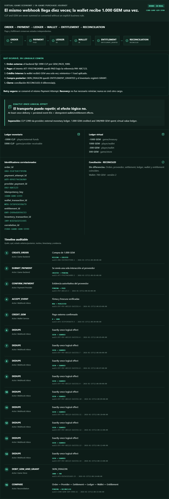
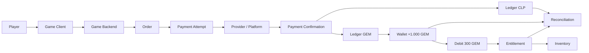

# 🎮 Economía virtual: de CLP a GEM y de GEM a un bien digital

## Alcance y estado

Este es un **caso vertical**, no una familia ni un payment rail nuevo. Combina
`stored-value`, tarjetas/wallets/transferencias/PSP/stores, ledger, idempotencia,
webhooks, conciliación y fulfillment digital. El checkout contiene una simulación
`DEMO` local, determinista y efímera; no conecta Apple, Google, Steam, consolas ni
un PSP, no usa credenciales y no mueve dinero.

| Capa | Estado | Evidencia |
|---|---|---|
| motor de compra GEM, wallet, entitlement e inventario | `IMPLEMENTED` / `SIMULATED` | `src/payments_lab/virtual_economy.py` |
| nueve escenarios, API, CLI y portal | `IMPLEMENTED` / `SIMULATED` | `paylab game-demo`, `/api/game-demo` y portal |
| stores y PSP reales | `REQUIRES_CREDENTIALS` | documentación oficial y contrato propio |
| persistencia, workers, inbox/outbox y scheduler | `PLANNED` | arquitectura objetivo; no existen en este checkout |
| LIVE | deshabilitado | no hay fallback DEMO → LIVE ni dinero real en CI |

## Dos movimientos relacionados, nunca una sola transacción

### Movimiento A · dinero externo

```text
CLP 5.990
Player → Store / PSP / wallet / tarjeta / banco → Game operator
```

### Movimiento B · valor interno

```text
1.000 GEM
Game Treasury GEM -1.000 → Player Wallet GEM +1.000
```

La confirmación del movimiento A **autoriza** el movimiento B; no los convierte
en la misma operación. CLP y GEM tienen journals separados. No se suman ni se
convierten sin una regla de negocio explícita.

Después ocurre una tercera decisión, también independiente:

```text
Player Wallet GEM -300 → Game Store GEM +300
                     ↓
               SKIN_DRAGON
                     ↓
          Entitlement + Inventory
```

Comprar GEM y gastar GEM no comparten idempotency key, orden ni wallet
transaction. El segundo paso no crea un cargo externo.

## Recorrido observable





## Dominios e identificadores

| Dominio | Identificador | Qué responde |
|---|---|---|
| Order | `order_id` | ¿qué producto y precio ofreció el juego? |
| Payment Attempt | `payment_attempt_id` | ¿qué interacción concreta se intentó? |
| Provider Transaction | `provider_payment_id` | ¿qué operación reconoce el store/PSP? |
| Idempotency | `idempotency_key` | ¿este retry representa la misma intención y payload? |
| Settlement | `settlement_id` | ¿qué declaró liquidado el proveedor? |
| Wallet Transaction | `wallet_transaction_id` | ¿qué load/debit/reversal cambió GEM? |
| Entitlement | `entitlement_id` | ¿qué derecho digital posee el jugador? |
| Inventory Movement | `inventory_transaction_id` | ¿qué bien entró o salió del inventario? |
| Refund | `refund_id` | ¿qué devolución se vinculó al pago original? |
| Correlación | `correlation_id` | ¿cómo reconstruyo el timeline completo? |

No existe una tabla universal que sustituya estas entidades. `Order`, `Payment
Attempt`, `Provider Transaction`, `Settlement`, `Wallet Transaction`,
`Entitlement`, `Inventory Movement`, `Refund`, `Chargeback` y conciliación tienen
ciclos y autoridades diferentes.

## Estados: pago no es fulfillment

Pago externo:

```text
CREATED → PENDING → AUTHORIZED → PAID → REFUNDED / CHARGEDBACK
                     ↘ UNKNOWN → recuperación por consulta o webhook
```

Entrega interna:

```text
ENTITLEMENT_PENDING → ENTITLEMENT_GRANTED → ENTITLEMENT_REVOKED
```

`PAYMENT = PAID` y `ENTITLEMENT = PENDING` es válido durante una recuperación.
Nunca se marca el pago `FAILED` sólo para ocultar el fallo de fulfillment.

## Idempotencia y exactly-once logical effect

El proveedor puede entregar diez veces `PAY-ABC123`. El inbox autentica, comprueba
frescura, persiste/deduplica el `event_id` y la wallet impone una referencia única
por `provider_payment_id`:

```text
10 entregas → 1 evento aceptado + 9 deduplicados → 1 load de 1.000 GEM
```

Esto no promete *exactly-once transport*. Construye un **exactly-once logical
effect** con idempotencia, deduplicación, estado persistente, correlación,
recovery y conciliación. El DEMO conserva esa memoria durante una ejecución; una
implementación real requiere constraints transaccionales, inbox/outbox y DB.

## Fallos que ejecuta el laboratorio

| Escenario | Evidencia y resultado seguro |
|---|---|
| éxito | CLP confirmado; +1.000 GEM; -300 GEM; `SKIN_DRAGON` una vez |
| timeout | attempt `UNKNOWN`; consulta la misma referencia; cero cargos nuevos |
| webhook duplicado | diez entregas; un `LOAD` de 1.000 GEM |
| pago exitoso + crédito fallido | `MISSING_CREDIT`; retry seguro completa el mismo fulfillment |
| respuesta perdida tras entrega | retry de cliente devuelve la misma orden y el mismo efecto |
| refund después de gastar 900 | asiento compensatorio, saldo -900 y revisión manual |
| chargeback después de consumo | saldo -900, restricción/revisión y mismatch explícito |
| refund antes de payment success | el evento tardío se guarda como evidencia sin regresión de estado |
| dos débitos simultáneos de 400 sobre 500 | uno gana; uno falla; saldo final 100, nunca -300 |

Ejecuta:

```powershell
python scripts/paylab.py game-demo --scenario game-currency-success
python scripts/paylab.py game-demo --scenario game-currency-timeout
python scripts/paylab.py game-demo --scenario game-currency-duplicate-webhook
python scripts/paylab.py game-demo --scenario game-currency-entitlement-failure
python scripts/paylab.py game-demo --scenario game-currency-response-lost
python scripts/paylab.py game-demo --scenario game-currency-crash-recovery
python scripts/paylab.py game-demo --scenario game-currency-refund
python scripts/paylab.py game-demo --scenario game-currency-chargeback
python scripts/paylab.py game-demo --scenario game-restore-purchase
```

## Timeout y recovery

Una respuesta perdida no prueba rechazo:

```text
POST payment → proveedor procesa → respuesta perdida → attempt UNKNOWN
                                           ↓
                    GET/status o webhook de la referencia original
```

El recovery completa ledger y wallet sobre `PAY-ABC123`; no crea otro payment
attempt. Si el proceso cae después de `PAID`, el estado durable permite retomar
el crédito pendiente por la misma clave. El objeto DEMO es efímero y simula esa
recuperación; no afirma persistencia productiva.

## Wallet, ledger, entitlement e inventario

### Stored value: semejanzas y diferencias

| Modelo | Cómo entra valor | Operaciones técnicas | Advertencia |
|---|---|---|---|
| gift card | emisión/carga por comercio | load, reserve, debit, release, expire, refund | puede estar sujeta a reglas de gift cards |
| prepaid balance | prefunding del titular | load, reserve, debit, release, redeem | puede representar un pasivo regulado |
| platform balance | settlement/ajuste de plataforma | credit, hold, fee, payout | puede involucrar fondos de terceros |
| mobile money | cash-in/banco/agente | cash-in, reserve, P2P, debit, cash-out | depende del emisor y jurisdicción |
| game currency | compra, premio o ajuste | load, reserve, debit, release, expire, refund | **no se declara dinero electrónico automáticamente** |

La clasificación jurídica depende de transferibilidad, convertibilidad, emisor, aceptación, cash-out, jurisdicción y otras características. PayLab modela la mecánica transaccional, no emite una conclusión legal.

La wallet expone `wallet_id`, `owner_id`, `currency`, `balance` y `version`, pero
el saldo es una proyección. La evidencia es:

```text
wallet + transaction history + ledger journals + audit events
```

El entitlement contiene `entitlement_id`, `player_id`, `product_id`,
`source_order_id`, `status`, `granted_at` y `revoked_at`. Ejemplos: `SKIN_DRAGON`,
`BATTLE_PASS_2026`, `DLC_02` y `CHARACTER_X`. Una skin es inventario; 1.000 GEM es
saldo. Restaurar una compra durable consulta la compra/entitlement existente y
reconstruye acceso: jamás crea un segundo cargo.

## Refund y chargeback

Refund es una devolución iniciada/aceptada por comercio o proveedor. Chargeback
es una disputa/reverso del rail y puede llegar sin cooperación del comercio. Si
el jugador ya consumió 900 GEM no existe una política universal. Opciones:

- bloquear o someter el refund a revisión según contrato y derechos aplicables;
- permitir saldo negativo;
- revocar un entitlement correlacionado cuando la política lo permita;
- restringir la cuenta y abrir revisión manual;
- absorber la pérdida.

PayLab simula saldo negativo y revisión para mostrar la mecánica, no para imponer
una política comercial o jurídica.

## Conciliación ampliada

```text
Order ↔ Provider Payment ↔ Settlement ↔ Monetary Ledger
      ↔ Virtual Ledger ↔ Player Wallet ↔ Entitlement ↔ Inventory
```

Tipos: `PAYMENT_MISMATCH`, `AMOUNT_MISMATCH`, `CURRENCY_MISMATCH`,
`DUPLICATED_CREDIT`, `MISSING_CREDIT`, `ORPHAN_TRANSACTION`,
`ORPHAN_ENTITLEMENT`, `REFUND_MISMATCH`, `CHARGEBACK_MISMATCH` e
`INVENTORY_MISMATCH`. Una diferencia puede ser bug, race, demora, operación
manual, fraude o corrupción de datos. La conciliación no la etiqueta como fraude
sin evidencia.

## Stores, web checkout y responsabilidades

| Canal | Inicia checkout | Procesa/verifica | Recibo/evento | Refund/settlement | Entitlement |
|---|---|---|---|---|---|
| Apple App Store | app mediante StoreKit | App Store; app/backend verifica transacción firmada | StoreKit, App Store Server API/Notifications V2 | Apple reporta refund y liquida según contrato | juego aplica transacción verificada; restore usa historial/current entitlements |
| Google Play | app con Play Billing | Play; backend verifica con Developer API | callback, query y RTDN | Play reporta voided/refund y settlement | backend concede sólo estado `PURCHASED` verificado y reconoce/consume |
| Steam | juego/backend inicia MicroTxn o Inventory purchase | Steam Wallet/Steamworks; purchasing server finaliza | callback/status e informes Steamworks | Steam según acuerdo/reportes | servidor confiable o Inventory Service concede ítem |
| Microsoft/Xbox | título abre XStore | Microsoft Store/Collections y licencias XStore | query de productos/entitlements/licencias | Microsoft Store según contrato | durable usa licencia; consumable se consume/fulfill según tipo |
| otras console stores | SDK/overlay oficial bajo programa partner | store y servicios autorizados | APIs disponibles al partner | store según contrato | juego verifica licencia/entitlement según producto |
| web checkout/PSP | backend crea orden | PSP/adquirente/banco | API/webhook firmado | PSP/banco | game backend concede tras evidencia autoritativa |

El cliente nunca es autoridad con `paid=true`. Envía el recibo o referencia
mínima al backend; éste verifica firma/estado contra la plataforma. No se guardan
PAN, CVV, PIN, track data, tokens reales ni recibos completos innecesarios.

Fuentes oficiales vigentes consultadas:

- [Apple · In-App Purchase y transacciones firmadas](https://developer.apple.com/documentation/storekit/in-app-purchase)
- [Apple · App Store Server Notifications V2](https://developer.apple.com/documentation/appstoreservernotifications)
- [Google Play · integración segura con backend](https://developer.android.com/google/play/billing/backend)
- [Google Play · ciclo de compra y pérdida de respuesta](https://developer.android.com/google/play/billing/integrate)
- [Steamworks · Microtransactions implementation](https://partner.steamgames.com/doc/features/microtransactions/implementation)
- [Steamworks · Inventory Service](https://partner.steamgames.com/doc/features/inventory)
- [Microsoft GDK · tipos de producto](https://learn.microsoft.com/en-us/xbox/gdk/docs/store/commerce/getting-started/xstore-choosing-the-right-product-type)
- [Microsoft GDK · modelo de entitlement/licencia](https://learn.microsoft.com/en-us/xbox/gdk/docs/store/commerce/fundamentals/xstore-product-sharing-model-for-games)

No se inventa un sandbox: sólo se usa el ambiente oficial disponible, con cuenta
y credenciales autorizadas. Stores de consola pueden requerir documentación y
acceso restringidos al programa partner.

## De DEMO a una implementación real

| Capa | Tecnología sugerida | API/contrato | Dato persistente |
|---|---|---|---|
| game client | SDK nativo de la store o TypeScript para web | StoreKit, Play Billing, Steamworks, XStore o checkout alojado | sólo referencia/estado UX; nunca secreto |
| game backend | Python/FastAPI en este lab; Node, Java, .NET o Go equivalentes | endpoint de orden, verificación y restore | order, attempt, provider ID, correlation ID |
| eventos | endpoint HTTPS + inbox/cola | notificación firmada/RTDN/webhook | event ID, payload sanitizado, firma/frescura |
| persistencia | PostgreSQL transaccional | constraints únicos y optimistic locking | wallet tx, journals, entitlement, inventory |
| operación | worker + scheduler + métricas | polling, recovery y conciliación | checkpoints, evidencia, SLA y owner |

### Configuración por ambiente

| Ambiente | Qué configurar | Qué puede demostrar |
|---|---|---|
| `DEMO` | sólo `PAYLAB_HOST`, `PAYLAB_PORT` y opcional `PAYLAB_CONFIG_DIR` | lógica local determinista; no contacta una store |
| `SANDBOX` / testing oficial | cuenta developer/partner, productos de prueba, credenciales backend y callbacks autorizados | contrato técnico de esa plataforma |
| `LIVE` | contrato productivo, secretos segregados, límites, alertas, conciliación y aprobaciones | operación real de esa cuenta; está deshabilitado aquí |

No existe fallback silencioso entre ambientes. Los costos dependen de programa, país, producto y contrato; se consultan en la consola y documentación oficial vigente, no se fijan en el repositorio.

### Ventajas y costos técnicos

- **Ventajas:** checkout y recibos gestionados por la plataforma, alcance global según canal, restore de durables y señales antifraude del proveedor.
- **Costos/limitaciones:** reglas de catálogo y revisión, comisiones/plazos variables, eventos asíncronos, refunds externos, dependencia del programa partner y conciliación adicional.

### Checklist antes de conectar una store

1. producto consumible/durable definido y mapeado a `product_id` interno;
2. verificación backend y política para pending/unknown;
3. claves/eventos con rotación, frescura, dedupe y mínimo privilegio;
4. idempotencia única para pago, wallet y entitlement;
5. restore, refund, voided purchase y chargeback ensayados;
6. settlement/reportes conciliados contra ledger monetario;
7. límites, antifraude, soporte y runbooks con responsables;
8. PAN, CVV, PIN, track data, tokens y secretos reales fuera del repo.

## Runbooks del vertical

| Incidente | Evidencia mínima | Acción segura | Qué NO hacer |
|---|---|---|---|
| pago aprobado, wallet 0 | order, provider ID, estado PAID, journal y wallet tx | bloquear segundo cobro; reintentar crédito por la misma referencia | crear otro payment attempt |
| wallet acreditada dos veces | dos wallet tx con mismo source/provider ID | contener gasto, abrir caso y compensar con journal autorizado | borrar una fila o editar saldo |
| entitlement faltante | debit GEM, source order, wallet tx, inventory | conceder idempotentemente desde la orden existente | volver a debitar GEM |
| refund sin revoke | refund ID, consumo, entitlement e inventario | aplicar política explícita: review, saldo negativo, revoke o absorción | asumir fraude o revocar sin regla |
| chargeback después de consumo | provider event, carga original, balance y bienes | restringir/revisar y registrar compensación trazable | ocultar la pérdida |
| webhook duplicado | event ID, firma, timestamp y resultado anterior | responder éxito sin repetir efecto | reprocesar porque “volvió a llegar” |
| payment `UNKNOWN` | request, timeout, provider ID y consultas | consultar/webhook/reconciliar con la misma referencia | convertir a FAILED o cobrar de nuevo |
| mismatch de conciliación | todas las fuentes y correlation ID | clasificar, asignar owner y preservar evidencia | etiquetar fraude automáticamente |

## Seguridad y fraude defensivo

- verificar firma/credencial del webhook, rotación de secreto, timestamp,
  freshness, allowlist cuando el proveedor la documente y replay protection;
- backend verification para fake receipt; nunca confiar en el cliente;
- detectar account takeover, instrumento robado, refund/chargeback abuse, bot
  farming, multi-account abuse y entitlement duplication;
- mantener secretos fuera de fixtures, logs y Git;
- no implementar evasión, bypass ni técnicas ofensivas contra stores/PSP.

## Marketplace P2P y cash-out

Una extensión P2P necesita reserva del bien, split inmutable, fee, settlement,
refund/dispute y payout del vendedor. El DEMO no ejecuta payouts. Permitir
`Virtual Asset → Marketplace → Fiat Payout` añade identidad, payout rails,
límites, fraude, settlement y potencial AML/KYC/compliance. PayLab documenta la
frontera; no se convierte en exchange.

## Auditoría y ajustes

Cada evento registra actor, acción, monto/unidad cuando aplica, timestamp,
motivo, referencia, estado anterior/posterior, `correlation_id` y evidencia. Un
operador no puede hacer `balance = 50000`; usa `ADMIN_ADJUSTMENT` con monto,
reason, operator, timestamp y correlation ID, más journal balanceado.

## Responsabilidades

- **Player:** consiente la compra y controla su cuenta/dispositivo.
- **Game Client:** inicia UX y transporta referencias; no confirma pagos.
- **Game Developer:** define productos, políticas y experiencia.
- **Game Backend:** orden, verificación, idempotencia, wallet, entrega y audit.
- **Payment Platform / Store / PSP:** procesa y reporta su transacción.
- **Card Network / Bank:** autoriza/liquida cuando el rail subyacente lo usa.
- **Marketplace Operator:** reserva, split, disputa y payout cuando existe P2P.

## Fronteras con otros repositorios

- game design/economía → `modern-gamedev-program`;
- naturaleza financiera del valor → `finance-and-banking-evolution-program`;
- comercio → `commerce-operating-system`;
- blockchain → `blockchain-learning-path`;
- ciberseguridad → `modern-cybersecurity-program`;
- blockchain security → `rootcause-blockchain-security`;
- empresa/regulación Chile → `modern-business-creation-program`.

PayLab conserva una sola pregunta: **qué ocurre técnicamente cuando el valor se
mueve y cómo demostrar que produjo una sola consecuencia correcta**.
